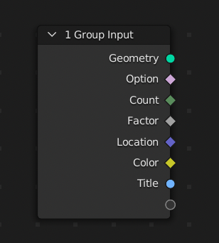
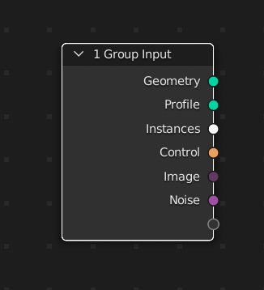
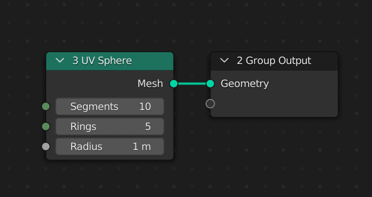
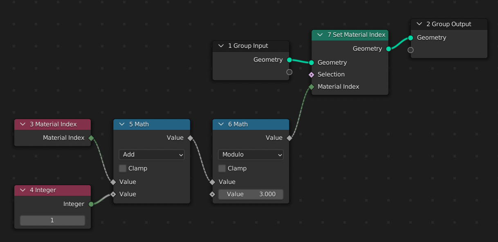

# geonodes

> In Blender, use python script to generate geometry nodes.

# Table of contents

- [Short description](#short-description)
- [Installation](#installation)
- [Overview](#overview)
- [Quick reference](#quick-reference)
- [Index](#index)

## Short description

Geometry nodes can be somehow difficult to maintain. The more nodes you have, the more difficult it is to
understand the algorithm. Debugging and maintaining a geometry nodes tree can be difficult, especially if
you get it from somebody else.

Geonodes module offers an elegant alternative by using the python style way to create the nodes.

## Example

Here after is an example of a simple script. It creates a surface from a grid by computing
`z = sin(d)/d` where `d=sqrt(x^2 + y^2)` is the distance of the vertex to the center.

```python
import geonodes as gn

with gn.Tree("Geometry Nodes") as tree:
    
    count = 100   # Grid resolution
    size  = 20    # Size
    omega = 2.    # Period
    height = 2.   # Height of the surface
    
    grid = gn.Mesh.Grid(vertices_x=count, vertices_y=count, size_x=size, size_y=size)
    
    with tree.layout("Computing the wave", color="dark_rose"):
        
        distance = gn.sqrt(grid.position.x**2 + grid.position.y**2)
        z = height * gn.sin(distance*omega)/distance
        
    grid.set_position(offset=(0, 0, z))
    
    tree.output_geometry = grid.set_shade_smooth()     
```

### Generated nodes

The generated nodes and the result of the Geometry nodes modifier is given below:


## Comments

- **Import**

  The module can be installed in `blender/script/modules/geonodes` folder. Using `import geondes as gn` is sufficient to acces
  all the module features.

- **Creating the Tree**

  A Tree instance can be created with
  
  ```python
  tree = Tree(tree_name)
  #...
  tree.close()
  ```
  
  But it is recommande to use `with` syntax to ensure that the tree will be properly closed. The closing performs final mandatory treatments.
  
- **Variables**

  Since it is standard python, one can use variables as global parameters. The variables can be changed in the script or can
  be exposed to the user as a group input:
  
  ```python
  # Alternative 1: change the script to change the parameter
  
  count = 100
  
  # Alternative 2: expose the parameter as modifier input
  
  count = gn.Integer.Input(100, "Count")

  # Alternative 3: expose the parameter with security and tool tip
  
  count = gn.Integer.Input(100, "Count", min_value=2, max_value=1000, description="Set the resolution of the surface")
  ```
  
- **geonodes types**

  geonodes module implements all the node socket types: Boolean, Float, ..., Geometry, Mesh, ... Material,...

- **Mesh creation**

  The Mesh primitives are implemented as static method of the Mesh class.
  
- **Layouts**

  Layouts can be created to make the result more readable and to help debug. Layout are initialized with a label and a color.
  All nodes created in the `with tree.layout():` scope are placed in this layout.
  
- **Operators**

  Python operators can be used on geonodes types. Operations between geonodes types and standard python types are valid in some cases:
  
  ```python
  a = gn.Float(10)         # The node "Value"
  a += 3                   # Node "Math" between previous node and default value 3
  v = gn.Vector((1, 2, 3)) # Node "Combine XYZ"
  w = v - (2, 3, a)        # Vector math between the previous vector and a "Combine XYZ" node
  ```
  
- **Methods**

  Nodes such as "Set position" are implemented as methods.
  
- **Input and output geometries**

  The output geometry is set with `tree.output_geometry`. Similaly, the input geometry can be read with `tree.input_geometry`
  
  ```python
  import geonodes as gn
  
  with gn.Tree("Geometry nodes") as tree:
  
      # The "do nothing" modifier !
      
      tree.output_geometry = tree.input_geometry
  ```
 
# Installation

Simply copy the geonodes folder in the modules folder `...blender/scripts/modules/`. Note that **geonodes** is not an addon, simply a python module.
The modules classes and functions are then accessible through a standard import statement:

```python
import geonodes as gn
```

# Overview

## Nodes, sockets and classes

geonodes manages **nodes** and **sockets**. Node sockets are data when the nodes are operators working on data.
For each socket type, there is a corresponding geonodes class:

- Geometry classes:
  - Geometry
  - Spline
  - Curve
  - Mesh
  - Instances
  - Points
  - Volume
- Values
  - Boolean
  - Integer
  - Float
  - Vector
  - Color
  - String
- Other
  - Collection
  - Object
  - Texture
  - Image
  - Material
 
A data class makes necessarily reference to a node socket. Operations on data classes are made by creating nodes. The node owning the socket is a property of the data class.<br>
The following example shows how to change the label and the color of the node owning the a Geometry class:

```python
import geonodes as gn

with gn.Tree("Geometry Nodes") as tree:
    
    # Get the input geometry
    
    geo = tree.input_geometry
    
    # Shade smooth
    
    geo.set_shade_smooth()

    # Change the node "shade smooth" name and color
    
    geo.node.node_color = "red"
    geo.node.label = "Smoothing"
    
    # Output geometry
    
    tree.output_geometry = geo 
```

The resuling tree is the following:


## Initializing classes

Data classes can be created in three ways:
1. From constant values
2. From group input
3. Mesh and Curve constructors

### 1. Constant initialization

Value classes can be initialized by passing a value in the class init:

```python
import geonodes as gn

with gn.Tree("Geometry Nodes") as tree:
    
    ok     = gn.Boolean(False)
    count  = gn.Integer(100)
    factor = gn.Float(5.5)
    vector = gn.Vector((1, 2, 3))
    color  = gn.Color((.1, .2, .3))
    title  = gn.String("My label")
 ```
 
 The variable correspond to output sockets of the initialization nodes:
 
 
 
 ### 2. Group inputs
 
 Each class implements the class method **Input** which get the socket from the tree group input.<br>
 In the example below we initialized the same variables from group inputs:
 
 ```python
 import geonodes as gn

with gn.Tree("Geometry Nodes") as tree:
    
    ok     = gn.Boolean.Input(False, "Option")
    count  = gn.Integer.Input(100, "Count")
    factor = gn.Float.Input(5.5, "Factor")
    vector = gn.Vector.Input((1, 2, 3), "Location")
    color  = gn.Color.Input((.1, .2, .3), "Color")
    title  = gn.String.Input("My label", "Title")
 ```
 The variables represent now the sockets of group input node:
 
 
 

 
 Geometry classes can also be initialized from a group input socket.<br>
 In the following example, we use the optional argument `description` to provide a tool tip to the user.
 
 ```python
 import geonodes as gn

with gn.Tree("Geometry Nodes") as tree:
    
    curve   = gn.Curve.Input("Profile", "The curve profile for converting to mesh")
    models  = gn.Collection.Input("Instances", "Collection of instances")
    control = gn.Object.Input("Control", "Object to use as control")
    image   = gn.Image.Input("Image", "The input image for the modifier")
    texture = gn.Texture.Input("Noise", "Noise texture to use to deform the surface")
 ```
 
 The group input is now:
 
 

 ### 3. Mesh and Curve constructors
 
 **Mesh** and **Curve** classes provide constructors (class methods) to initialize geometry. Basically, the constructors create the nodes in the Geometry Nodes menu **Mesh Primitives** and **Curve Primitives**.
 
```python
import geonodes as gn

with gn.Tree("Geometry Nodes") as tree:
    
    sphere = gn.Mesh.UVSphere(segments=10, rings=5)
    
    tree.output_geometry = sphere
```    



## Value classes : single value or array of values

It is important to understand that value classes such as **Float** or **Vector** can represent either a single value or an attribute,
i.e. an array of values (one value per **Mesh** vertex for instance).<br>
In the example below we create a modifier on a cube having several materials, each face with its own material.
The tree shifts the material index of the faces. The shift is an addition between an array of values `mat_indices` and a single value `offset`.
both variables share the same class: **Integer**.

```python
import geonodes as gn

with gn.Tree("Geometry Nodes") as tree:
    
    # Get the geometry from the modifier object
    # Since it is a mesh, we must cast to Mesh to benefit from
    # Mesh class methods
    
    cube = gn.Mesh(tree.input_geometry)
    
    # mat_indices represents the 6 material indices of the 6 faces of the cube
    
    mat_indices = cube.material_index

    # offset is a single value Integer
    
    offset = gn.Integer(1)
    
    # We can combine the two integers to set the new indices of the cube
    
    cube.set_material_index(material_index=(mat_indices + offset) % 3)
    
    # Let's represent the result
    
    tree.output_geometry = cube
 ```  
 
 

 
 
 
 
 
 


 
## Module presentation

The geonodes implements two layers:
- **Nodes layer**
  One class per geometry nodes, for instance AlignEulerToVector wraps the node FunctionNodeAlignEulerToVector
  The Node class initialization creates the geometry nodes
- **Sockets layer**
  One class per data type:
  - Basis data: Boolean, Integer, Float, Vector, Color, String
  - Geometry  : Geometry, Spline, Curve, Mesh, Point, Instance, Volume
  - Special   : Collection, Object, Material, Texture, Image
  The methods and properties of the sockets are implemented by creating nodes:
  ```python
  import geonodes as gn
  
  circle = gn.Mesh.Circle(radius=2.) # creates the node GeometryNodeMeshCircle
  ```
At creation time, a node takes two types or arguments:
- the input sockets
- the node parameters

```python
import geonodes as gn
from geonodes import nodes

# rotation   : first node socket
# factor     : second socket
# vector     : third socket
# axis       : first parameter
# pivot_axis : second parameter

node = nodes.AlignEulerToVector(rotation=None, factor=None, vector=None, axis='X', pivot_axis='AUTO')
```
# Source code generation

In a Blender project, create a Geometry nodes modifier and run the following script
```python
from generator.generator import gen_geonodes

# fpath is the location to where the geonodes folder is located
# within the Blender modules folder

fpath = ".../blender/modules/scripts/modules/geonodes/"
gen_geonodes(fpath)
```
# geonodes folder structure

## geonodes.core
### geonodes.core.node

- **Tree**        : Blender NodeTree wrapper
- **DataSocket**  : Root class for socket wrappers
- **Node**        : Root class for blender geometry nodes wrappers

  Some specific nodes are implemented in this module. They are used by **Tree**:
    
  - **GroupInput** : Wrapper for node NodeGroupInput.
    ```python
    # The group input is initialized in the Tree
    Tree.group_input = GroupInput()
    ```
  - **GroupOutput** : Wrapper for node NodeGroupOutput
    ```python
    # The group output is initialized in the Tree
    Tree.group_output = GroupOutput()
    ```       
  - **Viewer**      : Wrapper for node GeometryNodeViewer
    ```python
    # The viewer is initialized by the Tree when required
    Tree.viewer = None
    ...
    if self.viewer is None:
        self.viewer = Viewer()
    ```
    One viewer per tree. Data sockets can use the method to_viewer()
              
  - **Frame**       : Wrapper for node NodeFrame
    ```python
    def new_layout(self, label, color):
       self.layouts.append(Frame(label, color))
    ```
  - **SceneTime**   : Wrapper for GeometryNodeInputSceneTime
    ```python
    Tree.scene_ = None
    
    @property
    def scene(self):
        if self.scene_ is None:
            self.scene_ = SceneTime()
        return self.scene_
    ```
    
### geonodes.core.datasockets

Implements the base class for DataSockets
All the classes are base on geonode.node.DataSocket
For geometry data, only the class Geometry is implemented in this module
The final classes will be created in geonodes.sockets with the following inheritance
Geometry
    - Spline
        - Curve
    - Mesh
        - Points
        - Instance
        - Volume
        
----- geonodes.core.colors
Some colors constants
----- geonodes.core.arrange
arrange function locates the nodes to make the whole tree somehow readable
It works independantly of the geonodes structure and just take the name
of the NodeTree as an argument.
----------------------------------------------------------------------------------------------------
----- geonodes.nodes.nodes
All he nodes generated by the generator
----------------------------------------------------------------------------------------------------
----- geonodes.nodes.sockets
One file per data socket class plus functions.py which contains the global functions
----------------------------------------------------------------------------------------------------
----- geonodes.__init__.py
The pack initi file contains
====================================================================================================
Generation principle
The generation module is designed to ease the updates with the new versions of geometry nodes
Step 1
------
    try to create all the possible nodes by listing all the types in bpy.types:
    
    for type_name in dir(bpy.types):
        try:
            node = nodes.new(type_name)
        except:
            continue
        
        # We have a valid type
        
    The legacy nodes are excluded from the scane
    
Step 2
------
    Each node is analyzed by:
        - Identifying the parameters (non standard attributes)
            Three types of parameters are possible:
                - Non settable parameters, for instance the color selector of an input color node
                - Enum parameters: str param with a list of valid values
                - Non enum settable parameters, the resolution of a circle for instance
            The settable parameters will be part of the node creation argument
        
        - Identifying if the node has "shared sockets"
            Shared sockets are sockets of different types but sharing the same name.
            Only one socket is enabled at a time, depending upon a "driving parameter"
            Example: node FunctionNodeCompare:
                    - Driving parameter : data_type in ('FLOAT', 'INT', 'VECTOR', 'STRING', 'RGBA')
                    - Input sockets     : ['a', 'b']
                    a and b are names shared by sockets of type Float, Integer, Vector, String and Color
                    
        - Renaming sockets homonyms when exist
            For instance node ShaderNodeMath has three input sockets named Value. They are renamed
            value0, value1 and value2
                    
Step 3
------
    file nodes.py generation in folder geonodes.nodes
    
    The __init__ method of the node class is the concatenation of the input sockets and the settable parameters
    
    for instance, the __init__ method of ShaderNodeMath is:
        
        def __init__(self, value0=None, value1=None, value2=None, operation='ADD'):
            
            The node has 3 sockets and one parameter named operation.
            The default value 'ADD' is the one of the parameter at creation time.
            When a socket has the value None, it is left unplugged.
            A socket can be either a value or data socket class. If it is a value, it
            must be an acceptable default value for the input socket.
            
    An additional argument label is used to allow the user to change the node label:
        def __init__(self, value0=None, value1=None, value2=None, operation='ADD', label=None):
            
Step 4
------
    Generation of the data sockets classes.
    
    A data socket basically wraps an output node socket.
    The methods of a data class consist in creating a node and to plug the socket to one
    input socket of this node.
    
    Example:
        Let use x as a Float which is the output socket of a node.
        We can write:
            
            y = x ** 3
            
        This will create the node ShaderNodeMath with the following parameters:
            
            node = Math(value0=self, value1=3, operation='POWER')
            return node.value
        
    Implementation types
    ---------------------
    
    Depending on their behaviors, the nodes can be implented in the following ways:
        
        Constructor
        -----------
            For nodes which don't transform a socket but create new data
            
            Example: GeometryNodeMeshCircle is implemented as a Mesh constructor
            
            @classmethod
            def Circle(cls, vertices=None, radius=None, fill_type='NONE'):
                return cls(nodes.MeshCircle(vertices=vertices, radius=radius, fill_type=fill_type).mesh)
            
        Property
        --------
            For node which return info on data sockets. The properties are kept in local attributes:
                
                self.prop_ = ... node creation
                return self.prop_
            
            Example: GeometryNodeBoundBox returns 3 infos on the geometry : bounding_box, min and max
"""
