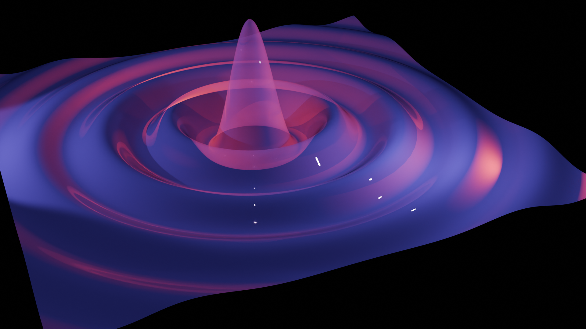
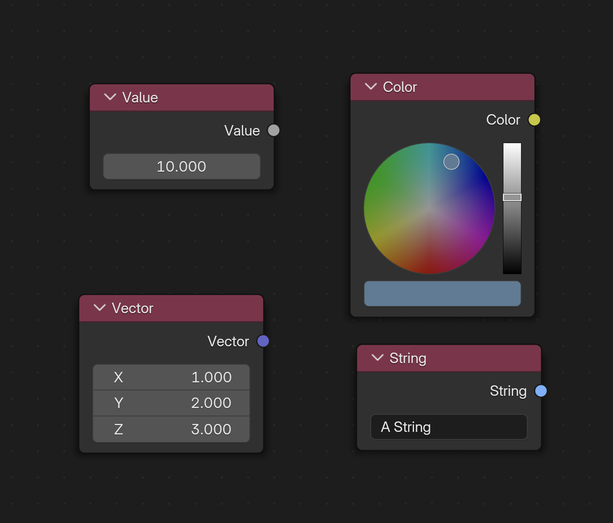
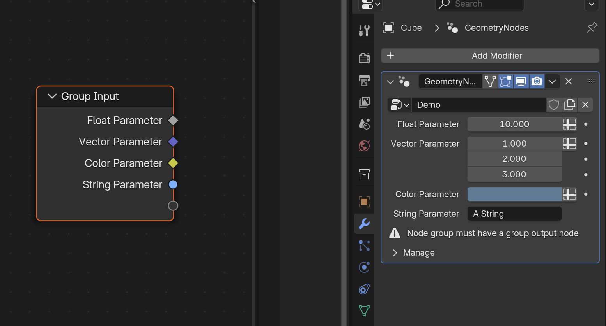
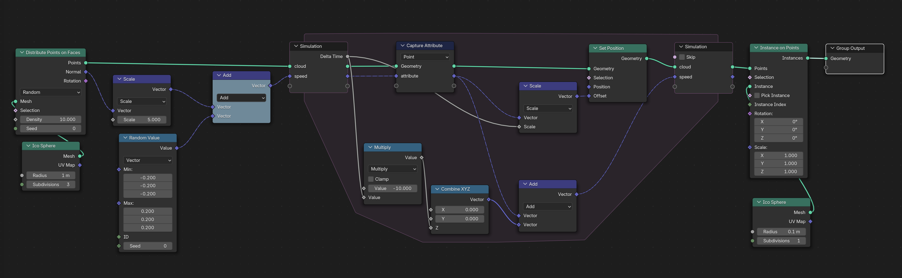
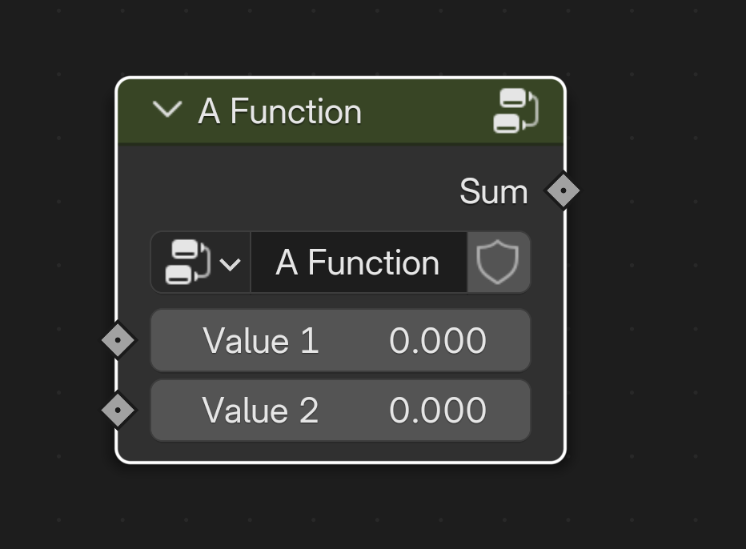

# geonodes


## Short

**Geometry Nodes** is a powerful **Blender** feature allowing the creation of amazing 3D models.
However, nodes trees can rapidly look like a _spaghetti plate_ difficult to understand and to maintain.
Complex formulas are not easy to build and debugging can be a headache.<br>

> The purpose of **_geonodes_** is to to create geometry nodes with python scripts.<br>

You keep the full power of Blender _Geometry Nodes_ but with the elegance of Python.

## Table of contents

- [Better a demo than long words](#better-a-demo-than-long-words)
- [Installation](#installation)
- [Documentation](#documentation)
- [Getting started](docs/getting_started.md)
- [API reference](docs/index.md)
- Tutorials by examples:
  - [Extrusion](docs/ex_extrusion.md)
  - [Simulation](docs/ex_simulation.md)
  - [Repeat](docs/ex_repeat.md)
  - [Building an arrow](docs/arrow.md)

## Better a demo than long words

The following script creates a surface from a grid by computing
`z = sin(d)/d` where `d=sqrt(x^2 + y^2)` is the distance of the vertex to the center.



```python
from geonodes import *

# Create the Geometry nodes named "Hello World"

with GeoNodes("Hello World"):

    # The surface is basically a grid 20 x 20 with a resolution 200 x 200
    grid = Mesh.Grid(vertices_x=200, vertices_y=200, size_x=20, size_y=20)

    # z is computed using gnmath library and operators as in pure python
    with Layout("Computing the wave"):
        pos = nd.position
        distance = gnmath.sqrt(pos.x**2 + pos.y**2)
        z = height*gnmath.sin(distance*omega)/distance

    # Let's change the z coordinate of our vertices
    with Layout("Point offset and smoothness"):
        grid.points.offset = (0, 0, z)
        grid.faces.smooth = True

    # We are done: plugging the deformed grid as the modified geometry
    grid.out()
```

> See [Demo details](docs/demo_1.md)

The generated nodes are shown below:


## Installation

**geonodes** is a python package. To install it, copy the package folder **geonodes** in `scripts/modules`.

The Blender `scripts` folder is defined in Blender preferences, see: [Blender File Paths settings](https://docs.blender.org/manual/en/latest/editors/preferences/file_paths.html).

> Note that **geonodes** is a python module, not an Blender addon

After the install, the Blender scripts hierarchy should look like:
```
.../scripts/
       modules/
           geonodes/
               __init__.py
               geonodes
               shadernodes
               demos
               ...
```

To make the module available in your script, use `import` in your script:

```python
from geonodes import *
```

or

``` python
from geonodes import GeoNodes, ShaderNodes, Geometry, Mesh, Vector...
```

## Documentation

Uses [index](docs/index.md) to gain access to the list of availables classes.

## Scripting nodes overview

All nodes belong to a tree. Two tree types are available:
- `GeoNodes` : [Geometry Nodes](docs/GeoNodes/GeoNodesTree.md)
- `ShaderNodes` : [Shader Nodes](docs/Shader/ShaderTree.md)

# Tutorial

## Prerequisites

To get the maximum benefit of **GeoNodes**, you must be familiar with both **python** and Blender **Geometry Nodes**.

## How it works

Each _Geometry Nodes_ output socket is wrapped by a **GeoNodes** class:
- A **Float** instance keeps a reference to an output socket of type _VALUE_
- A **Geometry** instance keeps a reference to an output socket of type _GEOMETRY_

_Geometry Nodes_ are methods, functions or operators working on the **GeoNodes** classes.
The arguments of a method call are connected to the _input sockets_ of the node.
The method returns a class refering to its output socket.

``` python
from geonodes import *

with GeoNodes("Demo"):

    # Get the input geometry
    # The INPUT geometry is the OUTPUT socket of the Group Input node

    geometry = Geometry()

    # Create a node "Vector"
    # The output socket of this node is kept in an instance of Vector

    vector = Vector((1, 2, 3))

    # Method set_position creates a node 'Set Position'
    # - output socket kept by geometry is plugged to the input socket 'Geometry'
    # - offset argument is plugged to the input socket 'Offset'
    # The method returns an new instance of Geometry pointing on the node output socket

    geometry = geometry.set_position(offset=vector)

    # Plug the output socket to the group output

    geometry.out()
```

### Blender Setup

Create a new script in _Scripting_ tab in **Blender**. You can setup this tab in order to display:

- A _Text editor_ for python scripting
- A _3D Viewport_ to view the progress
- A _Python Console_ to dump variables
- A _Geometry Node Editor_ to view the generated nodes

Here after is an example of the recommanded setup:


### 'Do Nothing' Modifier

Copy / paste the following piece of code to check that everything is properly setup:

``` python
from geonodes import *

with GeoNodes("Do Nothing"):
    Geometry().out()
```

A Geometry Nodes modifier has been created with the name "Do Nothing". You can use it on any object.

> [!NOTE]
> All scripts are supposed to start with ``` from geonodes import * ```.
> Then, nodes must be created only in the sccope of **with** context.

All the code samples must be placed after the following lines:

``` python
from geonodes import *

with GeoNodes("Tutorial"):
    pass
```

## Modules and Classes

### 'gnmath' module

**gnmath** provides the mathematical functions, basically the operations performed by
_Math_, _Vector Math_ and _Boolean Math_ nodes.

Math functions are named after their standard name in python **math** module.

> [!NOTE]
> **Vector** functions having the same name as their **Float** equivalent are prefixed with the letter *v*

``` python
a = Float(1)
b = gnmath.sin(a)
c = gnmath.multiply_add(10, b)

u = Vector((1, 2, 3))
v = gnmath.cross_product(u, (7, 8, 9))
a = gnmath.vsin(v)
```

> [!NOTE]
> Similarly **Boolean** functions _and_, _or_ and _not_ are prefixed by the letter *b*

``` python
a = Boolean(True)
b = gnmath.xor(a, False)
c = gnmath.band(b, False)
```

### 'nd' Class

**nd** (shortcut for **nodes**) exposes all the nodes as class methods.
This class is particuliarly usefull for input nodes such as _Position_ or _Radius_:

``` python
cube = Mesh.Cube() # or nd.cube()
new_pos = nd.position + (1, 2, 3)
cube = cube.set_position(new_pos)
```

### Data Classes

Each **Geometry Nodes** socket type is wrapped in a dedicated class. The available classes are the following:

- **Basic types**
  - Boolean, Integer, Float, Vector, Color, Rotation, Matrix, String
- **Blender Resources**
  - Material, Object, Texture, Collection, Image
- **Geometry**
  - Geometry
  - Geometry subclasses : Mesh, Curve, Cloud, Instances, Volume

  Blender **Nodes** are implemented as methods, properties and operators working on these classes.
  For instance, if `a` and `b` are two **Floats**, the script `a + b` will generate a **Math** node with
  operation _ADD_. The result of this operation is the **Output Socket** of the node.

### Domains

Geometry classes have one or several _Domain_ attributes according  **Blender** data structure.
The domains are the following:
- **Mesh**
  - points
  - faces
  - edges
  - corners
- **Curve**
  - points
  - splines
- **Cloud**
  - points
- **Instances**
  - insts
- **Volume**

The _Domain_ attribute is used in the nodes needing a _Domain_ parameter. In the following example,
the node '_Store Named Attribute_' is setup with the domain calling the method:

``` python
      # Create a Cube
      mesh = Mesh.Cube()

      # Store on domain POINT
      mesh.points.store_named_attribute("Point Value", 0.)

      # Store on domain FACE
      mesh.faces.store_named_attribute("Face Value", 0.)
```

> [!NOTE]
> A **Domain** is never instanced directly, it is always initialized as a property of a Geometry Class.

### Operators

Python operators can be used to operate on data, for instance:

``` python
# Float operators
a = Float(10)
c = a*pi # Math node, operation 'MULTIPLY'
c += 1 # Math node, operation 'ADD'
ok = a <=c # Compare node, operation 'LESS_EQUAL'

# Vector operators
u = Vector((1, 2, 3))
v = u + (7, 8, 9) # Vector Math node, operation 'ADD'
w = u*3 # Vector Math node, operation 'SCALE'

# Boolean operators
b = Boolean(True)
c = b | False # Boolean Math node, operation 'OR'

# String operators
s = String("A string")
s += ": this is something added. "
s += String(" ") * ("This", "is", "a", String("sentence."))

# Join Geometry
geo = Geometry() # Input geometry
geo += Mesh.Cube(), Curve.Spiral() # Join with two other geometries
```

> [!NOTE]
> Python _bool_ operators _or_, _and_ and _not_ don't apply on **Boolean** class, use their binary
> equivalent instead : |, & and -.

## Naming Conventions

### Node names

Naming conventions are such that method names can be easily deduced from the node name.

1. **RULE 1** : method names are built from the name of the node using the _snake_case_ convention:
  - _Set Material_ : **set_material**
  - _Store Named Attribute_ : **store_named_attribute**
2. **RULE 2** : when the node creates a new instance of the socket, it is implemented as a constructor **class method**
  using _CamelCase_ convention:
  - _Cube_ : constructor class method **Cube** of **Mesh**
  - _Combine XYZ_ : constructor class method **Combine** of **Vector**
  - _Bézier Segment_ : constructor class method **BezierSegment** of **Curve**
3. **RULE 3** : the name of the socket data type is omitted when redundant:
  - _Curve to Mesh_ : **Curve.to_mesh** method
  - _Mesh to Points_ : **Mesh.to_points** method
  - _Curve to Points_ : **Curve.to_points** method
  - _Volume to Points_ : **Volume.to_points** method
  - _Mesh Line_ : **Mesh.Line** constructor
  - _Curve Line_ : **Curve.Line** constructor
4. **RULE 4** : _Set xxx_ are implemented as properties when possible:
  - _Set Position_ : **position** and **offset** properties of domain :
    ``` mesh.points.position = v ``` and ``` mesh.points.offset = v ```
  - _Set Radius_ : **radius** property of **Cloud.points** and **Curve.points** :
    ``` cloud.points.radius = v ``` and ``` curve.points.radius = v ```
  - _Set Tilt_ : **tilt** property of **Curve.points** : ``` curve.points.tilt = v ```
  - _Set Handle Type_ : **handle_type** property of **Curve.points** :
    ``` curve.points.handle_type = 'FREE' ```

The example below applies this set fo rules:

``` python
from geonodes import *

with GeoNodes("Method names"):

    # ----------------------------------------------------------------------------------------------------
    # RULE 2 : Constructor nodes in CamelCase
    #
    # Primitive nodes 'Cube', 'Points' and 'Bézier Segment' are
    # implemented as constructors of their Geometry

    cube = Mesh.Cube()
    cloud = Cloud.Points()
    bezier = Curve.BezierSegment()

    # ----------------------------------------------------------------------------------------------------
    # RULE 2 : Constructor nodes in CamelCase
    # RULE 3 : Omit class name
    #
    # Primitive nodes 'Mesh Line' and  'Curve Line' are implemented as
    # constructors of their Geometry, omitting the name of the class

    mesh_line = Mesh.Line()
    curve_line = Curve.Line()

    # ----------------------------------------------------------------------------------------------------
    # RULE 1 : Nodes name in snake_case
    #
    # Nodes 'Subdivision Surface', 'Triangulate', 'Set Position' are implemented as method
    # of their geometry using the snake_case version for their name

    cube = cube.subdivision_surface()
    cube = cube.triangulate()
    curve = curve_line.set_position()

    # ----------------------------------------------------------------------------------------------------
    # RULE 1 : Nodes name in snake_case
    # RULE 3 : Omit class name
    #
    # In the snake_case version of the nodes 'Fill Curve', 'Deform Curves on Surface',
    # 'Subdivide Mesh' the name of the geometry is omitted

    mesh = Curve.Circle().fill()
    curves = curve_line.deform_on_surface()
    cube = cube.subdivide()

    # ----------------------------------------------------------------------------------------------------
    # RULE 4 : setters and getters are properties
    #
    # The nodes 'Set Position' and 'Set Radius' are also implemented as properties

    mesh.position += (1, 2, 3)
    mesh.offset = (1, 2, 3)
    cloud.radius = 1.


    # Make sure to have an output geometry
    Geometry().out()
```

### Geometry or Domains methods

Blender _Geometry Nodes_ exposes one single _Geometry_ type. On the other hand, **GeoNodes** provides
one class per geometry type : **Mesh**, **Curve**, **Cloud**, **Instances**, **Volume** which are
subclasses of the generic **Geometry** class.

Nodes are implemented on their geometry classes:
- _Interpolate Curves_, _Resample Curve_, _Reverse Curve_ : implemented only on **Curve** class
- _Extrude Mesh_, _Flip Faces_, _Mesh Boolean_ : implemented only on **Mesh** class

Nodes needing a _Domain_ parameter are implemented on **Domain**, not **Geometry** :
- _Store Named Attribute_ : implemented on all domains
- _Extrude Mesh_ : implemented on **Mesh.points**, **Mesh.edges** and **Mesh.faces**

### Node sockets and parameters

To be fully configured, a node needs values for its sockets and parameters.
The method arguments provides the required initial values.

The following conventions are used:

1. **RULE A** : arguments for sockets are built as the _snake_case_ version of their name:
  - _Value_ socket : **value**
  - _Geometry_ socket : **geometry**
  - _Instance Index_ socket : **instance_index**
2. **RULE B** : sockets are given first, following their order in the node, and parameters are placed after:
  - `float.map_range(0, 1, 10, 20)`  is equivalent to `float.map_range(from_min=0, from_max=1, ...)`
2. **RULE C** : _Selection_ socket is omitted and is passed as item index of the **Geometry**
  - Don't write `mesh.set_id(selection=sel, ...)` but write instead `mesh[sel].set_id(...)`
3. **RULE D** : arguments for parameters use the python parameter name:
  - Node _Volume to Mesh_ has the parameter _resolution_mode_ : `mesh = vol.to_mesh(..., resolution_mode='GRID')`
4. **RULE E** : _domain_ parameter is omitted, it is taken from the calling domain:
  - Don't write `mesh.extrude(domain='FACE')` but write instead `mesh.faces.extrude()`
5. **RULE F** : _data_type_ parameter is omitted, it is deduced from the attribute type:
  - Don't write `sphere.sample_uv_surface(value=a, data_type='VECTOR')` but simply write
    `sphere.sample_uv_surface(a)`

> [!NOTE]
> The first socket is initialized with the class instance calling the method:
> `mesh.set_id(...)` connects the socket wrapped by the variable `mesh` to the
> socket _Geometry_ of the node _Set ID_.

``` python
from geonodes import *

with GeoNodes("Argument names"):

    # ----------------------------------------------------------------------------------------------------
    # RULE A : socket arguments in snake_case

    sphere = Mesh.UVSphere(segments=16, rings=12, radius=1.)
    sphere = sphere.merge_by_distance(distance=.1)

    # ----------------------------------------------------------------------------------------------------
    # RULE B : sockets ordered as in the node, parameters are placed after

    sphere = sphere.merge_by_distance(.1, 'ALL')

    # ----------------------------------------------------------------------------------------------------
    # RULE C : Selection socket is set by item index
    #
    # Don't write:
    # sphere = sphere.set_position(selection=nd.index < 5, position=(1, 2, 3))

    sphere = sphere[nd.index < 5].set_position(position=(1, 2, 3))

    # ----------------------------------------------------------------------------------------------------
    # RULE D : parameter arguments take the parameter name
    #
    # Node 'Merge by Distance' owns a parameter named 'mode'

    sphere = sphere = sphere.merge_by_distance(mode='ALL')

    # ----------------------------------------------------------------------------------------------------
    # RULE E : domain parameter is taken from the calling domain
    #
    # Don't write:
    # sphere = sphere.set_shade_smooth(shade_smooth=True, domain='FACE')

    sphere.faces.shade_smooth = True

    # ----------------------------------------------------------------------------------------------------
    # RULE F : data_type parameter is omitted, it is deduced from the argument type
    #
    # Don't write
    # b = sphere.sample_uv_surface(value=a, data_type='VECTOR')
    # data_type will be deduced from the type of variable a

    a = Vector()
    b = sphere.sample_uv_surface(value=a)

    # Make sure to have an output geometry
    sphere.out()
```

### Returned values

The general rule is that the methods return the first output socket of the node.

When the node has other output sockets, they are returned as properties of the returned variable.

> [!IMPORTANT]
> To avoid collision with existing properties, the additional output socket names are **suffixed by _**.

The example below illustrates how to access output sockets:

``` python
from geonodes import *

with GeoNodes("Returned Values"):

    # ----------------------------------------------------------------------------------------------------
    # Simple example
    #
    #  Node 'Cube' returns two output sockets:
    # - Mesh
    # - UV Map
    # The returned value has a property named uv_map_

    cube = Mesh.Cube()
    cube.corners.store("UV Map", cube.uv_map_)

    # ----------------------------------------------------------------------------------------------------
    # Advanced example
    #
    #  Node 'Extrude Mesh' returns three output sockets:
    # - Mesh
    # - Top
    # - Side

    ico = Mesh.IcoSphere()

    # Extrude 30% of the faces
    ico = ico.faces[Boolean.Random(probability=.3)].extrude(offset_scale=.4)

    # Duplicate extruded faces with a 0 scale extrusion
    ico = ico.faces[ico.top_].extrude(offset_scale=0)

    # --- ico.top_ is needed twice, let's use an intermediary variable

    # Scale the extrude faces
    ico_scaled = ico.faces[ico.top_].scale(scale=.5)

    # Another extrusion
    ico = ico_scaled.faces[ico.top_].extrude(offset_scale=1)

    # --- Let's now dig the sides

    ico = ico.faces[ico.side_].extrude(offset_scale=0)
    ico_scaled = ico.faces[ico.top_].scale(.8)
    ico = ico_scaled.faces[ico.top_].extrude(offset_scale=-.01)

    # Output
    (ico + cube.set_position(offset=(5, 0, 0))).out()
```

> [!NOTE]
> When calling a method, make sure to put the result in a variable in order to
> be able to use the resulting socket in another node.
> Typically write `other_mesh = mesh.set_position()` to have a pointer on the displaced geometry.

> [!IMPORTANT]
> After setting a property, the geometry variable points to the result. Just compare the two syntaxes below:
> ``` python
> cube = Mesh.Cube()
>
> # Method set_position doesn't change the cube variable
> # The resulting geometry must be set into a variable
> displaced_cube = cube.set_position(offset=(1, 2, 3))
>
> # Setting the offset property changes the output socket
> # the cube variable refers to
> cube.offset = (1, 2, 3)
> ```

## Class instantiation and Group Inputs

### Basic classes

Basically the **GeoNodes** classes are instantiated using the default constructor.
The code below creates four inputs nodes:



``` python
# The following instructions create the corresponding input nodes
float = Float(10)
vector = Vector((1, 2, 3))
color = Color((.1, .2, .3))
string = String("A String")
```

The optional **name** argument is used to create a Group Input socket.
The initialization value is used as default value.
The code below creates four group input sockets:



``` python
# The following instructions create the corresponding input nodes
float = Float(10, name="Float Parameter"")
vector = Vector((1, 2, 3), name="Vector Parameter")
color = Color((.1, .2, .3), name="Color Parameter")
string = String("A String", name="String Parameter")
```

One can fine tune the group inputs by using **min**, **max** and **tip** arguments.
In addition, sub types can be defined by using dedicated constructor as shown below:

``` python
# An integer between 2 and 10
resolution = Integer(2, "Resolution", min=2, max=10, tip="Mesh resolution")

# A float factor between 0 and 1
factor = Float.Factor(.5, "Factor", 0, 1, "Modification factor")
```

### Blender resources

Blender resources (**Object**, **Collection**, **Material**, **Image**, **Texture**) are refered
either using their blender python value or simply by their name as shown below:

``` python
# Default cube
bl_cube = bpy.data.objects.get("Cube")
cube_obj = Object(bl_cube, name="Your object")

# The following line is equivalent
cube_obj = Object("Cuve", name="Your object")
```
### Geometries

**Geometry** and its subclasses are instancied through their constuctors (`Mesh.Cube` or `Curve.Spiral` for instance).
When instancied directly, a new Group Input socket is created.
If the name is not passed as key word argument, the default name is used.
When no name is passed,

``` python
# Node 'Cube'
mesh = Mesh.Cube()

# Geometry group input node is used if it exists,
# otherwise a group input node named 'Mesh' is created
mesh = Mesh()

# Other geometries can be created
curve = Curve(name="Curve")
```

> [!NOTE]
> For modifiers, only one input geometry is created. More than one geometry can be created only in _Groups_.

## Group Outputs

To plug a variable to the Group Output, simply use the method **out** with the name argument as shown below:

``` python
with GeoNodes("Group outputs"):

    cube = Mesh.Cube()
    cube.out()

    # The keyword argument name can be used
    Integer(10).out(name="The 10 int")
```

## Simulation and Repeat Zones

### Creation

Simulation zones are created with the classes **Simulation** and **Repeat**.
The zone variables are created with `**kwargs` arguments. The sockets types are
deduced from the python variable types. If the passed value is `None`, its is
considered as a null **Geometry**.

The example below creates a _Repeat_ zone with 4 variables of types **Geometry**, **Geometry**,
**Vector** and **Integer**:

``` python
with Repeat(geometry=Geometry(), curve=None, position=Vector(), index=1, iterations=10) as rep:
    pass
```

### Acces to the zones sockets

The zone sockets are initialized as properties of the **Repeat** or **Simulation**.
The can be get and set using the standard python syntax, for instance `rep.index` refers to
the socket named **index** in the example above.

Since a zone is composed of two nodes, each one replicating the same sockets as inputs and outputs,
socket names are replicated 4 times. Accessing the zone properties depends upon the access is made
**inside** or **outside** the **with** block and if the access is **set** or **get**:

- **INSIDE** the **with** block:
  - **getting** the property : read the output socket of the first node
  - **setting** the property : write the input socket of the second node
- **OUTSIDE** the **with** block:
  - **getting** the property : read the ouput socket of the second node
  - **setting** the property : raises an error (sockets are set at zone instantiation time)

  Despite it is not that easy to describe, this produces an very natural way to create and work with zones.
  The example below explodes a sphere:

  ``` python
  from geonodes import *

  with GeoNodes("Explosion"):

      mesh = Mesh.IcoSphere(subdivisions=3)
      cloud = mesh.faces.distribute_points(density=10)
      speed = 5*cloud.normal_ + Vector.Random(-.2, .2, seed=0)

      # Create a Simulation zone with two variables
      # - cloud : Cloud
      # - speed : Vector

      with Simulation(cloud=cloud, speed=speed) as sim:

          # INSIDE the simulation : getting is reading the first node

          speed = sim.speed

          speed = sim.cloud.points.capture(speed)
          sim.cloud.points.offset = speed*sim.delta_time

          # INSIDE the simulation : setting is writting the second node

          sim.speed = speed + (0, 0, -10*sim.delta_time)

      # OUTSIDE the simulation : getting is reading the second node

      cloud = Cloud(sim.cloud)

      # Done

      balls = cloud.points.instance_on(instance=Mesh.IcoSphere(radius=.1))

      balls.out()
```



## Groups and Modifiers

### Creating a Group

When creating a new tree, the argument **is_group** is used to specify to create a group of nodes rather
than a modifier:

``` python
with GeoNodes("A Function", is_group=True):

    a = Float(name="Value 1")
    b = Float(name="Value 2")

    (a + b).out("Sum")
```

This creates the following group:



### Calling a Group

Calling a group is made by instantiating a **Group** class.
The first parameter of the **Group** instantiation is the name of the _Group_ to call.
The sockets to plug th the input sockets of the group can be passed in two ways:
- as a dict
- as keyword arguments using their snake_case name


``` python
with GeoNodes("Call a Group"):

    a = gnmath.cos(1)
    b = a**2

    # ---------------------------------------------------------------------------
    # Standard method

    # dict syntax

    val1 = Group("A Function", {'Value 1': a, 'Value 2': b}).sum

    # snake_case syntax

    val2 = Group("A Function", value_1=a, value_2=b).sum

    # ---------------------------------------------------------------------------
    # Alternative method
    #
    # GroupF (for Group Functions) allows to call a group as a method
    # using its snake_case name

    val = GroupF().a_function(value_1=val1, value_2=val2).sum

    val.out()
```
