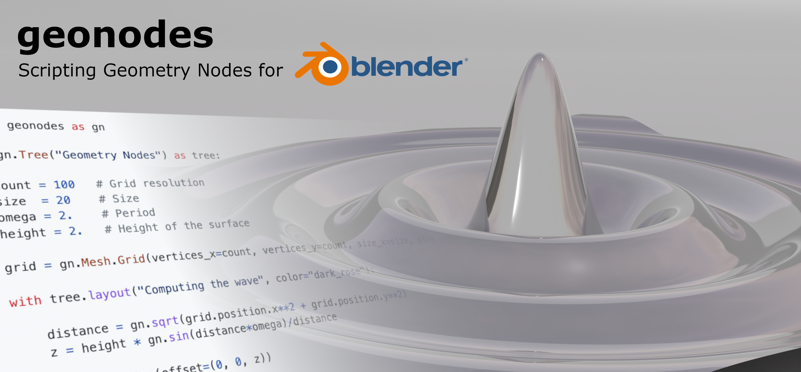
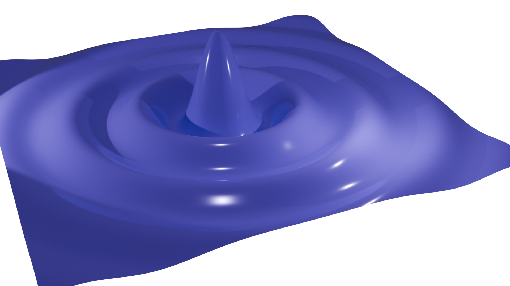
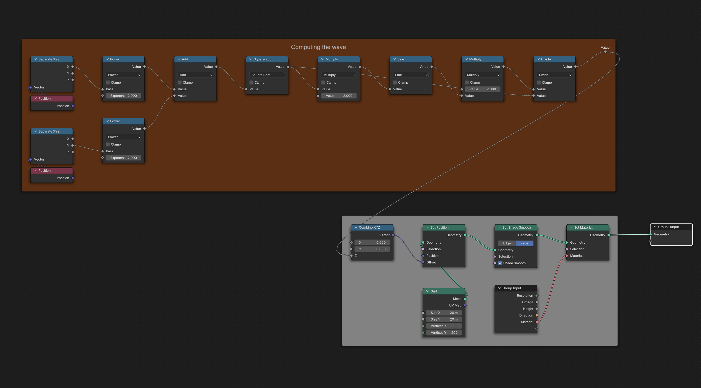

# geonodes



## Short

**Geometry Nodes** is a powerful **Blender** feature allowing the creation of amazing 3D models.
However, nodes trees can rapidly look like a _spaghetti plate_ difficult to understand and to maintain.
Complex formulas are not easy to build and debugging can be a headache.<br>

> The purpose of **_geonodes_** is to to create geometry nodes with python scripts.<br>

You keep the full power of Blender _Geometry Nodes_ but with the elegance of Python.

## Table of contents

- [Better a demo than long words](#better-a-demo-than-long-words)
- [Installation](#installation)
- [Documentation](#documentation)
- [Getting started](docs/getting_started.md)
- [API reference](docs/index.md)
- Tutorials by examples:
  - [Extrusion](docs/ex_extrusion.md)
  - [Simulation](docs/ex_simulation.md)
  - [Repeat](docs/ex_repeat.md)
  - [Building an arrow](docs/arrow.md)

## Better a demo than long words

The following script creates a surface from a grid by computing
`z = sin(d)/d` where `d=sqrt(x^2 + y^2)` is the distance of the vertex to the center.
It first creates a dedicated Material changing the color based on the location of
an object passed as modifier parameter.



```python
from geonodes import *

# Create the Geometry nodes named "Hello World"

with GeoNodes("Hello World"):

    # Parameters
    count  = 200
    size   = 20.
    omega  = 2.
    height = 2.

    # The surface is basically a grid 20x20 with a resolution 200 x 200

    grid = Mesh.Grid(vertices_x=count, vertices_y=count, size_x=size, size_y=size)

    # We compute z

    with Layout("Computing the wave"):
        distance = gnmath.sqrt(nd.position.x**2 + nd.position.y**2)
        z = height*gnmath.sin(distance*omega)/distance

    # Let's change the z coordinate of our vertices
    grid.points.offset = (0, 0, z)

    # Material and smoothness
    grid.faces.smooth = True
    grid.faces.material = Material(None, "Material")

    # We are done: plugging the deformed grid as the modified geometry
    grid.out()
```

> See [Demo details](docs/demo_1.md)

The generated nodes are shown below:



## Installation

**geonodes** is a python package. To install it, copy the package folder **geonodes** in `scripts/modules`.

The Blender `scripts` folder is defined in Blender preferences, see: [Blender File Paths settings](https://docs.blender.org/manual/en/latest/editors/preferences/file_paths.html).

> Note that **geonodes** is a python module, not an Blender addon

After the install, the Blender scripts hierarchy should look like:
```
.../scripts/
       modules/
           geonodes/
               __init__.py
               geonodes
               shadernodes
               demos
               ...
```

To make the module available in your script, use `import` in your script:

```python
from geonodes import *
```

or

``` python
from geonodes import GeoNodes, Shader, ...
```

## Documentation

Uses [index](docs/index.md) to gain access to the list of availables classes.

## Scripting nodes overview

All nodes belong to a tree. Two tree types are available:
- `GeoNodes` : [Geometry Nodes](docs/GeoNodes/GeoNodesTree.md)
- `Shader` : [Material Nodes](docs/Shader/ShaderTree.md)

## Basics

### Prerequisites

To get the maximum benefit of **GeoNodes**, you must be familiar with both **python** and Blender **Geometry Nodes**.

### Blender Setup

Create a new script in _Scripting_ tab in **Blender**. You can setup this tab in order to display:

- A _Text editor_ for python scripting
- A _3D Viewport_ to view the progress
- A _Python Console_ to dump variables
- A _Geometry Node Editor_ to view the generated nodes

Here after is an example of the recommanded setup:


### 'Do Nothing' Modifier

Copy / paste the following piece of code to check that everything is properly setup:

``` python
from geonodes import *

with GeoNodes("Do Nothing"):
    Geometry().out()
```

A Geometry Nodes modifier has been created with the name "Do Nothing". You can use it on any object.

> [!NOTE]
> All scripts are supposed to start with ``` from geonodes import * ```.
> Then, nodes must be created only in the sccope of **with** context.

All the code samples must be placed after the following lines when there are not explicity given in the exemple.

``` python
from geonodes import *

with GeoNodes("Tutorial"):
    pass
```

### Overview

All **Geometry Nodes** socket types are wrapped in a python class. The available classes are the following:

- Basic types
  - Boolean
  - Integer
  - Float
  - Vector
  - Color
  - Rotation
  - Matrix
  - String

- Blender Resources
  - Material
  - Object
  - Texture
  - Collection
  - Image

- Geometry
  - Geometry
  - Mesh
  - Curve
  - Cloud
  - Instances
  - Volume

  Blender **Nodes** are implemented as methods, properties and operators working on these classes.
  For instance, if `a` and `b` are two **Floats**, the script ``` a + b ``` will generate a **Math** node with
  operation _ADD_. The result of this operation is the **Output Socket** of the node.


[!Note]
