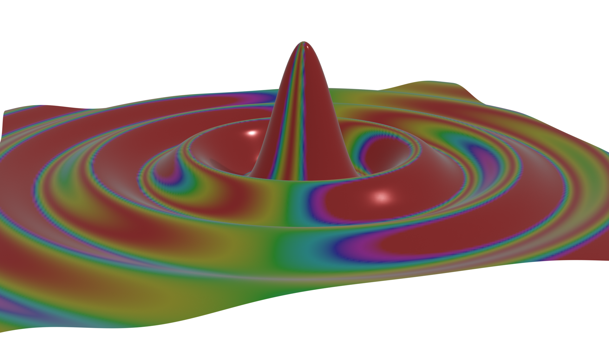
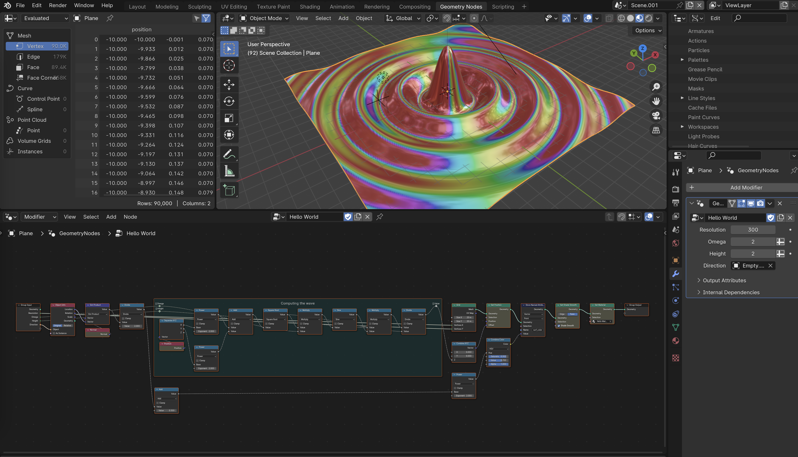

# geonodes


## Short

**Geometry nodes** is a powerful **Blender** feature allowing the creation of amazing 3D models.
However, nodes trees can rapidly look like a _spaghetti plate_ difficult to understand and to maintain.
Complex formulas are not easy to build and debugging can be a headache.<br>
 
> The purpose of **_geonodes_** is to to create geometry nodes with python scripts.<br>
 
You keep the full power of Blender geometry nodes but with the elegance of Python.

## Table of contents

- [Better a demo than long words](#better-a-demo-than-long-words)
- [Installation](#installation)
- [Documentation](#documentation)
- [Getting started](docs/getting_started.md)
- [API reference](docs/index.md)
- Tutorials by examples:
  - [Extrusion](docs/ex_extrusion.md)
  - [Simulation](docs/ex_simulation.md)
  - [Repeat](docs/ex_repeat.md)
  - [Building an arrow](docs/arrow.md)
    
## Better a demo than long words

The following script creates a surface from a grid by computing
`z = sin(d)/d` where `d=sqrt(x^2 + y^2)` is the distance of the vertex to the center.
It first creates a dedicated Material changing the color based on the location of
an object passed as modifier parameter.



```python
from geonodes import GeoNodes, Shader

# A Shader to be used by the Geometry Nodes modifier
with Shader("Hello Material") as tree:
    # Read the color from the arribute nameed 'surf_color'
    col = tree.Attribute("surf_color").color
    
    # A Principled BSDF shader 
    tree.output_surface = tree.PrincipledBSDF(
        base_color = col,
        roughness  = .1,
        metallic   = .7).bsdf
        
# The Geometry Nodes modifier
with GeoNodes("Hello World") as tree:
    
    # Let's get the parameters from the user
    count  = tree.integer_input("Resolution", 100, min_value=10, max_value=300)
    size   = 20   # Size
    omega  = tree.integer_input("Omega", 2.)
    height = tree.integer_input("Height", 2.)
    
    # The base (x, y) grid
    grid = tree.Grid(vertices_x=count, vertices_y=count, size_x=size, size_y=size).mesh
    
    # We compute z
    with tree.layout("Computing the wave"):
        # Separate XYZ the position vector 
        pos = grid.position
        
        # Compute the distance
        distance = tree.sqrt(pos.x**2 + pos.y**2)
        
        # Height in z
        z = height * tree.sin(distance*omega)/distance
        
    # Let's change the z coordinate of our vertices
    grid.offset = (0, 0, z)
    
    # The color of the surface depends upon the orientation of the faces
    # towerd a control object
    
    target = tree.object_input("Direction")
    loc = target.object_info().location
    
    hue = (grid.normal.dot(loc)/2 + .5)**2
    grid.POINT.store_named_vector("surf_color", tree.CombineColor(hue, .9, .7, mode='HSV'))
    
    
    # We smooth the grid
    grid.FACE.shade_smooth = True
    
    # We set the material created above
    grid.material = "Hello Material"
    
    # We are done: plugging the deformed grid as the modified geometry
    tree.output_geometry = grid        
```

> See [Demo details](docs/demo_1.md)

The generated nodes and the result of the Geometry nodes modifier is given below:



## Installation

**geonode** is a python package. To install it, copy the package folder **geonodes** in `scripts/modules`.

The Blender `scripts` folder is defined in Blender preferences, see: [Blender File Paths settings](https://docs.blender.org/manual/en/latest/editors/preferences/file_paths.html).

> Note that **geonodes** is a python module, not an Blender addon

After the install, the Blender scripts hierarchy should look like:
```
.../scripts/
       modules/
           geonodes/
               __init__.py
               core/
               nodes/
               ...
```

To make the module available in your script, use `import` in your script:

```python
import geonodes as gn
```

or

``` python
from geonodes import GeoNodes, Shader
```

> `gn` is the recommended alias for geonodes.

## Documentation

Uses [index](docs/index.md) to gain access to the list of availables classes.

## Scripting nodes overview

All nodes belong to a tree. Four tree types are available:
- `GeoNodes` : [Geometry Nodes](docs/GeoNodes/GeoNodesTree.md)
- `Shader` : [Material Nodes](docs/Shader/ShaderTree.md)
- `Compositor` : [Compositor Nodes](docs/Compositor/CompositorTree.md)

