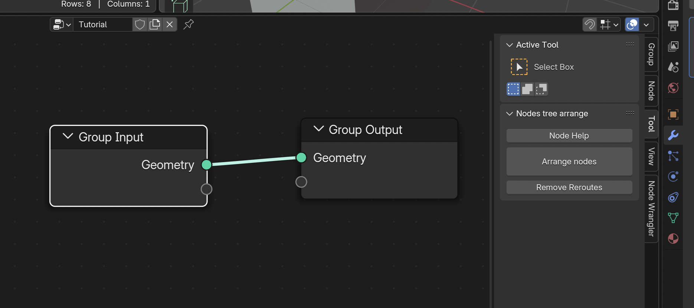
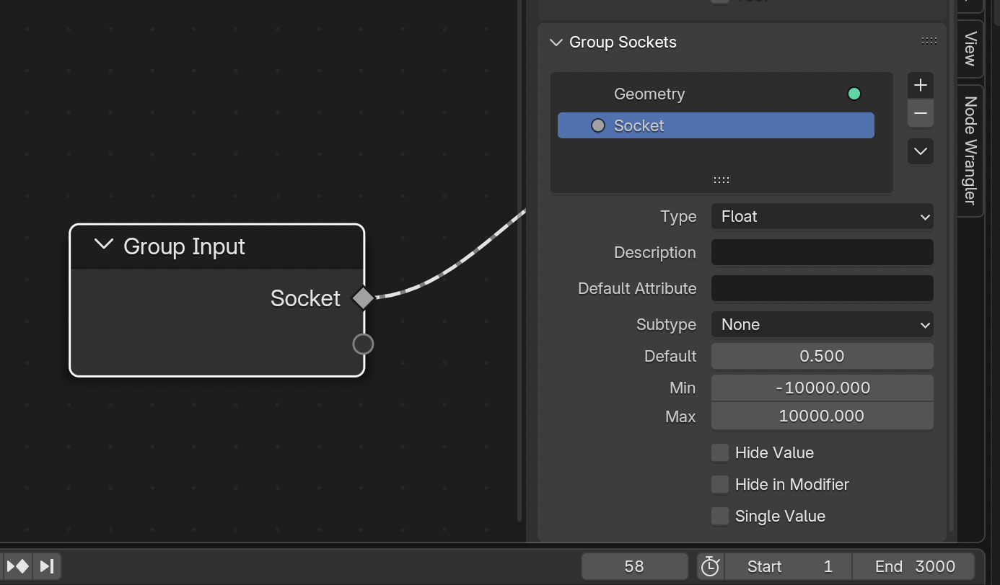

# geonodes


## Short

**Geometry Nodes** is a powerful **Blender** feature allowing the creation of amazing 3D models.
However, nodes trees can rapidly look like a _spaghetti plate_ difficult to understand and to maintain;
complex formulas are not easy to build; and debugging can be a headache.<br>

> The purpose of **_geonodes_** is to to create geometry nodes with python scripts.<br>

You keep the full power of Blender _Geometry Nodes_ but with the elegance of Python.

## Table of contents

- [Better a demo than long words](#better-a-demo-than-long-words)
- [Installation](#installation)
- [API reference](doc/index.md)
- [Demos](/demos.md)
- [Tutorial](#tutorial)

## Better a demo than long words

The following script creates a surface from a grid by computing
`z = sin(d)/d` where `d=sqrt(x^2 + y^2)` is the vertex distance to the center.


```python
from geonodes import *

# Create the Geometry Nodes named "Hello World"

with GeoNodes("Hello World"):
    
    height = 3
    omega  = 2

    # The surface is basically a grid 20 x 20 with a resolution 200 x 200
    grid = Mesh.Grid(vertices_x=200, vertices_y=200, size_x=20, size_y=20)
    

    # z is computed using gnmath library and operators as in pure python
    with Layout("Computing the wave"):
        pos = nd.position
        distance = gnmath.sqrt(pos.x**2 + pos.y**2)
        z = height*gnmath.sin(distance*omega)/distance

    # Let's change the z coordinate of our vertices
    with Layout("Point offset and smoothness"):
        grid.offset = (0, 0, z)
        grid.faces.smooth = True

    # We are done: plugging the deformed grid as the modified geometry
    grid.out()
```

The generated nodes are shown below:


## Installation

**geonodes** is a python package. To install it, copy the package folder **geonodes** in `scripts/modules`.

The Blender `scripts` folder is defined in Blender preferences, see: [Blender File Paths settings](https://docs.blender.org/manual/en/latest/editors/preferences/file_paths.html).

> Note that **geonodes** is a python module, not an Blender addon

After the install, the Blender scripts hierarchy should look like:
```
.../scripts/
       modules/
           geonodes/
               __init__.py
               core
               demos
               ...
```

To make the module available in your script, use `import` in your script:

```python
from geonodes import *
```

## Scripting nodes overview

All nodes belong to a tree. Two tree types are available:
- `GeoNodes` : [Geometry Nodes](docs/GeoNodes/GeoNodesTree.md)
- `ShaderNodes` : [Shader Nodes](docs/Shader/ShaderTree.md)

# Tutorial

> [!IMPORTANT]
> Geometry Nodes modifiers and groups scripted by **geonodes** don't overwrite existing **modifier** or **groups**.

> [!CAUTION]
> But shaders scripted by **geonodes** can overwrite an existing material.

## Prerequisites

To get the maximum benefit of **GeoNodes**, you must be familiar with both **python** and Blender **Geometry Nodes**.

## How it works

Each _Geometry Nodes_ output socket is wrapped by a class:
- A **Float** instance keeps a reference to an output socket of type _VALUE_
- A **Geometry** instance keeps a reference to an output socket of type _GEOMETRY_

_Geometry Nodes_ are methods, functions or operators working on the **GeoNodes** classes.
The arguments of a method are connected to the _input sockets_ of the node.
The method returns a class refering to one of its output socket, or, rarely, to the node itself.

``` python
from geonodes import *

with GeoNodes("Doc Socket Init"):

    # Get the Group Input geometry
    geometry = Geometry()

    # Plug the geometry to the Group output node
    geometry.out()

    # Create sockets from their node primitives
    with Layout("Primitives"):
        i = Integer(123)
        f = Float(3.14)
        s = String("A string")
        b = Boolean(True)
        v = Vector((1, 2, 3))
        red = Color("Red")
        green = Color("#00FF00")
        blue = Color((0, 0, 1))
        r = Rotation((pi, pi, pi/2))

    # The key word argument name indicates the following are Group input sockets
    # The value is the default value
    i = Integer(123, name = "Integer")
    f = Float(3.14, name = "Float")
    s = String("A string", name = "String")
    b = Boolean(True, name = "Boolean")
    v = Vector((1, 2, 3), name = "Vector")
    red = Color("Red", name = "Color 0")
    green = Color("#00FF00", name = "Color 1")
    blue = Color((0, 0, 1), name = "Color 2")
    r = Rotation((pi, pi, pi/2), name = "Rotation")

    # If the initial value is a string, the value is a named attribute
    # Named Attribute 'Integer'
    with Layout("Named Attributes"):
        i = Integer("Integer")
        # Named Attribute 'Float'
        f = Float("Float")

    # Creating Geometries
    with Layout("Creating geometries"):
        cube = Mesh.Cube()
        curve = Curve.Spiral()
```

### Blender Setup

Create a new script in _Scripting_ tab in **Blender**. You can setup this tab in order to display:

- A _Text editor_ for python scripting
- A _3D Viewport_ to view the progress
- A _Python Console_ to dump variables
- A _Geometry Node Editor_ to view the generated nodes

Here after is an example of the recommanded setup:


### 'Do Nothing' Modifier

Copy / paste the following piece of code to check that everything is properly setup:

``` python
from geonodes import *

with GeoNodes("Do Nothing"):
    Geometry().out()
```

A Geometry Nodes modifier has been created with the name "Do Nothing". You can use it on any object.

> [!NOTE]
> All scripts are supposed to start with ``` from geonodes import * ```.
> Then, nodes must be created only in the sccope of **with** context.

All the code samples must be placed after the following lines:

``` python
from geonodes import *

with GeoNodes("Tutorial"):
    pass
```

## Modules and Classes

### 'gnmath' module

**gnmath** provides the mathematical functions, basically the operations performed by
_Math_, _Integer Math_, _Vector Math_ and _Boolean Math_ nodes.

Math functions are named after their standard name in python **math** module.

> [!NOTE]
> **Vector** functions having the same name as their **Float** equivalent are prefixed with the letter *v*
> **Integer** functions having the same name as their **Float** equivalent are prefixed with the letter *i*
> All bitwise **Integer** operations are prefixed with *bw_*

``` python
    with GeoNodes("Doc gnmath"):
        a = Float(1)
        b = gnmath.sin(a)
        
        # Add between two Floats
        c = gnmath.add(b, 7.5)

        i = Integer(123)
        # Greater Common Divisor exists only for Integers
        j = gnmath.gcd(i, 17) 
        
        # Add exists also for Floats
        k = gnmath.iadd(j, 7)
        
        u = Vector((1, 2, 3))
        # Cross product exists only for vectors
        v = gnmath.cross(u, (7, 8, 9))
        # Add axists also for Floats
        w = gnmath.vadd(v, (5, 6,7))

        # Bitwise functions
        j = gnmath.bw_and(i, 7)        
```

> [!NOTE]
> Similarly **Boolean** functions _and_, _or_ and _not_ are prefixed by the letter *b*

``` python
    a = Boolean(True)
    b = gnmath.xor(a, False)
    c = gnmath.band(b, False)
    d = gnmath.band(b, False)
```

> [!NOTE]
> Math functions are also available as methods and some of them as operators.

The following example gives the same result as the two previous ones:

``` python
    a = Float(1)
    b = a.sin()
    c = b + 7.5

    i = Integer(123)
    j = i.gcd(17) 
    k = j + 7
    
    u = Vector((1, 2, 3))
    v = u.cross((7, 8, 9))
    w = v + (5, 6,7)
    
    
    a = Boolean(True)
    b = a.xor(False)
    # and operator is implemented with & 
    c = b & False
    # or operator is implemented with |
    d = b | False
```

### 'nd' Class

**nd** class (shortcut for **nodes**) exposes all the nodes as class methods.
This class is particuliarly usefull for input nodes such as _Position_ or _Radius_:

``` python
cube = Mesh.Cube() # or nd.cube()
new_pos = nd.position + (1, 2, 3)
cube.set_position(new_pos)
```

### Data Classes

Each **Geometry Nodes** socket type is wrapped in a dedicated class. The available classes are the following:

- **Basic sockets**
  - Attributes : Boolean, Integer, Float, Vector, Color, Rotation, Matrix,
  - String
- **Blender Resources**
  - Material, Object, Texture, Collection, Image
- **Geometry**
  - Geometry
  - Geometry subclasses : Mesh, Curve, GreasePencil, Cloud, Instances, Volume
- **Special**
  - Menu, Closure, Bundle

Blender **Nodes** are implemented as methods, properties and operators working on these classes.
For instance, if `a` and `b` are two **Floats**, the script `a + b` will generate a **Math** node with
operation _ADD_. The result of this operation is the **Output Socket** of the node.

### Domains

Geometry classes have one or several _Domain_ attributes following **Blender** data structure.
The domains are the following:
- **Mesh**
  - points
  - faces
  - edges
  - corners
- **Curve**
  - points
  - splines
- **GreasePencil**
  - layers 
- **Cloud**
  - points
- **Instances**
  - insts
- **Volume**

The _Domain_ attribute is used in nodes having a _Domain_ parameter. In the following example,
the node '_Store Named Attribute_' is setup with the domain calling the method:

``` python
      # Create a Cube
      mesh = Mesh.Cube()

      # Store on domain POINT
      mesh.points.store_named_attribute("Point Value", 0.)

      # Store on domain FACE
      mesh.faces.store_named_attribute("Face Value", 0.)
```

> [!NOTE]
> A **Domain** is never instanced directly, it is always initialized as a property of a Geometry Class.

### Operators

Python operators can be used to operate on data, for instance:

``` python
# Float operators
a = Float(10)
c = a*pi # Math node, operation 'MULTIPLY'
c += 1 # Math node, operation 'ADD'
ok = a <= c # Compare node, operation 'LESS_EQUAL'

# Integer operators
a = Integer(10)
c = a*42 # Operation between two Integers : Integer Math node is used
c += 1 # Integer Math node, operation 'ADD'
d = -c # Integer Math node, operation 'NEGATE'

# Bitwise operators
a = Integer(1) << 3
a |= Integer(7) & 1

# Vector operators
u = Vector((1, 2, 3))
v = u + (7, 8, 9) # Vector Math node, operation 'ADD'
w = u*3 # Vector Math node, operation 'SCALE'

# Boolean operators
b = Boolean(True)
c = b | False # Boolean Math node, operation 'OR'

# String operators
s = String("A string")
s += ": this is something added. "
s += String(" ") * ("This", "is", "a", String("sentence."))

# Join Geometry
geo = Geometry() # Input geometry
geo += Mesh.Cube(), Curve.Spiral() # Join with two other geometries

# Mesh boolean
cube = Mesh.Cube()
ico  = Mesh.IcoSphere(radius=.8)

mesh = cube - ico # Difference
mesh = cube * ico # Union
mesh = cube / ico # Intersect
```

> [!NOTE]
> Python _bool_ operators _or_, _and_ and _not_ don't apply on **Boolean** class, use their binary
> equivalent instead : |, & and -.

## Naming Conventions

When using ***geonodes***, a question rapidly arises: ***What is the name of the method which implements the Node I want ?***

Naming conventions are used to easily answer to this question.

> [!IMPORTANT]
> In addition to the rules below, you can use the button ***[Node Help]*** in the right _Tool_ panel in the ***Geometry Nodes***
> editor. This button generates the implementations of the selected nodes into a script named 'Node Help'.



### Node names

Naming conventions are such that method names can be easily deduced from the node name.

1. **RULE 1** : method names are built from the name of the node using the _snake_case_ convention:
  - _Set Material_ : **set_material**
  - _Store Named Attribute_ : **store_named_attribute**
2. **RULE 2** : when the node creates a new instance of the socket, it is implemented as a constructor **class method**
  using _CamelCase_ convention:
  - _Cube_ : constructor class method **Cube** of **Mesh**
  - _Combine XYZ_ : constructor class method **Combine** of **Vector**
  - _Bézier Segment_ : constructor class method **BezierSegment** of **Curve**
3. **RULE 3** : the name of the socket data type is omitted when redundant:
  - _Curve to Mesh_ : **Curve.to_mesh** method
  - _Mesh to Points_ : **Mesh.to_points** method
  - _Curve to Points_ : **Curve.to_points** method
  - _Volume to Points_ : **Volume.to_points** method
  - _Mesh Line_ : **Mesh.Line** constructor
  - _Curve Line_ : **Curve.Line** constructor
4. **RULE 4** : _Set xxx_ are implemented as properties when possible:
  - _Set Position_ : **position** and **offset** properties of geometry :
    ``` mesh.position = v ``` and ``` mesh.offset = v ```
  - _Set Radius_ : **radius** property of **Cloud.points** and **Curve.points** :
    ``` cloud.points.radius = v ``` and ``` curve.points.radius = v ```
  - _Set Tilt_ : **tilt** property of **Curve.points** : ``` curve.points.tilt = v ```
  - _Set Handle Type_ : **handle_type** property of **Curve.points** :
    ``` curve.points.handle_type = 'FREE' ```

The example below applies this set fo rules:

``` python
from geonodes import *

with GeoNodes("Method names"):

    # ----------------------------------------------------------------------------------------------------
    # RULE 2 : Constructor nodes in CamelCase
    #
    # Primitive nodes 'Cube', 'Points' and 'Bézier Segment' are
    # implemented as constructors of their Geometry

    cube = Mesh.Cube()
    cloud = Cloud.Points()
    bezier = Curve.BezierSegment()

    # ----------------------------------------------------------------------------------------------------
    # RULE 2 : Constructor nodes in CamelCase
    # RULE 3 : Omit class name
    #
    # Primitive nodes 'Mesh Line' and  'Curve Line' are implemented as
    # constructors of their Geometry, omitting the name of the class

    mesh_line = Mesh.Line()
    curve_line = Curve.Line()

    # ----------------------------------------------------------------------------------------------------
    # RULE 1 : Nodes name in snake_case
    #
    # Nodes 'Subdivision Surface', 'Triangulate', 'Set Position' are implemented as method
    # of their geometry using the snake_case version for their name

    cube.subdivision_surface()
    cube.triangulate()
    curve_line.set_position()

    # ----------------------------------------------------------------------------------------------------
    # RULE 1 : Nodes name in snake_case
    # RULE 3 : Omit class name
    #
    # In the snake_case version of the nodes 'Fill Curve', 'Deform Curves on Surface',
    # 'Subdivide Mesh' the name of the geometry is omitted

    mesh = Curve.Circle().fill()
    curve_line.resample(count=17)
    cube.subdivide()

    # ----------------------------------------------------------------------------------------------------
    # RULE 4 : setters and getters are properties
    #
    # The nodes 'Set Position' and 'Set Radius' are also implemented as properties

    mesh.position += (1, 2, 3)
    mesh.offset = (1, 2, 3)
    cloud.radius = 1.

    # Join the geometries and to output
    Geometry.Join(cube, cloud, bezier, mesh_line, curve_line, mesh).out()
```

### Geometry or Domains methods

Blender _Geometry Nodes_ exposes one single _Geometry_ type. On the other hand, **GeoNodes** provides
one class per geometry type : **Mesh**, **Curve**, **GreasePencil**, **Cloud**, **Instances**, **Volume** which are
subclasses of the generic **Geometry** class.

Nodes are implemented on their geometry classes:
- _Interpolate Curves_, _Resample Curve_, _Reverse Curve_ : implemented only on **Curve** class
- _Extrude Mesh_, _Flip Faces_, _Mesh Boolean_ : implemented only on **Mesh** class

Nodes needing a _Domain_ parameter are implemented on **Domain**, not **Geometry** :
- _Store Named Attribute_ : implemented on all domains
- _Extrude Mesh_ : implemented on **Mesh.points**, **Mesh.edges** and **Mesh.faces**
- _For Each Element_ : implemented on all domains

### Node sockets and parameters

To be fully configured, a node also needs values for its parameters.
The method arguments provides the required initial values.

The following conventions are used:

1. **RULE A** : arguments for sockets are built as the _snake_case_ version of their name:
  - _Value_ socket : **value**
  - _Geometry_ socket : **geometry**
  - _Instance Index_ socket : **instance_index**
2. **RULE B** : sockets are given in their order in the node. The parameters come after:
  - `float.map_range(0, 1, 10, 20)`  is equivalent to `float.map_range(from_min=0, from_max=1, ...)`
2. **RULE C** : _Selection_ socket is omitted and is passed as item index of **Geometry**
  - Don't write `mesh.set_id(selection=sel, ...)` but write instead `mesh[selection].set_id(...)`
3. **RULE D** : arguments for parameters use the python parameter name:
  - Node _Volume to Mesh_ has the parameter _resolution_mode_ : `mesh = vol.to_mesh(..., resolution_mode='GRID')`
4. **RULE E** : _domain_ parameter is omitted, it is taken from the calling domain:
  - Don't write `mesh.store_named_attribute(domain='FACE')` but write instead `mesh.faces.store_named_attribute()`
5. **RULE F** : _data_type_ parameter is omitted, it is deduced from the attribute type:
  - Don't write `sphere.sample_uv_surface(value=a, data_type='VECTOR')` but simply write
    `sphere.sample_uv_surface(a)
6. **RULE G** : nodes having a _mode_ like parameter are implemented once per possible value:
  - You can write `mesh.raycast(mapping='INTERPOLATED')` or alternatively `mesh.raycast_interpolated()`

> [!NOTE]
> Use the button ***[Node Help]*** in the right _Tool_ panel in the ***Geometry Nodes***
> editor to see all the methods which implement the selected nodes.


``` python
from geonodes import *

with GeoNodes("Argument names"):

    # ----------------------------------------------------------------------------------------------------
    # RULE A : socket arguments in snake_case

    sphere = Mesh.UVSphere(segments=16, rings=12, radius=1.)
    sphere.merge_by_distance(distance=.1)

    # ----------------------------------------------------------------------------------------------------
    # RULE B : sockets ordered as in the node, parameters are placed after

    sphere.merge_by_distance(distance=.1, mode='All')

    # ----------------------------------------------------------------------------------------------------
    # RULE C : Selection socket is set by item index
    #
    # Don't write:
    # sphere.set_position(selection=nd.index < 5, position=(1, 2, 3))

    sphere[nd.index < 5].set_position(position=(1, 2, 3))

    # ----------------------------------------------------------------------------------------------------
    # RULE D : parameter arguments take the parameter name
    #
    # Node 'Merge by Distance' owns a parameter named 'mode'

    sphere.merge_by_distance(mode='All')

    # ----------------------------------------------------------------------------------------------------
    # RULE E : domain parameter is taken from the calling domain
    #
    # Don't write:
    # sphere.set_shade_smooth(shade_smooth=True, domain='FACE')

    sphere.faces.set_shade_smooth(True)

    # ----------------------------------------------------------------------------------------------------
    # RULE F : data_type parameter is omitted, it is deduced from the argument type
    #
    # Don't write
    # b = sphere.sample_uv_surface(value=a, data_type='VECTOR')
    # data_type will be deduced from the type of variable a

    a = Vector()
    b = sphere.sample_uv_surface(value=a)

    # ----------------------------------------------------------------------------------------------------
    # RULE G : nodes having a _mode_ like parameter are implemented once per possible value
    
    # Mix Color
    col1, col2 = Color(), Color()
    
    # You can mix using the factor_mode parameter
    col = col1.mix(col2, factor_mode='UNIFORM')
    
    # You can alternatively used the methods suffixed by the mode
    col = col1.mix_darken(col2)
    col = col1.mix_multiply(col2)
    col = col1.mix_burn(col2)

    sphere.out()   
```

### Returned values

The general rule is that the methods return the first output socket of the node.

When the node has other output sockets, they can be accessed in two ways:
- using the **node** property of the returned socket: ``` a = socket.node.xxx ```
- or using the **peer sockets naming convention** which exposes peer output sockets
  as properties of the socket itself. In that case, if the name of the peer output
  socket interfers with another socket property, you can suffix the name with '_'.

The example below illustrates how to access output sockets:

``` python
from geonodes import *

with GeoNodes("Returned Values"):

    # ---------------------------------------------------------------------------
    # Simple example
    # ---------------------------------------------------------------------------

    #  Node 'Cube' returns two output sockets:
    # - Mesh
    # - UV Map
    # The returned value has a property named uv_map_

    cube = Mesh.Cube()
    
    # The following lines are equivalent
    uv_map = cube.node.uv_map
    uv_map = cube.uv_map

    # ---------------------------------------------------------------------------
    # Reading info
    # ---------------------------------------------------------------------------
    
    # The returned socket is the first one: point_count
    # Let's name it info for the sake of clarity
    info = cube.domain_size()

    # The other sockets can be read
    face_count = info.face_count
    edge_count = info.edge_count

    # Peer sockets can be read from any socket
    point_count = face_count.point_count
    # The two sockets wrap the same blender socket
    assert info._bsocket == point_count._bsocket

    # ---------------------------------------------------------------------------
    # Names collision
    # ---------------------------------------------------------------------------

    # The returned socket is the first one : 'Transform'
    # Let's name if info for the ssake of clarity
    transfo = nd.self_object.info()

    # Location peer socket
    loc = transfo.location

    # But rotation and scale are properties of Transformation class
    rot0 = transfo.rotation # rotation property of transfo

    # To read the peer socket, we need to suffix the name with _
    rot1 = transfo.rotation_
    assert rot0._bsocket != rot1._bsocket

    # ---------------------------------------------------------------------------
    # Example
    # ---------------------------------------------------------------------------

    #  Node 'Extrude Mesh' returns three output sockets:
    # - Mesh
    # - Top
    # - Side

    ico = Mesh.IcoSphere(subdivisions=2)

    # Extrude 30% of the faces
    ico.faces[Boolean.Random(probability=.3)].extrude(offset_scale=.4)

    # Duplicate extruded faces with a 0 scale extrusion
    ico.faces[ico.top_].extrude(offset_scale=0)

    # --- ico.top_ is needed twice, let's use an intermediary variable

    top = ico.top
    ico.faces[top].scale(scale=.5)

    # Another extrusion
    ico.faces[top].extrude(offset_scale=1)

    # --- Let's now dig the sides

    ico.faces[ico.side].extrude(offset_scale=0)
    top = ico.top
    ico.faces[top].scale(.8)
    ico.faces[top].extrude(offset_scale=-.01)

    # Output
    (ico + cube.set_position(offset=(5, 0, 0))).out()                    
```

## Class instantiation and Group Inputs

### Basic classes

Basically the **GeoNodes** classes are instantiated using the default constructor.
The optional **name** argument is used to create a Group Input socket.

See the examples in [How it works](#how_it_works)

Additional parameters can be passed depending on the type of input:
- ***tip*** for description
- ***default_attribute***
- ***subtype***
- ***min*** and ***max***
- ***hide_value***
- ***hide_in_modifier***
- ***single_value***



Rather than giving the subtype as a parameter, you can use the dedicated constructors
as shown below:
b types can be defined by using dedicated constructor as shown below:

``` python
# An integer between 2 and 10
resolution = Integer(2, "Resolution", min=2, max=10, tip="Mesh resolution", single_value=True)

# A float factor between 0 and 1
factor = Float.Factor(.5, "Factor", 0, 1, "Modification factor")
```

### Forward input

The special class ***Input** can be used as function argument to get the argument value from Group input as shown below:

``` python
with GeoNodes("Doc Input"):

    # ---------------------------------------------------------------------------
    # Initial creation
    # ---------------------------------------------------------------------------

    # Node input sockets can be created first to make clear the interface
    # of the node

    # ::::: Node inputs

    height = Float(3., "Height", 0, 10)

    with Panel("Helix Params"):
        resol   = Integer(12, "Resolution", 5, 100)
        rots    = Float(2, "Rotations", 0.1, 10)
        radius  = Float(1., "Radius", 0.01, 2)

    # ::::: End of input

    helix = Curve.Spiral(resolution=resol, rotations=rots, start_radius=radius, end_radius=radius,height=height)

    # ---------------------------------------------------------------------------
    # Using Inputs
    # ---------------------------------------------------------------------------

    # Input special socket creates a socket of the proper and name and type
    # In the following exemples, Group Input sockets will be automatically
    # created for each socket fed by Input()

    with Panel("Cube Params"):
        cube = Mesh.Cube(size=Input(), vertices_x=Input(), vertices_y=Input(), vertices_z=2)

    # ---------------------------------------------------------------------------
    # Linking several sockets
    # ---------------------------------------------------------------------------

    # Use the node method link_inputs to create input sockets without
    # having to list them
    # Use include and exclude argument to refine the links

    spiral = Curve.Spiral()
    # Link all the inputs but the height
    spiral.node.link_inputs(None, "Spiral", exclude=["Height"])
    # The height is fixed
    spiral.height = Float.Input("Height")

    Geometry.join(helix, spiral, cube).out()
```


#### Panels

Inputs can be placed into a panel in two ways:
- Using the ***Panel*** class in a _with_ context block
- Using the panel argument when initializing the input

``` python
from geonodes import *

with GeoNodes("Panels"):
    
    # Create two options in a panel named Options

    with Panel("Options"):
        shade_smooth = Boolean(True, "Shade Smooth")
        subdiv = Integer(1, "Subdivision", 0, 5)
        
    # Create a third value in this panel using the argument syntax
    change_mat = Boolean(True, "Change Material", panel="Options")

    # Methods can be combined
    with Panel("Options"):
        count = Integer(5, "Count", 1, 10, panel="Sub options")

    # The panels can be chained with > char
    Factor = Float.Factor(.5, "Factor", 0, 1, panel="Options > Sub options")
```

### Blender resources

Blender resources (**Object**, **Collection**, **Material**, **Image**, **Texture**) are refered
either using their blender python value or simply by their name as shown below:

``` python
# Default cube
bl_cube = bpy.data.objects.get("Cube")
cube_obj = Object(bl_cube, name="Your object")

# The following line is equivalent
cube_obj = Object("Cube", name="Your object")
```
### Geometries

**Geometry** and its subclasses are instancied through their constuctors (`Mesh.Cube` or `Curve.Spiral` for instance).
When instancied directly, a new Group Input socket is created.
If the name is not passed as key word argument, the default name is used.

``` python
import bpy
from geonodes import *

with GeoNodes("Creating Geometries"):

    # Geometry group input node is used if it exists,
    # Otherwise a group input node named 'Mesh' is created
    mesh = Mesh()

    # Node 'Cube'
    cube = Mesh.Cube()

    # In Groups, other geometries can be created
    curve = Curve(name="Curve")

    # Gemetries can be converted
    spiral = Curve.Spiral().to_mesh(profile_curve=Curve.Circle(radius=.1))

    # Volume
    cube_vol = Volume.Cube()
    
    (cube + mesh + curve + spiral + cube_vol).out()
```

### Outing to sockets

As described, the standard syntax to provide values to input sockets of a node, is to use
argument of a function:

``` python
    # Create a circle
    profile = Curve.Circle(radius=.1)

    # Use this profile as value for 'Profile Curve' socket of node 'Curve to Mesh'
    spiral = Curve.Spiral().to_mesh(profile_curve=profile)

    # Resulting mesh as group output
    spiral.out()
```

Another way to set values to input socket is to temporarily set the node as current
output node, replacing the the Group Output Node. This is done using the ***with*** context
as shown below.

``` python
    # Create a circle
    profile = Curve.Circle(radius=.1)

    # Use this profile as value for 'Profile Curve' socket of node 'Curve to Mesh'
    with Curve.Spiral().to_mesh() as spiral:
        profile.out("Profile Curve)

    # Resulting mesh as group output
    spiral.out()
```

This alternative can be easier to read for complex nodes. It can be used with menu-like nodes:

``` python
from geonodes import *

with GeoNodes("Menu Demo") as tree:
    
    # ----------------------------------------------------------------------------------------------------
    # Geometries are provided as method arguments
    # ----------------------------------------------------------------------------------------------------
    
    simple = Geometry().menu_switch("Input", {
        "Cube": Mesh.Cube(),
        "Ico": Mesh.IcoSphere(),
        "Cone": Mesh.Cone(), 
        },
        menu=Input("Simple Mesh", default="Ico"), 
        )

    # ----------------------------------------------------------------------------------------------------
    # Here, the geometries are successfully adeed, making the source code clearer
    # ----------------------------------------------------------------------------------------------------
        
    profile = Curve.Circle(radius=.1)
        
    with Geometry.MenuSwitch() as from_curve:
        simple.out("Simple Mesh")
        
    with from_curve:
        Curve.Spiral().to_mesh(profile_curve=profile).out("Spiral")
        
    with from_curve:
        Curve.Circle().to_mesh(profile_curve=profile).out("Circle")
        
    # The best is to set the menu socket once the inputs are completed
    from_curve.node.menu = Input("From Curve", default="Simple Mesh")
    
    # ----------------------------------------------------------------------------------------------------
    # Same for Index switch
    # ----------------------------------------------------------------------------------------------------

    # Each out method feeding an Index Switch node will add an entry
    
    curve = Curve.IndexSwitch(index=Input("Curve Index"))
    with curve:
        Curve.Spiral().out()
        
    with curve:
        Curve.Circle().out()
        
    with curve:
        Curve.Quadrilateral().out()
        
    # ----------------------------------------------------------------------------------------------------
    # Switch
    # ----------------------------------------------------------------------------------------------------
    
    curve.switch(Input("Mesh/Curve"), from_curve).out()
```

## Group Outputs

To plug a variable to the Group Output, simply call the method **out** with the name argument as shown below:

``` python
with GeoNodes("Group outputs"):

    cube = Mesh.Cube()
    cube.out()

    # The keyword argument name can be used
    Integer(10).out(name="The 10 int")
```

## Paired zones

### Closure

The two **Closure** zone nodes are created when instantiating a Closure class.
To create the nodes, use the ***with*** context:

``` python
    # Create a closure adding 1 to the input
    with Closure() as cl:
        a = Float(1.0, "Float")
        a += 1
        a.out("Plus One")
```

The closure evaluation is made using the **evaluate** method. This method
takes a **signature** argument which is a dict describing the closure inputs and outputs.

``` python
with GeoNodes("Closure"):

    # Create a closure adding to two entries 
    with Closure() as cl0:
        a = Float(1.0, "A")
        b = Float(1.0, "B")
        (a + b).out("Sum")

    # If evaluated immediately, the signature is read from the previous nodes.
    cl0.evaluate().out(panel = "Separate 0")

    # We can get the closure signature for future use
    sig = cl0.get_signature()

    # We can evaluate a closure using this signature
    cl1 = Closure(name="Closure 1")
    cl1.evaluate(signature=sig).out(panel="Signature 1")

    # We can evaluate another closure using a manual signature:
    # a couple of dicts for input and output
    sig = (
        {'A': 'Float', 'B': 'Float'},
        {'Sum': 'Float'})

    cl2 = Closure(name="Closure 2")
    cl2.evaluate(signature=sig).out(panel="Signature 2")

    # Selecting a closure
    # Note that since the closure coming from MenuSwitch
    # doesn't come from a zone, the ***with*** context relates
    # to the 'Menu Switch', not the zone (compare to the creation of cl0).
    
    with Closure.MenuSwitch() as cl:
        cl0.out("Closure 0")
        cl1.out("Closure 1")
        cl2.out("Closure 2")

    cl.node.menu = Input(default_value="Closure 0")

    cl.out()
```

### Loops

To make the code as clear and pythonistic as possible, the Geometry nodes loop zones
**Simulation**, **Repeat** and **For Each Element** are implemented as python iterator.

- **Simulation** and **Repeat** : Socket iterator
- **For Each Element** : Domain iterator

``` python
    mesh = Mesh()

    for simul in mesh.simulation():
        # Nodes are created in the Simulation zone
        pass

    for rep in mesh.repeat(10):
        # Nodes are created in the Repeat zone
        pass

    for feel in mesh.points.for_each():
        # nodes are created in the For Each Element zone
        pass
```

The object returned by the iterator exposes the input and output sockets.

> [!CAUTION]
> Within the ***for*** iteration, the **ouput sockets** come from **input node** and the
> **input sockets** are those of the **output node**.
> Outside the ***for***, the **ouput sockets** come from **output node** and the
> **input sockets** are those of the **input node**.

> [!NOTE]
> Within the ***for*** iteration, the geometry is the geometry to compute. The for iteration must
> end with `xxx.out()` where `xxx` is the name of the Geometry class.
> Outside the ***for*** iteration, the geometry has jumped to the zone output node and cand be used
> to continue.

``` python
with GeoNodes("Simulation"):
    
    # Two input parameters
    count  = Integer(10, "Count", 1, 100)
    radius = Float(.1, "Radius", 0, 2)
    
    # Cloud of points
    cloud = Cloud.Points(count=count, position=Vector.Random((-5, -5, 5), (5, 5, 15)))
    
    # Gravity simulation with initial random speed
    for sim in cloud.simulation(Speed=Vector.Random(-1, 1)):

        # cloud is now the Simulation Input Node output socket
        
        # One speed per point
        speed = cloud.points.capture_attribute(sim.speed)
        
        # Increment the posiion
        cloud.position += speed*sim.delta_time
        
        # Acceleration
        speed += sim.delta_time*(0, 0, -9.81)
        
        # Bounce onfloor
        x, y, z = speed.xyz
        speed = speed.switch(nd.position.z.less_than(radius), (.9*x, .9*y, -.7*z))
        
        # Next iteration
        speed.out("Speed")
        
        # Connect the simulated geometry to output node
        # Within for loop, out refers to Zone Output Node
        cloud.out()

    # cloud is now the output socket of the output zone
        
    mesh = Mesh.Grid(20, 20)
    mesh += cloud.instance_on(instance=Mesh.UVSphere(radius=radius))
        
    # Outside de the loop, out refers to Group Output Node
    mesh.out()
 ```


Zones are made of two linked nodes: one input node and one output node.
In Blender 4.3, three zones exist:
- Simulation zone: class **Simulation**
- Repeat zone : class **Repeat**
- For Each Element zone : class **ForEachElement** or domain method **for_each**

They are all subclasses of **Zone** class.

Zones are initialized by dynamically creating sockets. Sockets can be created:
- either with a dict
- or with keyword arguments

The sockets types are deduced from the python variable types. If the passed value is `None`, its is
considered as a null **Geometry**.

The example below creates a _Repeat_ zone with 4 variables of types **Geometry**, **Geometry**,
**Vector** and **Integer**:

``` python
with Repeat(geometry=Geometry(), curve=None, position=Vector(), index=1, iterations=10) as rep:
    pass
```

Or alternatively with `sockets` dict argument:
``` python
with Repeat(sockets={'Geometry': Geometry(), 'Curve': None, 'Position': Vector(), 'index': 1}, iterations=10) as rep:
    pass
```

### Access to the zones sockets

The zone sockets are initialized as properties of the **Zone** class.
They can be get and set using the standard python syntax, for instance `rep.position` refers to
the socket named **position** in the example above.

Since a zone is composed of two nodes, each one replicating the same sockets as inputs and outputs,
socket names are replicated 4 times. Accessing the zone properties depends upon the access is made
**inside** or **outside** the **with** block and if the access is **set** or **get**:

- **INSIDE** the **with** block:
  - **getting** the property : read the output socket of the first node
  - **setting** the property : write the input socket of the second node
- **OUTSIDE** the **with** block:
  - **getting** the property : read the ouput socket of the second node
  - **setting** the property : raises an error (sockets are set at zone instantiation time)

Despite it is not that easy to describe, this produces an very natural way to create and work with zones.

> [&IMPORTANT]
> **ForEachElement** zone behaves diferrently : input sockets of the input node are not replicated in the
> output socket. On the other hand, the output nodes has two panels of sockets named **main** and **generated**.

The example below explodes a sphere:

``` python
from geonodes import *

with GeoNodes("Explosion"):

    mesh = Mesh.IcoSphere(subdivisions=3)
    cloud = mesh.faces.distribute_points(density=10)
    speed = 5*cloud.normal_ + Vector.Random(-.2, .2, seed=0)

    # Create a Simulation zone with two variables
    # - cloud : Cloud
    # - speed : Vector

    with Simulation(cloud=cloud, speed=speed) as sim:

        # INSIDE the simulation : getting is reading the first node

        speed = sim.speed

        speed = sim.cloud.points.capture(speed)
        sim.cloud.points.offset = speed*sim.delta_time

        # INSIDE the simulation : setting is writting the second node

        sim.speed = speed + (0, 0, -10*sim.delta_time)

    # OUTSIDE the simulation : getting is reading the second node

    cloud = sim.cloud

    # Done

    balls = cloud.points.instance_on(instance=Mesh.IcoSphere(radius=.1))

    balls.out()
```


## Groups and Modifiers

### Creating a Group

When creating a new tree, the argument **is_group** is used to specify to create a **group of nodes** rather
than a **modifier**:

``` python
with GeoNodes("A Function", is_group=True):

    a = Float(name="Value 1")
    b = Float(name="Value 2")

    (a + b).out("Sum")
```

This creates the following group:


### Calling a Group

Calling a group is made by instantiating a **Group** class.
The first parameter of the **Group** instantiation is the name of the _Group_ to call.
The sockets to plug th the input sockets of the group can be passed in two ways:
- as a dict
- as keyword arguments using their _snake_case_ name

The output sockets of the group are read as properties of the **Group** instance,
using their _snake_case_ name.


``` python
from geonodes import *

with GeoNodes("A Function", is_group=True):
    (Float(0, "Value 1") + Float(0, "Value 2")).out("Sum")

with GeoNodes("Call a Group"):

    a, b = 1, 2

    # ---------------------------------------------------------------------------
    # Standard method

    # dict syntax

    val1 = Group("A Function", {'Value 1': a, 'Value 2': b}).sum

    # snake_case syntax

    val2 = Group("A Function", value_1=a, value_2=b).sum

    # ---------------------------------------------------------------------------
    # Alternative method
    #
    # For big projects, one can prefer the python syntax
    # Class G makes it possible

    val3 = G.a_function(val1, val2)
    
    geo = Geometry()
    geo.offset = (val1, val2, val3)
    geo.out()    
```

## Named Attributes

Named attributes can be stored using `store_named_attribute` or its short version `store`. These methods
must be called on a domain, such as in `Mesh.points.store("A Named Int", 1)`.

One can also uses the named attribute property syntax which creates a named attribute for a property starting by underscore '_'
followed by a capital letter: `Mesh.points._A_Named_Int = 1` is equivalent to `Mesh.points.store("A Named Int", 1)`.

> [!IMPORTANT]
> To avoid names collision, the named attribute ***MUST*** start with a capital letter.
> Except the first one, underscore chars are replaced by spaces in the stored name.

Reading a named attribute is done using the class constructor `NamedAttribute`, or its short version `Named`.
For instance, reading a Vector named "Direction" is done with `Vector.Named("Direction")`.

One can even further shorten the syntax by instantating a new class with an attribute name rather than with a value:
`Vector("Direction")` is interpreted as `Vector.Named("Direction")`.

``` python
from geonodes import *

with GeoNodes("Named Attributes"):
    
    cube = Mesh.Cube()
    
    # ----- Storing a named attribute
    
    cube.points.store_named_attribute("Weight", 1.)
    # or the short name
    cube.points.store("Weight", 1.)
    # or using the named attribute property syntax
    # Note that the first letter is a capital
    cube.points._Weight = 1.
    
    # ----- Reading a named attribute    
    
    weight = nd.named_attribute("Weight", data_type='FLOAT')
    
    # A better way is to use a class constructor
    weight = Float.NamedAttribute("Weight")
    # or the short name
    weight = Float.Named("Weight")
    # or even shorter, using a string as constructor value
    weight = Float("Weight")
    
    # ----- When a named attribute has been created, the named attribute property syntax
    # can be used to read the attribute

    w = Float("Weight")
    # Can be replaced by the following line for the sake of code clarity, 
    w = cube.points._Weight
    w.out("Should be Weight")

    cube.points._Weight = Float("Weight") + 2
    # Can be written in a more pythonistic way
    cube.points._Weight += 2
``` 

# Shaders

**GeoNodes** can also be used to script shaders.

Creating _Shader Nodes_ is the same as creating _Geometry Nodes_, with the following differences:
- Use **ShaderNodes** rather that **GeoNodes**
- Use **snd** (for _Shader Nodes_) rather than **nd**
- **out** method takes the class type to select the proper socket between _Surface_, _Volume_, _Displacement_ and _Thickness_

> [!CAUTION]
> When instantianting a shader, the existing shader is deleted. You can loose a shader created directly in Blender.

``` python
from geonodes import *

with ShaderNodes("Surface Shader"):

    # ----- Principled BSDF

    ped = Shader.Principled(
        base_color = (.1, .2, .3),
        roughness = .2,
    )

    # ----- To surface output

    ped.out()

    # ----- Noise displacement

    noise = Texture.Noise()

    bump = snd.bump(height=noise)
    bump.out()

    # ----- Thickness

    a_float = Float(.1)

    a_float.out()

    # ----- AOV Output

    snd.aov_output(color=Color((.6, .7, .9)), value=pi, aov_name='Test')

with ShaderNodes("Volume Shader"):

    # ----- Principled BSDF

    ped = VolumeShader.Principled(
        color = (.1, .2, .3),
        density = .01,
    )

    # ----- To surface output

    ped.out()
```


