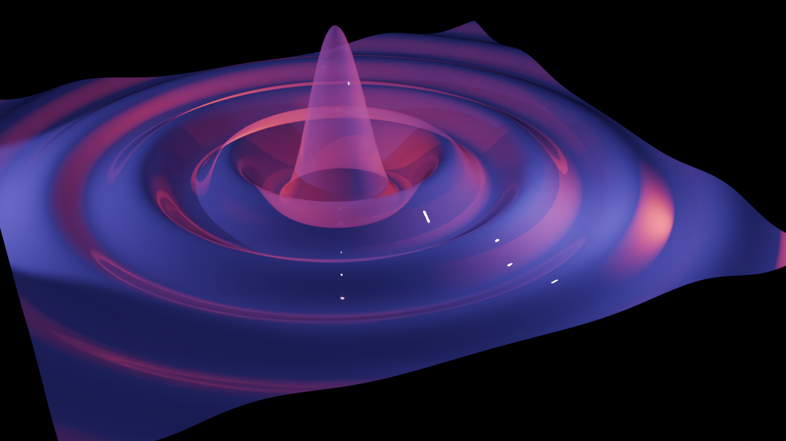
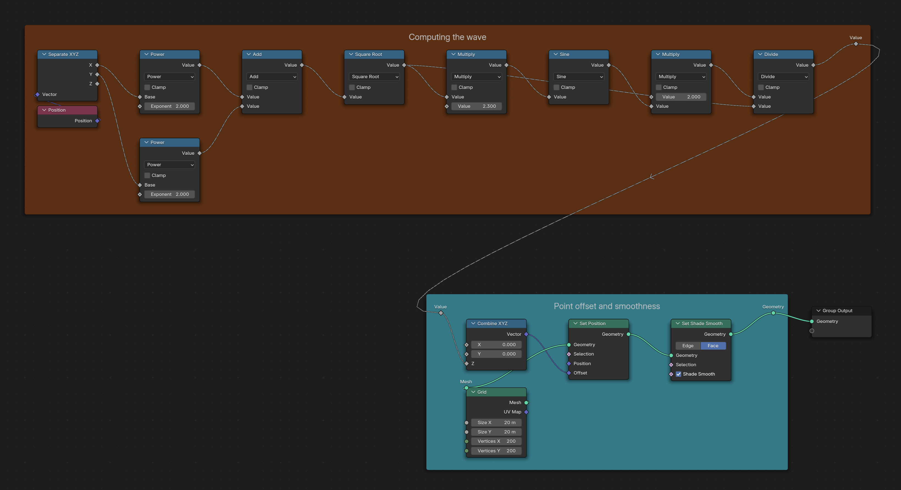

# geonodes


> Last supported Blender version : ***Blender V5.1***

**Geometry Nodes** is a powerful **Blender** feature allowing the creation of amazing 3D models.
However, nodes trees can rapidly look like a _spaghetti plate_ difficult to understand and to maintain;
complex formulas are not easy to build; and debugging can be a headache.<br>

> The purpose of **_geonodes_** is to to create geometry nodes with python scripts.<br>

You keep the full power of Blender _Geometry Nodes_ but with the elegance of Python.

## Further reading

- [Documentation](https://al1brn.github.io/geonodes/)
- [Overview](https://al1brn.github.io/geonodes/getting_started/overview.md)
- [Installation](https://al1brn.github.io/geonodes/getting_started/installation.md)
- [API reference](https://al1brn.github.io/geonodes/api/index.md)

## Better a demo than long words

The following script creates a surface from a grid by computing
`z = sin(d)/d` where `d=sqrt(x^2 + y^2)` is the vertex distance to the center.



```python
from geonodes import *

# Create the Geometry Nodes named "Hello World"

with GeoNodes("Hello World"):
    
    height = 3
    omega  = 2

    # The surface is basically a grid 20 x 20 with a resolution 200 x 200
    grid = Mesh.Grid(vertices_x=200, vertices_y=200, size_x=20, size_y=20)
    

    # z is computed using gnmath library and operators as in pure python
    with Layout("Computing the wave"):
        pos = nd.position
        distance = gnmath.sqrt(pos.x**2 + pos.y**2)
        z = height*gnmath.sin(distance*omega)/distance

    # Let's change the z coordinate of our vertices
    with Layout("Point offset and smoothness"):
        grid.offset = (0, 0, z)
        grid.faces.smooth = True

    # We are done: plugging the deformed grid as the modified geometry
    grid.out()
```

The generated nodes are shown below:



## ✨ Features

- Pythonic API for Geometry Nodes

    - Object oriented API

        - Sockets are classes
        - Nodes are methodds and propetries

    - Full node tree construction via code
    - Designed for readability and composability

- Support for:

  - Geometry Nodes and Shaders
  - Modidiers, Groups and Tools
  - Panels to build clean user interface
  - Layouts to group and comment your trees

