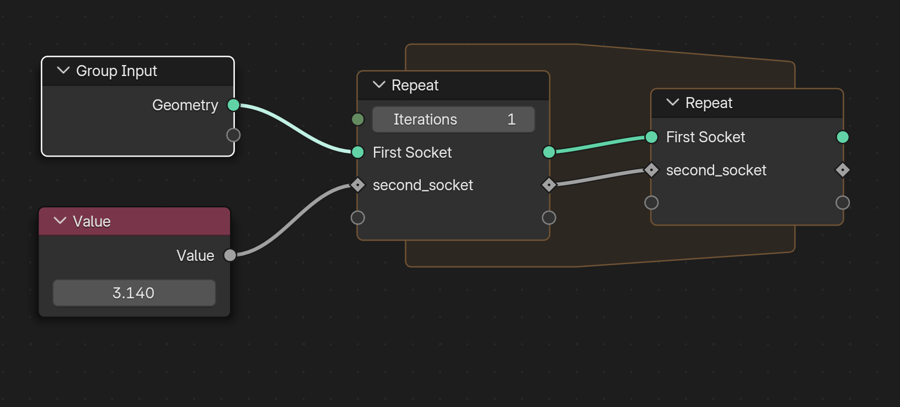

# Zone

``` python
Zone(/, *args, **kwargs)
```

Initialize self.  See help(type(self)) for accurate signature.

#### Arguments:
- **args**
- **kwargs**

## Content

- [init_zone](zone.md#init_zone)

## Methods


----------
### init_zone()

> method

``` python
init_zone(sockets={}, **snake_case_sockets)
```

> Two nodes zone

**Zone** is the root class for [Simulation](simulation.md#simulation), [Repeat](repeat.md#repeat) and [ForEachElement](foreachelement.md#foreachelement) zones.

#### With block

A **Zone** is intended to be used in a **with** block:

``` python
with Zone(...) as zone:
    ...
```

#### Sockets definition

The zone sockets can be defined in two ways:
- using the **sockets** dict argument
- using the **snake_case_sockets** key word arguments

``` python
# Create a zone with 2 sockets:
# - First Socket
# - second_socket
with Zone({"First Socket": Geometry()}, second_socket=Float(3.14)) as zone:
    ...
```



> [!NOTE]
> The sockets are created on the two nodes and, in both nodes, as input and output sockets.
> Hence, a single name correspond two 4 sockets:
> - input socket of the first node
> - output socket of the first node
> - input socket of the second node
> - output socket of the second node

#### Getting and setting zone sockets

Zone sockets are accessed through their **snake_case** name whatever the manner they have
been initialized:

``` python
with Zone({"First Socket": Geometry()}, second_socket=Float(3.14)) as zone:
    a = zone.first_socket
    b = zone.second_socket
```

Inside the **with** block:
- **getting** a socket: output socket of the first node
- **setting** a socket: input socket of the second node

Outside the **with** block:
- **getting** a socket: output socket of the second node
- **setting** a socket: Error

Even if it is not easy to describe, this is in fact quite straightforward:

``` python
with Repeat(geometry=None, index=0, iterations=10) as repeat_zone:

    # Value of the current index
    index = repeat_zone.index

    # ...

    # Update the index for next loop
    repeat_zone.index = index + 1

    # Incrementing is also valid
    repeat_zone.index += 1

# Outside the block, we have accees to the result of the loop
geo = repeat_zone.geometry
```

#### Arguments:
- **sockets** (_dict_ = {}) : sockets to create, string names
- **snake_case_sockets** : sockets to create, snake_case names

##### <sub>:arrow_right: [geonodes](index.md#geonodes) :black_small_square: [Zone](zone.md#zone) :black_small_square: [Content](zone.md#content) :black_small_square: [Methods](zone.md#methods)</sub>