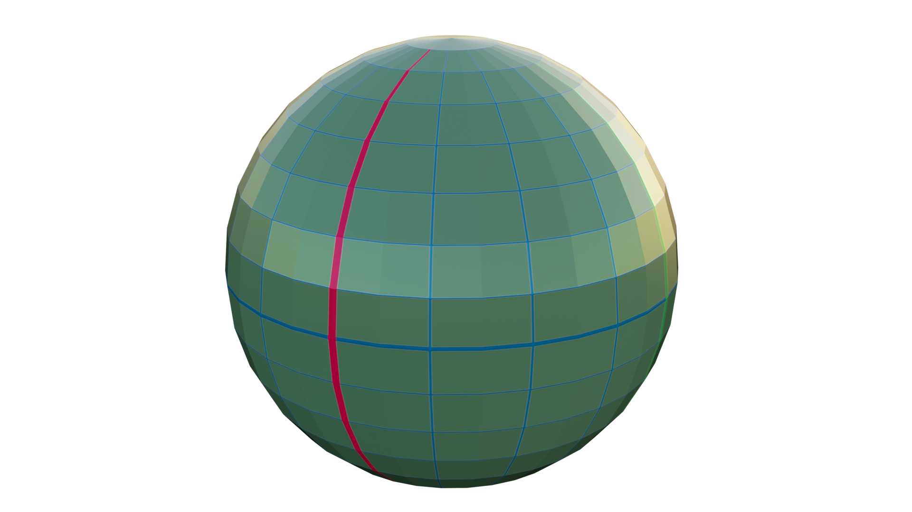
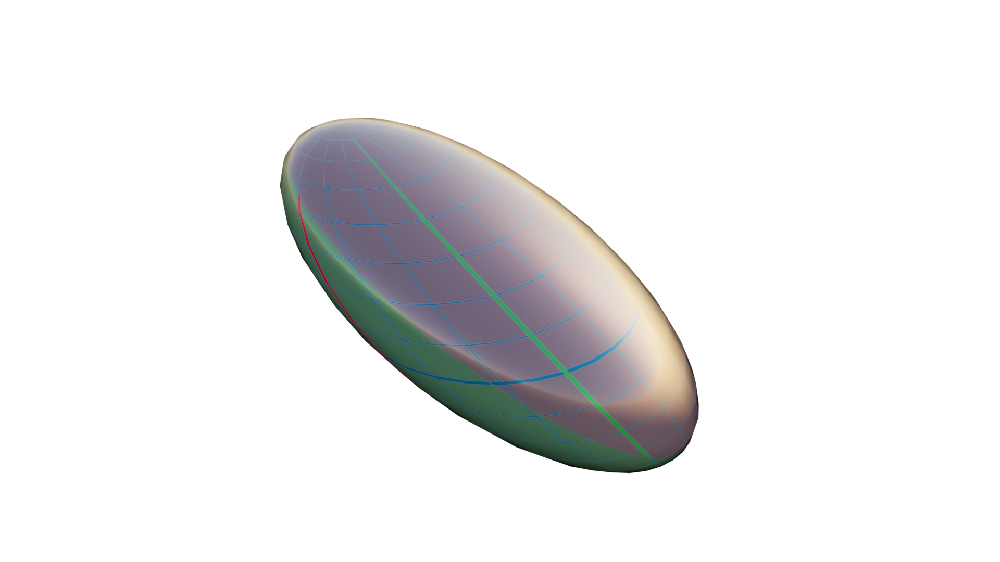

# The 4D Engine

> Compute 4D shapes Geometry Nodes scripted with **geonodes**.

## Overview

This project implements a 4D Engine to viualize 4D shapes in Blender by projecting them from 4D to 3D.

The architecture of the Engine is the following:
- A set of node groups perform the mathematical computations
- A set of Geometry Nodes modifiers can be stacked to build 4D objects and project them
- The last modifier to stack is "Projection"

> [!Note]
> All modifiers are prefixed by 4D, hence the actual name of the "Projection" modifier is "4D Projection".

For instance, to plunge a standard UV sphere into 4D, simply stack the two nodes:
- ***To 4D***
- ***Projection***

Applied to a sphere, the result of this transformation is:

The projection 4D -> 3D is driven by the Euler rotation of the object named "Projection".

For 
- One object named **Projection** controls the 4D to 3D projections direction (using its standard Euler rotation)
- 

Use **geonodes**, python is used to generate tree nodes modifiers performing 4D computations.
The 4D modifiers can be stacked to build more complex objects.

### Maths trees and modifiers

The 4D engine is made of two layers, the second layers using the first one for the actual computation:

- **Maths trees**: Utilities to perform the computation on 4D vertices.
- **Modifiers**: Trees with input and output geometries transforming the shapes.

The following image shows a stack of 4 modifiers to build an hypersphere:

- **4D Hypersphere:** Create 7 slices into the 4D space along the W axis
- **4D Rotate in hyperplane:** Rotate the shape in 4D space
- **4D Light:** Enlight the result with a 4D light
- **4D Projection:** Project the result into the 3D space

## The nodes trees

### Maths trees

- Projection
  - [Projection matrix](projection_matrix.md)
  - [Projection](projection.md)

- Normalization
  - [Length](length.md)
  - [Normalize](normalize.md)
  - [Normal basis](normal_basis.md)
  - [Cross](cross.md)
  - [Hyperplane](hyperplane.md)

- Rotation
  - [Rotate to hyperplane](rotate_to_hyperplane.md)
  - [Rotate from hyperplane](rotate_from_hyperplane.md)
  - [Rotate in hyperplane](rotate_in_hyperplane.md)
  - [Follow vector](follow_vector.md)
  - [W Plane rotation](w_plane_rotation.md)
  - [Rotation 2D](rotation_2d.md)

- Special
  - [Build along curve](build_along_curve.md)

### Modifiers trees

- Initiaiization / utilities
  - [To 4D](mod_to_4D.md)
  - [Add normals](mod_add_normals.md)
  - [Add tangents](mod_add_tangents.md)

- Projection
  - [Dot normal](mod_dot_normal.md)
  - [Projection](mod_projection.md)

- Rotation
  - [Rotate in hyperplane](mod_rotate_in_hyperplane.md)
  - [Rotation 2D](mod_rotation_2d.md)
  - [W Plane rotation](mod_w_plane_rotation.md)

- Objects
  - [Axis](mod_axis.md)
  - [Line](mod_line.md)
  - [Clifford torus](mod_clifford.md)
  - [Hypersphere](mod_hypersphere.md)

- Special
  - [Light](mod_light.md)
  - [Build along curve](mod_build_along_curve.md)

## Show case
### A sphere plunged in 4D

     
### An hypersphere made of 7 slices

### Clifford torus

### Cones along a circle

