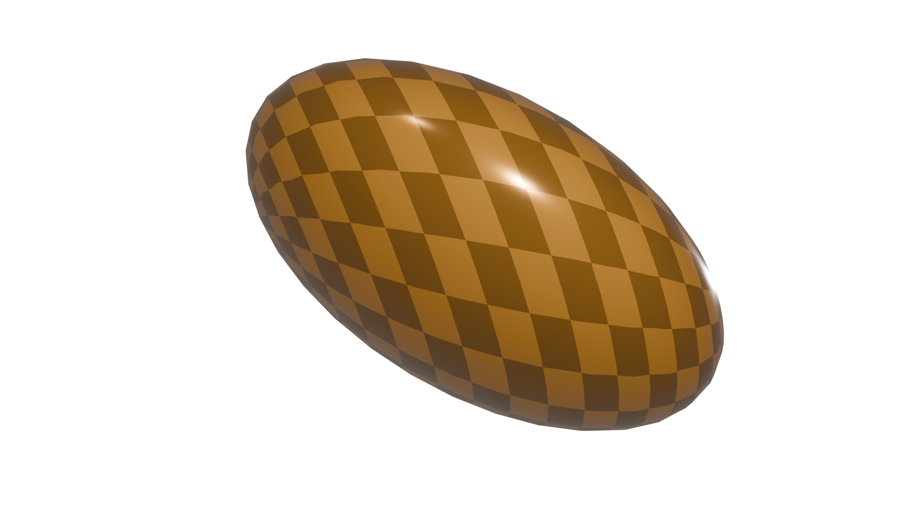
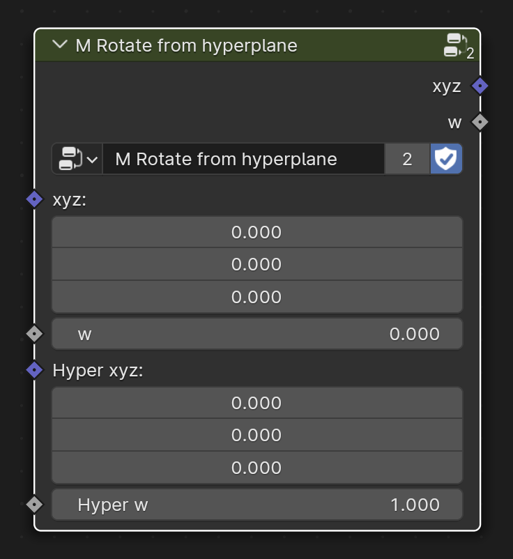

# The 4D Engine

> Compute 4D shapes Geometry Nodes scripted with **geonodes**.

## Overview

This project implements a 4D Engine to viualize 4D shapes in Blender by projecting them from 4D to 3D.

The architecture of the Engine is the following:
- A set of node groups perform the mathematical computations
- A set of Geometry Nodes modifiers can be stacked to build 4D objects and project them
- The last modifier to stack is "Projection"

> [!Note]
> This module makes an extensive use of prefix to provide some sorting in the numerous modiers.

For instance, to plunge a standard UV sphere into 4D, simply stack the two nodes:
- ***4D Plunge 3D Geometry*** : add a fourth component to the geometry
- ***4D Projection*** : projection de 4D shape into 3D

The node ***4D Projection*** generally terminates the stack of 4D modfiers.
In the exemple below, the modifier ***4D Rotation 4D*** is added to rotate the figure in front of the camera.


Applied to a sphere, the result of this transformation is:



The projection 4D -> 3D is driven by the Euler rotation of two objects named "Projection" and "Projection2":
- "Projection" : each Euler angle is the angle between each axis and the fourth W axis : X: XW, Y: YW, Z: ZW
- "Projection2" :  each Euler angle is the secondary rotation : X: YZ, Y: XZ, Z: XY

> [!Note]
> With the architecture, all the 4D objects are projected with the same parameters

## Building the engine

The modifiers are build by calling **build4D** method of the **geonodes** module:

``` python
import geonodes as gn

gn.build4D()
```

> [!Note]
> Once the modifiers are created, python is not needed anymore to play with the modifiers.
> Moddifiers can be adder either manually or with **geonodes** to create custom shapes.

## Conventions

The 4 dimensions of a 4-vector are stored in a couple (**Vector**, **Float**).
Input and output sockets are suffixed by:
- `V` for the vector part
- `w` for the float part

In the exemple below, the nodes group ***M Projection*** accepts a 4-vector as input and returns a 4-vector.


The `V` part is the geometry position, and the `w` fourth component is stored as named attribute "w".

## V4 Class

Computing needs to perform operations on 4-Vectors: dot product, normalization, addition, scale...
To make source code as clear as possible the 4D engine uses a specific class which is basically a couple (Vector, Float):

``` python
class V4:
    def __init__(self, V, w):
        
        # Get the current tree
        tree = GeoNodes.current_tree()
        
        # The arguments can be either a socket or a value
        if hasattr(V, 'bsocket'):
            self.V = V
        else:
            self.V = tree.Vector(V)
            
        if hasattr(w, 'bsocket'):
            self.w = w
        else:
            self.w = tree.value(w)
``` 


This class implement the basic operations, for instance dot product and addition (note the use of a layout
to group the created node in a color specific layout and make the result quite readable):

``` python
class V4:

    # ...

    def dot(self, other):
        with GeoNodes.current_tree().layout("Dot 4", V4_COL):
            return self.V.dot(other.V) + self.w*other.w
            
    # ...
    
    def __add__(self, other):
        with GeoNodes.current_tree().layout("V4 Add", V4_COL):
            return V4(self.V + other.V, self.w + other.w)
```

The `V4` class also implements initialization and outputing functions to ease its use.
For instance, the `Position`constructor loads the position and the "w" named attribute.
If can read these information directly from the geometry or sample it:

``` python
class V4:
    @classmethod
    def Position(cls, geo, sample_index=None):
        with GeoNodes.current_tree().layout("Get Position V4", V4_COL):
            if sample_index is None:
                return cls(geo.position, geo.named_float("w"))
            else:
                return cls(
                    geo.POINT.sample_index_vector(geo.position,         index=sample_index), 
                    geo.POINT.sample_index_float( geo.named_float("w"), index=sample_index))
```

A `V4` class can then be used to change to 4D coordinates of a shape:

``` python
class V4:
    def set_position(self, geo):
        # Need to sample w before setting the position because w can be computed
        # from the position (for instance after a rotation)
        # Changing the position would change w before it is written
        with GeoNodes.current_tree().layout("Set Position V4", V4_COL):
            w = geo.POINT.sample_index_float(self.w, index=geo.index)
            geo.position = self.V
            return geo.store_named_float("w", w)
```

Thanks to the `V4` class, one can generate nodes by simply scripting python operation on 4-vectors.
The piece of code below shows how to use `V4` class.
- The `Input` constructor creates two input sockets suffixed by 'V' and 'w' (`"I V"` and `"I w"` for the first vector for instance)
- `normalized` returns a normalized version of the 4-vector. Here, it also returns an error if the vector is null
- In the layout frame, operations are performed on the 4-vectors

``` python
    with GeoNodes("Normalize 3-Basis", is_group=True, fake_user=True, prefix=g_maths) as tree:
        
        u0 = V4.Input(tree, "I", (1., 0., 0., 0.))
        u1 = V4.Input(tree, "J", (0., 1., 0., 0.))
        u2 = V4.Input(tree, "K", (0., 0., 1., 0.))
        
        # ----- Let's normalize the first vector
        
        e0, err = u0.normalized(True)
            
        # Let's suppress this dimension in the second one
        
        with tree.layout("Make the second vector perp to the first"):
            
            # u1 minus e0 part

            d = e0.dot(u1)
            u1 -= e0*d

            # Let's normalize
            
            e1, er = u1.normalized(True)
            err += er
            
        # ...
```

The image below shows the generated nodes:


    


    


Note that both suffixes are 
Input and output sockets use the name `xyz` for the vector and `w` for the float.

For instance, the group "Rotate from hyperplane" needs two 4-vectors as input which are named:
- `xyz` and `w`
- `Hyper xyz` and `Hyper w`
- Output sockets : `xyz` and `w`



The fourth component is stored as **named attribute** `w`.

Meshes normals are saved as **named atributes** `Nxyz` and `Nw`.

Curves tangents are aved as **named atributes** `Txyz` and `Tw`.


## Maths Groups

- Projection
  - **Projection matrix** : build the projection Matrix from the ***Projection*** object
  - **Projection** : project the geometry into 3D. Must be the last modifier of the stack.

- Normalization
  - **Length** : length of a 4-vector
  - **Normalize** : normalize a 4-vector
  - **Normal basis** : build a normal basis from as set of 3 independant 4-vectors
  - **Cross** : cross product like between three 4-vectors, returns a 4-vector normal to the input
  - **Hyperplane** : return a normal basis perpendicular to a 4-vector

- Rotation
  - **Rotate to hyperplane** : rotate a vector to an hyperplane defined by a 4-vector
  - **Rotate from hyperplane** : rotate a vector from an hyperplane defined by a 4-vector
  - **Rotate in hyperplane** : rotate a vector within an hyperplane by either Euler or axis angle
  - **Follow vector** : rotate a vector such as vector A is aligned with vector B
  - **W Plane rotation** : rotate a vector within the w plane
  - **Rotation 2D** : rotate a vecor within a 2D plane defined by two 4-vectors

- Special
  - **Build along curve** : build a 4D shape by duplicating a 3D shape along a 4D curve


### Modifiers trees

- Initiaiization / utilities
  - **To 4D** : plunge a standard curve of mesh into 4D by setting its w component
  - **Add normals** : compute the 4D normals to a mesh surface
  - **Add tangents** : compute the 4D tangents of a curve 

- Projection
  - **Dot normal** : compute the dot product between the normals and the projection direction
  - **Projection** : projection from 4D to 3D

- Rotation
  - **Rotate in hyperplane** : rotate a 4D geometry in hyperplane
  - **Rotation 2D** : 2D rotation of a 4D geometry
  - **W Plane rotation** : rotation in the w plane

- Objects
  - **Axis** : visualize the 4 axis as they are projected
  - **Line** : a simple line
  - **Clifford torus** : Clifford torus
  - **Hypersphere** : hypersphere
  

- Light
  - **Light Set** : make the object emits 4D light
  - **Light Capture** : the object receive 4D light
  
- Miscelleanous
  - **Curve to mesh** : transform a 4D curve into a 4D mesh
  - **Build along curve** : build along curve


## Show case
### A sphere plunged in 4D


     
### An hypersphere made of 7 slices


### Clifford torus


### Cones along a circle


