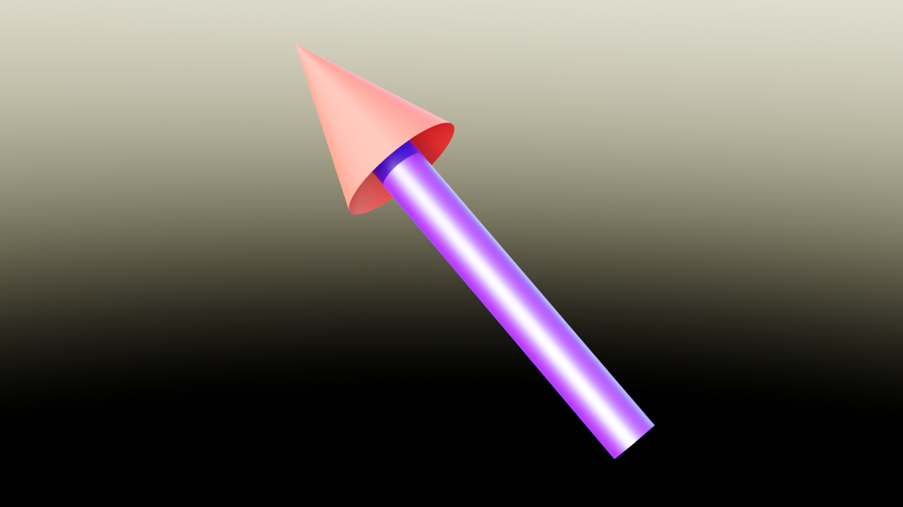
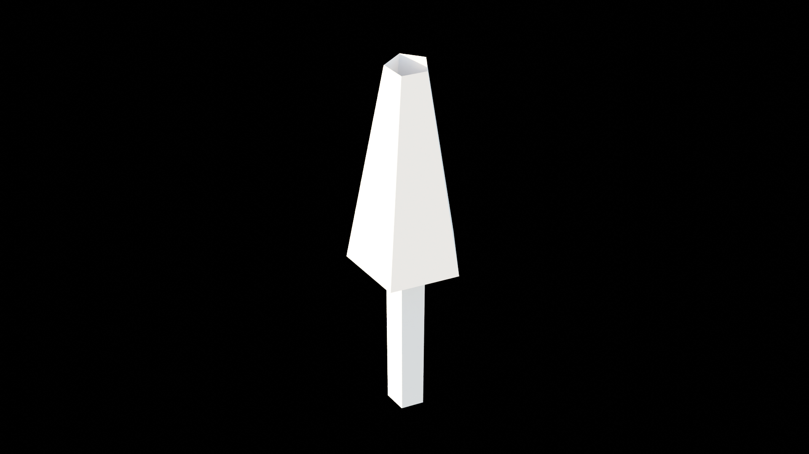

# Building an arrow

> Tutorial on how to build a full parametrized arrow.

## Objective

We need arrows of different resolution, appearance, size which can take various orientations.
We want to control these parameters with the modifier, including the material on shaft and arrowhead.

The image below shows what we want to build:




## Parameters

The parameters to create are the following:

| Name             | Type           | Description                                                      |
| ---------------- | -------------- | ---------------------------------------------------------------- |
| Length           | Float          | Total length of the arrow, including the arrowhead               |
| Radius           | Float          | Radius shaft                                                     |
| Head size        | Float          | Size of the arrow head, expressed as a factor applied to radius  |
| Head angle       | Float (Angle)  | Angle of the arrowhead peak                                      |
| Recess           | Float          | How "deep" the shaft penetrates in the arrowhead (0: flat, 1: max) |
| Vertices         | Integer        | Circular resolution expressed inf number of vertices             |

We will add complementatry parameters later on but for the moment, these parameters allow to build the arrow.
The good practice is to start by declaring the parameters at the begining of the tree.

``` python
from geonodes import GeoNodes

with GeoNodes("Arrow") as tree:
    length    = tree.float_input(   "Length",       1., min_value=0)
    r         = tree.float_input(   "Radius",       .02, min_value=0.001)
    s         = tree.float_input(   "Head size",    3., min_value=1.001)
    angle     = tree.angle_input(   "Angle",        np.radians(20),   min_value=np.radians(10), max_value=0.999*np.pi/2)
    k         = tree.float_input(   "Recess",       .5, min_value=0., max_value=0.99)
    vertices  = tree.integer_input( "Vertices",     12, min_value=3)
    smooth    = tree.bool_input(    "Shade smooth", True)
    shaft_mat = tree.material_input("Shaft")
    head_mat  = tree.material_input ("Arrowhead")
    obj       = tree.object_input(  "Orientation")
    track_obj = tree.bool_input(     "Track",        description="Track object if True, copy rotation otherwise")
```

## Some maths

We will build the arrow by extruding a base disk up along the z axis and then enlarging the cylinder to build the arrowhead.
Some maths are required to build the arrow according the parameters.


The corresponding python code is given here after:

``` python
# ----- Arrowhead radius from the shaft radius

rh = r*s

# ----- Arrowhead height from the angle

tg = tree.tan(angle)
hh = rh/tg
z0 = length - hh

# ----- Recess computation

h  = r/tg
d  = k*h*(s - 1)

z1 = z0 + d
z2 = z0 + k*h*s

# ----- polygon correction factor
# Extrusion uses edge position which is the mean of the two
# extremities. The vertices position is then computed as the mean
# of the two edges. Twice a cosine factor

f = 1/tree.cos(np.pi/vertices)**2
fac = tree.combine_xyz(f, f, 1)
```

## Building by extrusion

The starting point is a disk:

``` python
    arrow = tree.MeshCircle(vertices=vertices, radius=r, fill_type='NGON').mesh
```

The shaft length was computed above, it is equal to `z1`. Hence, the shaft is built by extruding the disk edges up to z1:

``` python
    arrow = arrow.extrude_mesh(offset=(0, 0, 1), offset_scale=z1, mode='EDGES')
    # Extrusion node arrow provides selection sockets 'top' and 'side'
    node = arrow.node
```

The `extrude_mesh` method returns the `mesh` socket of the extrusion node. To get access to `top` and `side` sockets, we simply read the node attribute from the `arrow` socket.

The next extrusion step is to extrude the edges downwards and outwards.
It the scheme above, we are at points `Q'` and want to extrude to point `Q''`.
The direction of extrusion is given by the vector `QQ'`.
The amount of extrusion is given by the maths.

**Note:** Points `Q'` and  `Q''` are multiple (points forming the top circle of the shaft) when the point `Q` is unique.

``` python
    arrow = arrow[node.top].extrude_mesh(offset=arrow.position - (0, 0, z2), offset_scale=s - 1, mode='EDGES')
    node = arrow.node
```

To finish the arrow, we simply extrude from the current position to the top of the arrow:

``` python
    arrow = arrow[node.top].extrude_mesh(offset=(0, 0, length) - arrow.position, mode='EDGES')
```

## Edges and vertices position

The arrow looks good but a problem appears with low numbers of vertices: the vertices don't join at the top of the arrowhead.
For instance, with 5 vertices, the arrow is given below:



This is due to the fact that we extrude edges using their position.
The edges positions are supposed to be on a circle, when in reality, the edges positions are the mean of their two vertices.
The vertices are on the circle, when the edges position is within the circle.
Extrusion is instructed on edges but operated on vertices.
The position of the vertices is deducted from the positions of the two edges they are part of.
This computed position is even more inside the disk.

To correct that, we have to correct the edges positions with a factor computed from the number of vertices.
Without detailling the maths, the correction is the following:

``` python
    # ----- polygon correction factor
    # Extrusion uses edge position which is the mean of the two
    # extremities. The vertices position is then computed as the mean
    # of the two edges. Twice a cosine factor
    
    f = 1/tree.cos(np.pi/vertices)**2
    fac = tree.combine_xyz(f, f, 1)
```

And then:

``` python
    arrow = arrow[node.top].extrude_mesh(offset=arrow.position*fac - (0, 0, z2), offset_scale=s - 1, mode='EDGES')
    ...
    arrow = arrow[node.top].extrude_mesh(offset=(0, 0, length) - arrow.position*fac, mode='EDGES')
```

## Materials

We want to apply materials: one for the shaft and one for the rest.

- Get the materials as input
- Get the extruded faces
- Setting the material to the faces

``` python
    # Default material
    arrow.material = head_mat

    # Material for extruded faces
    arrow[node.side].material = shaft_mat
```

## Arrow orientation

We want to orient our arrow. The orientation can be either the copy of the orientation of a reference object,
or the tracking of a target object.

We need to add an object plus a Boolean option to indicate how to use this object:

``` python
    obj       = gn.Object.Input(None, "Orientation")
    track_obj = gn.Boolean.Input(True, "Track", description="Track object if True, copy rotation otherwise")
```

In standard python, we would use a `if` statement.
But here, we need to compute both orientations and use a `switch` node:

``` python
    info = tree.ObjectInfo(obj, transform_space='ORIGINAL')
    rot_copy  = info.rotation

    info = tree.ObjectInfo(obj, transform_space='RELATIVE')
    loc       = info.location
    
    rot_track = tree.AlignEulerToVector(vector=loc, axis='Z')
    
    arrow.transform_geometry(rotation=rot_copy.switch(track_obj, rot_track))
``` 

## The final arrow

The final code includes a smoothing option and the crease property is set to 1 for "horizontal" edges.

``` python
from geonodes import GeoNodes
import numpy as np

with GeoNodes("Arrow") as tree:
    
    length    = tree.float_input(   "Length",       1., min_value=0)
    r         = tree.float_input(   "Radius",       .02, min_value=0.001)
    s         = tree.float_input(   "Head size",    3., min_value=1.001)
    angle     = tree.angle_input(   "Angle",        np.radians(20),   min_value=np.radians(10), max_value=0.999*np.pi/2)
    k         = tree.float_input(   "Recess",       .5, min_value=0., max_value=0.99)
    vertices  = tree.integer_input( "Vertices",     12, min_value=3)
    smooth    = tree.bool_input(    "Shade smooth", True)
    shaft_mat = tree.material_input("Shaft")
    head_mat  = tree.material_input ("Arrowhead")
    obj       = tree.object_input(  "Orientation")
    track_obj = tree.bool_input(     "Track",        description="Track object if True, copy rotation otherwise")
    
    with tree.layout("Maths stuff..."):
        
        # ----- Arrowhead radius from the shaft radius
        
        rh = r*s
        
        # ----- Arrowhead height from the angle

        tg = tree.tan(angle)
        hh = rh/tg
        z0 = length - hh
        
        # ----- Recess computation
        
        h  = r/tg
        d  = k*h*(s - 1)
        
        z1 = z0 + d
        z2 = z0 + k*h*s
        
        # ----- polygon correction factor
        # Extrusion uses edge position which is the mean of the two
        # extremities. The vertices position is then computed as the mean
        # of the two edges. Twice a cosine factor
        
        f = 1/tree.cos(np.pi/vertices)**2
        fac = tree.combine_xyz(f, f, 1)
        
    # ----- Let's go
    
    with tree.layout("Arrow base"):
    
        arrow = tree.MeshCircle(vertices=vertices, radius=r, fill_type='NGON').mesh
        arrow.material = head_mat
        
    with tree.layout("Extrusion"):
        
        arrow = arrow.extrude_mesh(offset=(0, 0, 1), offset_scale=z1, mode='EDGES')
        node = arrow.node
        arrow[node.side].material = shaft_mat
        
        arrow = arrow[node.top].extrude_mesh(offset=arrow.position*fac - (0, 0, z2), offset_scale=s - 1, mode='EDGES')
        node = arrow.node
        arrow[node.side].material = head_mat

        arrow = arrow[node.top].extrude_mesh(offset=(0, 0, length) - arrow.position*fac, mode='EDGES')
        
    # ----- Set crease to 1 for horizontal edges
    
    with tree.layout("crease and smoothing"):
        
        node = arrow.edge_vertices()
        p1, p2 = node.position_1.xyz, node.position_2.xyz
        hrz = (p1.z - p2.z).abs().less_than(0.001)
        arrow.store_named_float("crease", tree.value(0).switch(hrz, 1))
        
        # ----- Shade smooth
        
        arrow.FACE.shade_smooth = smooth
        
    # ----- Orientation

    with tree.layout("Orientation"):
        info = tree.ObjectInfo(obj, transform_space='ORIGINAL')
        rot_copy  = info.rotation

        info = tree.ObjectInfo(obj, transform_space='RELATIVE')
        loc       = info.location
        
        rot_track = tree.AlignEulerToVector(vector=loc, axis='Z')
        
        arrow.transform_geometry(rotation=rot_copy.switch(track_obj, rot_track))

    # ----- Done
    
    tree.og = arrow
```


