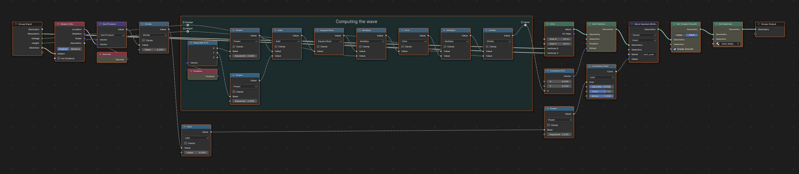

# Demo script

> Let's review this demo script in detail. Afterwards, you should be able to script your own tree.

> [!NOTE]
> To start using this module, it is recommanded to read first [Getting Started](getting_started.md).

The script creates a surface from a grid by computing
`z = sin(d)/d` where `d=sqrt(x^2 + y^2)` is the distance of the vertex to the center.

## Comments

### Module import

Import the tree classes `GeoNodes`,  `Shader` and/or `Compositor` from the module

```python
# Compositor class is not required in this demo
from geonodes import GeoNodes, Shader
```

### Creating the tree nodes

The tree nodes are created using the `with` context management. The material is created first because it is then used in the Geometry Nodes modifier.

> [!CAUTION]
> All nodes are erased.

```
# A Shader to be used by the Geometry Nodes modifier
with Shader("Hello Material") as tree:
    pass
        
# The Geometry Nodes modifier
with GeoNodes("Hello World") as tree:
    pass
```

### Modifier input

User input can be created using `tree.<DATA_TYPE>_input()` methods as shown below:

``` python
with GeoNodes("Hello World") as tree:
    
    # Let's get the parameters from the user
    count  = tree.integer_input("Resolution", 100, min_value=10, max_value=300)
    size   = 20   # Size
    omega  = tree.integer_input("Omega", 2.)
    height = tree.integer_input("Height", 2.)
    target = tree.object_input("Direction")
```

### Geometry primitive

Use the **CamelCase** name of the node to create the node in the current tree. The code below create a grid:

``` python
    # Create the grid and get the output socket mesh in the variable grid
    grid = tree.Grid(vertices_x=count, vertices_y=count, size_x=size, size_y=size).mesh
```

Alternatively, use the **snake_case** version of the name to directly get the output socket:

``` python
    # Create the grid and get the output socket mesh in the variable grid
    grid = tree.grid(vertices_x=count, vertices_y=count, size_x=size, size_y=size)
```

### Computations

Do maths on vectors, floats, booleans, integers using operators and maths functions available in the tree:

``` python
    # Separate XYZ the position vector 
    pos = grid.position
    
    # Compute the distance
    distance = tree.sqrt(pos.x**2 + pos.y**2)
    
    # Height in z
    z = height * tree.sin(distance*omega)/distance
```
### Modify the Geometry

Use geometry socket methods to modify the geometry

``` python
    # Let's change the z coordinate of our vertices
    grid.offset = (0, 0, z)
    # same as
    grid = tree.SetPosition(geometry=grid, offset=(0, 0, z)).geometry
    
    # We smooth the grid
    grid.FACE.shade_smooth = True
    # same as
    grid = tree.SetShadeSmooth(geometry=grid, shade_smooth=True).geometry
    
    # We set the material created above
    grid.material = "Hello Material"
    # same as
    grid = tree.SetMaterial(geometry=grid, material=bpy.data.materials["Hello Material"]).geometr
```

### Tree input and output geometry

Input and output geometries are geometry socket of the tree:

``` python
    # Plug the geometry to the output socket
    tree.output_geometry = grid
    # Or use the shortcut
    tree.og = grid

    # Similarily input geometry can be read from the tree
    geo = tree.input_geometry
    # Or use the shortcut
    geo = tree.ig
```

### Layouts

Layouts are ways to make the trees clearer. Creating a layout is done in the context of `with` syntax: any new node created in the scope of a `with` is included in the layout.
Note that layouts can be imbricated.

```python
    # We compute z
    with tree.layout("Computing the wave"):
        # Separate XYZ the position vector 
        pos = grid.position
        
        # Compute the distance
        distance = tree.sqrt(pos.x**2 + pos.y**2)
        
        # Height in z
        z = height * tree.sin(distance*omega)/distance

   # New nodes are created out of the previous layout
```

## Full example

### Source code

``` python
from geonodes import GeoNodes, Shader

# A Shader to be used by the Geometry Nodes modifier
with Shader("Hello Material") as tree:
    # Read the color from the arribute nameed 'surf_color'
    col = tree.Attribute("surf_color").color
    
    # A Principled BSDF shader 
    tree.output_surface = tree.PrincipledBSDF(
        base_color = col,
        roughness  = .1,
        metallic   = .7).bsdf
        
# The Geometry Nodes modifier
with GeoNodes("Hello World") as tree:
    
    # Let's get the parameters from the user
    count  = tree.integer_input("Resolution", 100, min_value=10, max_value=300)
    size   = 20   # Size
    omega  = tree.integer_input("Omega", 2.)
    height = tree.integer_input("Height", 2.)
    
    # The base (x, y) grid
    grid = tree.Grid(vertices_x=count, vertices_y=count, size_x=size, size_y=size).mesh
    
    # We compute z
    with tree.layout("Computing the wave"):
        # Separate XYZ the position vector 
        pos = grid.position
        
        # Compute the distance
        distance = tree.sqrt(pos.x**2 + pos.y**2)
        
        # Height in z
        z = height * tree.sin(distance*omega)/distance
        
    # Let's change the z coordinate of our vertices
    grid.offset = (0, 0, z)
    
    # The color of the surface depends upon the orientation of the faces
    # toward a control object
    
    target = tree.object_input("Direction")
    loc = target.object_info().location
    
    hue = (grid.normal.dot(loc)/2 + .5)**2
    grid.POINT.store_named_vector("surf_color", tree.CombineColor(hue, .9, .7, mode='HSV'))
    
    
    # We smooth the grid
    grid.FACE.shade_smooth = True
    
    # We set the material created above
    grid.material = "Hello Material"
    
    # We are done: plugging the deformed grid as the modified geometry
    tree.output_geometry = grid
```

### Generated nodes



### Resulting mesh


