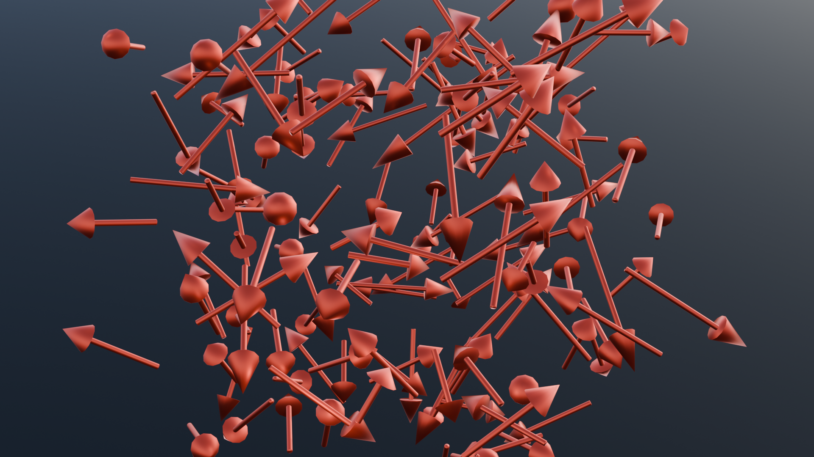
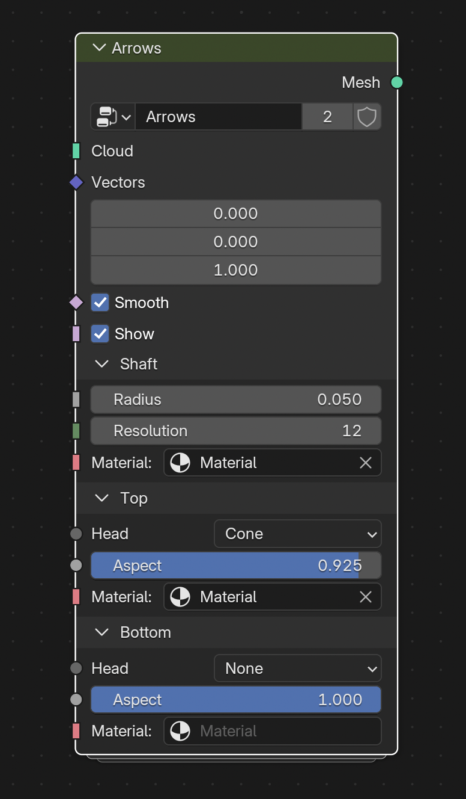
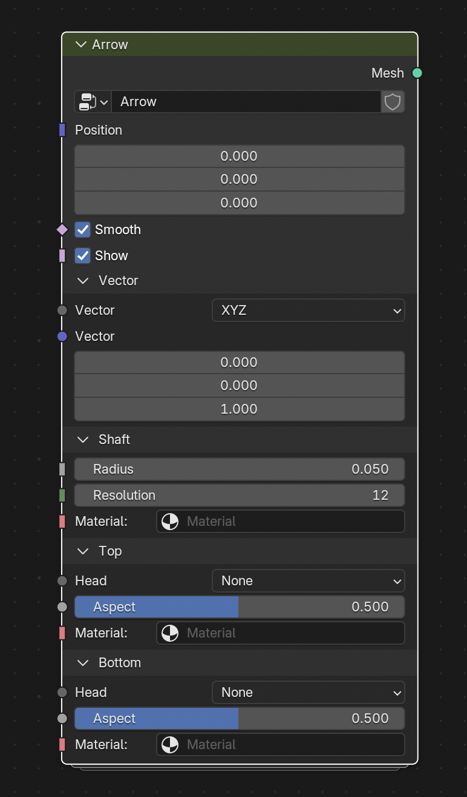

# arrows demo

This demo builds two modifiers:

- arrow : create a single arrow with control of position, orientation, length, size
- arrows (field of arrows) : one arrow on each geometry point

## arrows modifier

## arrow modifier

## What to learn

- using closure for various arrow head shapes
- using menu to select different geometries

