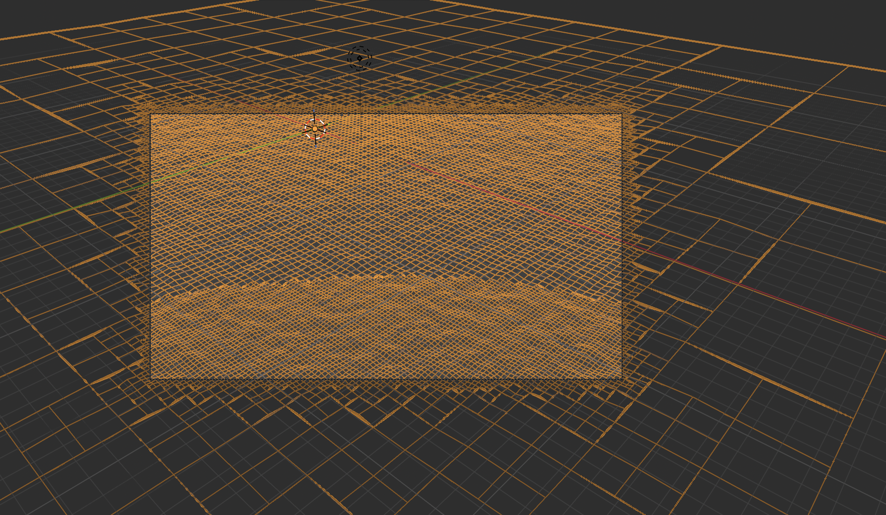
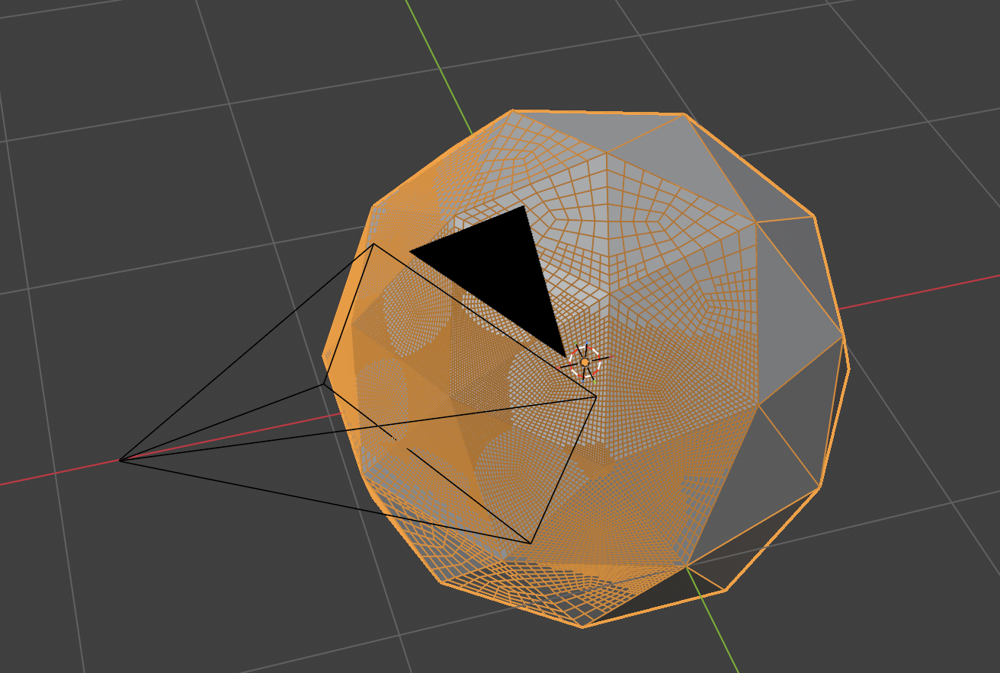

# cam_culling demo

Camera culling defining if points, edges and faces are visible.
This is feature is implemented in a modifier providing variable subdivision.

## Modifiers

- **Camera Projection** : computes positions which are visible or not
- **Camera Point Culling** : removes points which are not visible
- **Camera Edge Culling** : removes edges which are not visible
- **Camera Face Culling** : removes faces which are not visible
- **Multires Surface** : Multi resolution surface
- **Multires Faces** : multi resolution faces
- **DEMO Multires Faces** : a demo of **Multires Surface**

