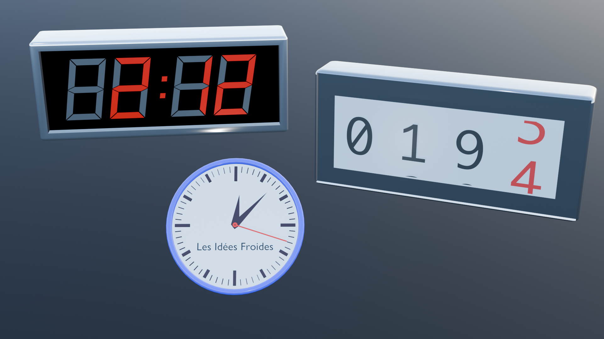
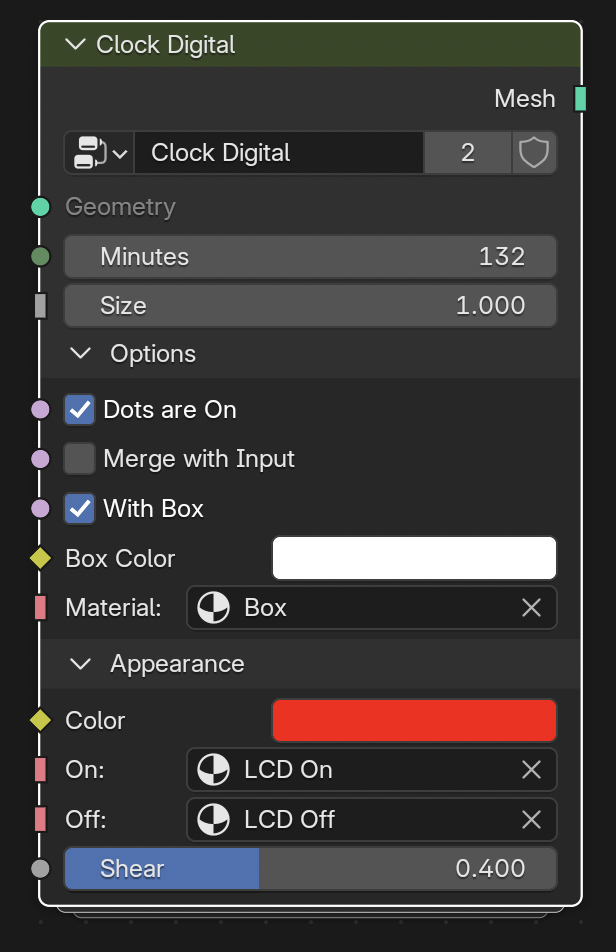
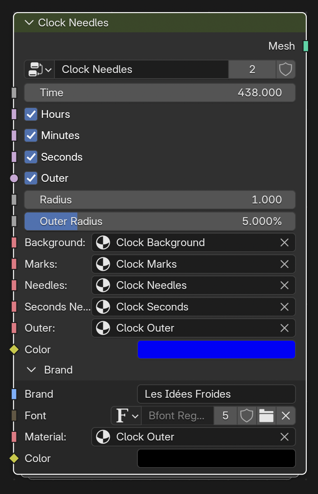
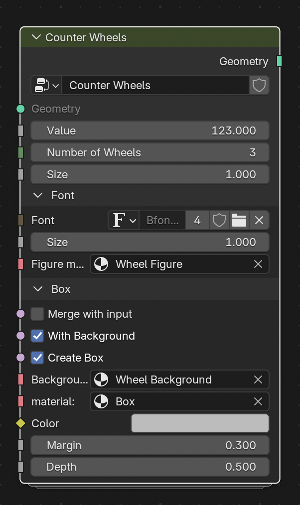

# counters demo

This demo builds several modifiers:

- Clock Digital : a digital clock displaying hours and minutes plus two flashsing points
- Clock Needles : a clock with 3 needles
- Counter digital : a digital counter
- Counter Wheels : a counter with several wheels displaying a number

## Clock Digital

## Clock Needles

## Counter Wheels

## What to learn

- using fonts
- creating shaders
- mesh boolean
- repeat zone
- index switch
- panels
- creating geometries : needles, roundeds boxes, torus...

