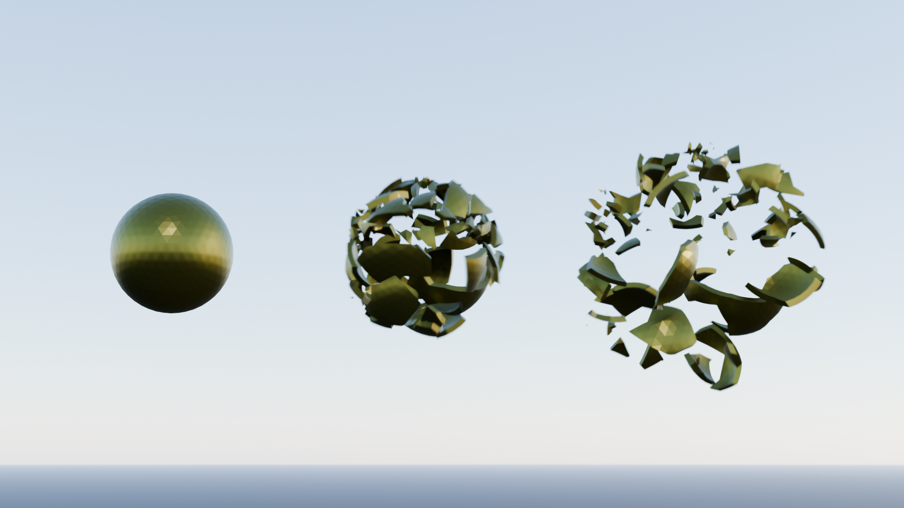
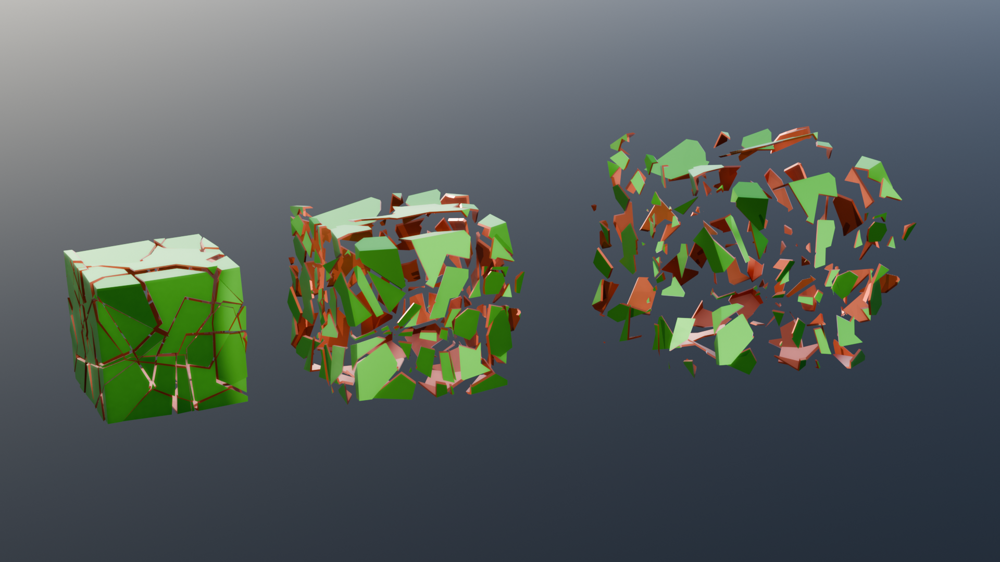

# explosition demo

Simulate kinematics on a cloud of points with field of forces.

The forces are provided with a closure to reuse the engine for many purposes.

This example also provides a simple way to fracture a mesh into small parts.
The fracture can be done on the volume or on the solidifed skin.

## Modifiers

- **Plane Split** : split a mesh into two parts using a random plane
- **Break into Parts** : break the mesh into parts by recursivelly calling the previous
  modifiers on the islands
- **Cone Split** : fracture a mesh into parts using random cones centered on the mesh.
  This algorithm gives better result to split a solidified mesh
- **Mesh to Located Islands** : convert mesh islands into instances located at the center of
  each island (Node "**Split to Instance** locates instances to `(0, 0, 0)`)
- **Gravity Closure** : creates an acceleration closure used by kinematics
- **Viscosity Closure** : creates a viscosity closure used by kinematics
- **Kinematics Engine** : simulation loop applying acceleration and rotation to a cloud of points
- **Instances Kinematics** : aplies the kinematics engine to Instances
- **Mesh Kinematics** : applies the kinematics engine to a mesh. The mesh islands are converted to instances.
- **Kinematics Demo** : this modifier can be applied on default cube

## What to learn

- closure
- simulation
- repeat
- mesh boolean
- solidify a mesh
- fracture a mesh into parts
- convert mesh islands into instances properly located
- call an embedded node : 'Random Rotation'

