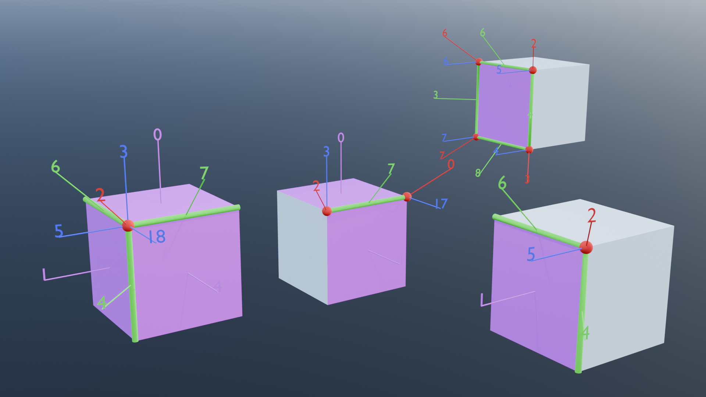
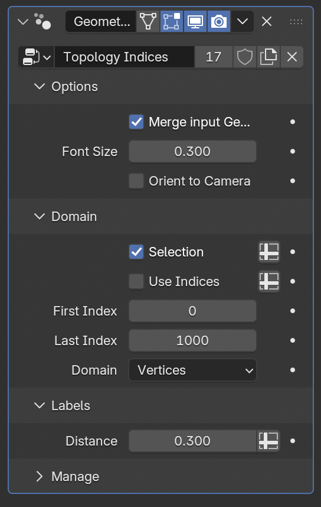

# topology demo

Display the indices of mesh domain elements with their peer elements :
vertex indices of an edge, edge indices of face... 

## Modifiers

- **Topology Indices** : The modifier allows to select a domain in 'Vertices', 'Edges', ...
  It displays the index of each element of the selected domain
- **Mesh Topology** : The modifier selects a domain in 'Vertices', 'Edges',...
  and a index which must be valid in the selected domain.
  The modifiers displays the linked domain elements, for instance the edges, faces and corners
  linked to a selected vertex.

## What to learn

- dealing with element indices
- element of elements

