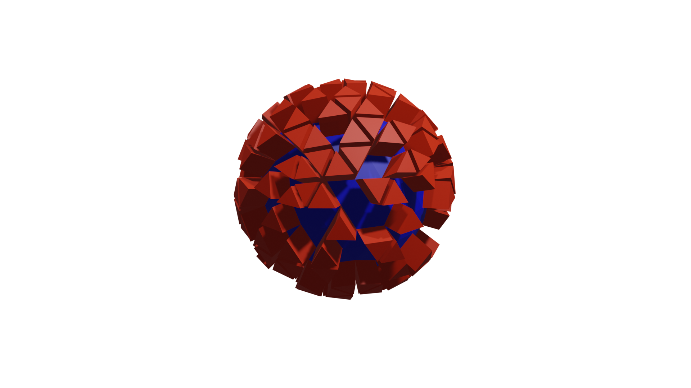

# Extrusion

> How to extrude faces.

In this example:
- Two simple materials are created to be used in the geometry node modifier
- Two modifier parameters are exposed
- The array indexing syntax is used as an alternative to the `selection` socket
- Faces are extruded based on their material index

``` python
from geonodes import GeoNodes, Shader

# Let's create the base material of the Ico Sphre

with Shader("Base Material") as tree:
    tree.output_surface = tree.PrincipledBSDF(
        base_color = (0, 0, 1),
        roughness = .9,
        ).bsdf
        
# Material for selected faces

with Shader("Sel Material") as tree:
    tree.output_surface = tree.PrincipledBSDF(
        base_color = (1, 0, 0),
        roughness = .1,
        ).bsdf
        
# The Ico Sphere modifier

with GeoNodes("Icosphere tuto") as tree:

   # Good practice: let's start with the tree inputs

   radius = tree.float_input("Radius", 1., min_value=0.01, max_value=10, description="A reasonable radius for the sphere")
   subs   = tree.integer_input("Subdivisions", 3, min_value=1, max_value=6, description="Ico Sphere d-subdivisions. Don't be too ambitious")
   
   # The icosphere
   ico = tree.IcoSphere(radius=radius, subdivisions=subs).mesh
   
   # Base material
   ico.set_material("Base Material")

   # Faces selection
   sel = tree.random_boolean(probability=.5)

   # A geometry socket can use [sel] as an alternative to selection=sel
   # The two following statements are equivalent
   if True:
      ico[sel].set_material("Sel Material")
   else:
      ico.set_material("Sel Material", selection=sel)

   
   # Extrude the select faces
   
   ico = ico[ico.material_index.equal(2)].extrude_mesh(offset_scale=0.3)
   
   tree.og = ico
    
```




