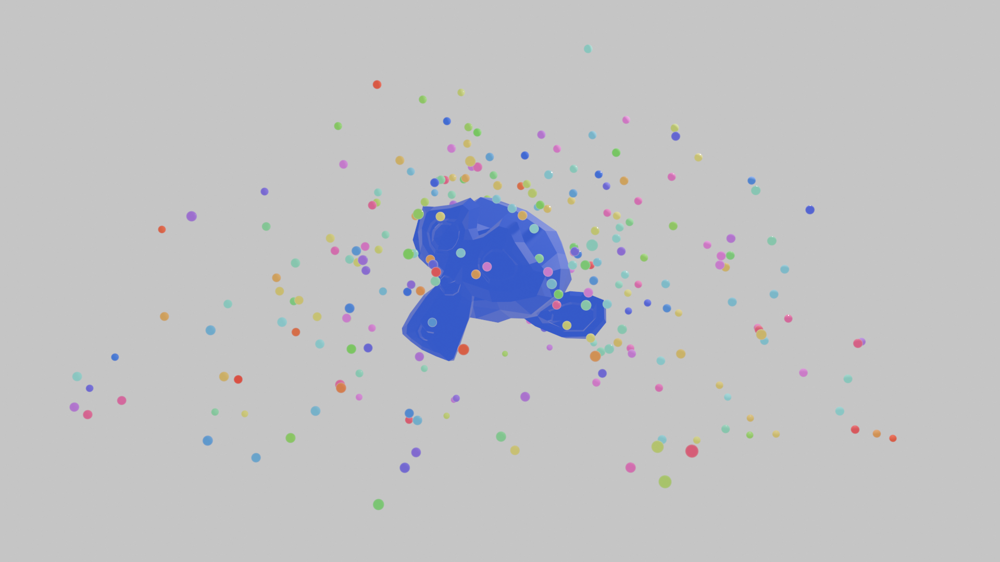

# Simulation

> Example of simulation zone

Simulation zone is created with `tree.simulation` method using a `with` block.
Loop variables are created with `kwargs` syntax:

``` python
# Create a simulation zone with age loop parameter
with tree.simulation(geometry=tree.ig, age=10):
   pass
```

**Simulation** sockets:
- Inside the zone (i.e. inside the `with` statement):
  - reading a socket get the **output socket** of the zone input node
  - setting a socket set the **input socket** of the zone output node
- Outside the zone (i.e. after the `with`statement);
  - reading a socket get the **output socket** of the zone output node
 
``` python
with tree.simulation(geometry=tree.ig, age=10) as simul:

    # simulation input node age socket has been initialized to 10

    # Reading the age socket from the input node
    a = simul.age

    ...

    # Updating age for the next simulation loop
    simul.age += 1

# Outside the context, getting the resulting geometry
geo = simul.geometry
```    


## Sample code

In this demo:
- Create a material using an attribute created by the geometry node modifier
- Create a simulation loop creating balls sent at a random speed
- Simulating gravity



``` python
from geonodes import GeoNodes, Shader

# ----- Create the material for the balls
# The geometry node will create an attribute 'hue' for each instance
# This attribute is read by the shader

with Shader("Ball Material") as tree:
    # Get the hue instance attribute
    hue = tree.Attribute(attribute_name="hue", attribute_type='INSTANCER').fac
    
    # Build the color from this value
    col = tree.combine_color(hue, 1., 1., mode='HSV')
    
    # A simple principled bsdf
    tree.output_surface = tree.PrincipledBSDF(
            base_color=col,
            roughness=.1).bsdf
            
            
# ----- The geometry node modifier
# Generates points on surface pointing upwards with an initial speed
# Apply gravity on the speeds
# Kill the particles once they are below the ground

with GeoNodes("Rockets") as tree:
    
    # Modifier parameters
    
    density = tree.float_input("Density", 1., min_value=0., max_value=10.)
    speed   = tree.float_input("Speed", 40.)
    acc     = tree.acceleration_input("Acceleration", (0, 0, -9.86))
    radius  = tree.float_input("Balls radius", .1)
    
    # Get the input geometry
    
    geo = tree.ig
    
    # Simulation
    
    points = tree.Points(count=0).geometry
    
    with tree.simulation(points=points, age=50) as simul:
        
        with tree.layout("New points"):
        
            # Face normals
            normal = geo.normal
            
            # Faces oriented upwards
            sel = normal.z.greater_than(0.1)
            
            # Current frame as seed
            cur_frame = tree.SceneTime().frame
            
            # Points on these surface
            new_points = geo[sel].distribute_points_on_faces(density=density, seed=3*cur_frame).points
            
            
        with tree.layout("Initial speed"):
            
            # Normals
            pts_normal = new_points.node.normal
            
            # Speeds
            speeds = tree.random_vector(min=pts_normal*speed/10, max=pts_normal*speed/3, seed=3*cur_frame+1)
            
            # Some rotation
            tree.VectorRotate.print_doc()
            rot = tree.random_vector(min=-.2, max=.2, seed=10*cur_frame)
            speeds = speeds.vector_rotate(rotation=rot, rotation_type='EULER_XYZ')
            
            new_points.store_named_vector("speed", value=speeds)
            
            # Random hue
            new_points.store_named_float("hue", value=tree.random_float(0, 1, seed=3*cur_frame+2))
            
            
        # Join to the current geometry
        pts = simul.points + new_points
        
        with tree.layout("Gravity"):
        
            # Apply gravity
            speeds = tree.named_vector("speed")
            speeds += acc*simul.delta_time
            pts.store_named_vector("speed", speeds)
            
        with tree.layout("Move the points according their speed and kill below ground 0"):
            
            # Move the points
            pts.set_position(offset=tree.named_vector("speed")*simul.delta_time)
            
            # Kill on the ground
            pts.POINT[pts.position.z.less_than(0)].delete_geometry()
            
        # Loop
        simul.points = pts
        
    with tree.layout("Ball instances"):
        
        ball = tree.UVSphere(radius=radius).mesh
        ball.set_material("Ball Material") 
            
        balls = simul.points.instance_on_points(instance=ball)
        
            
    tree.og = geo + balls
```
        
    
