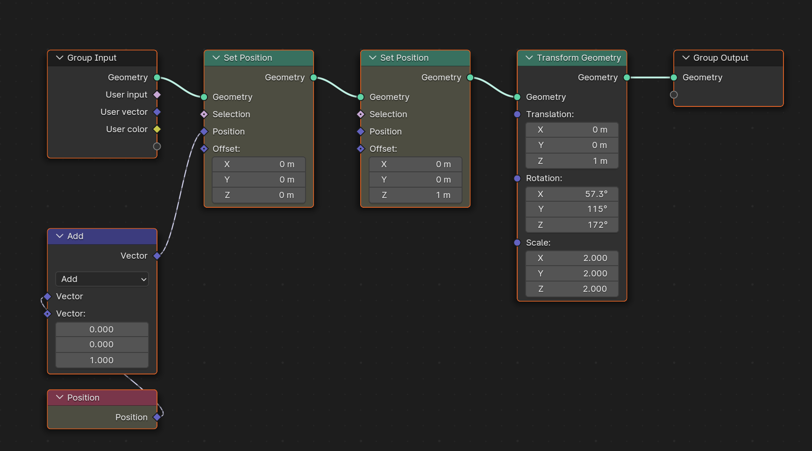
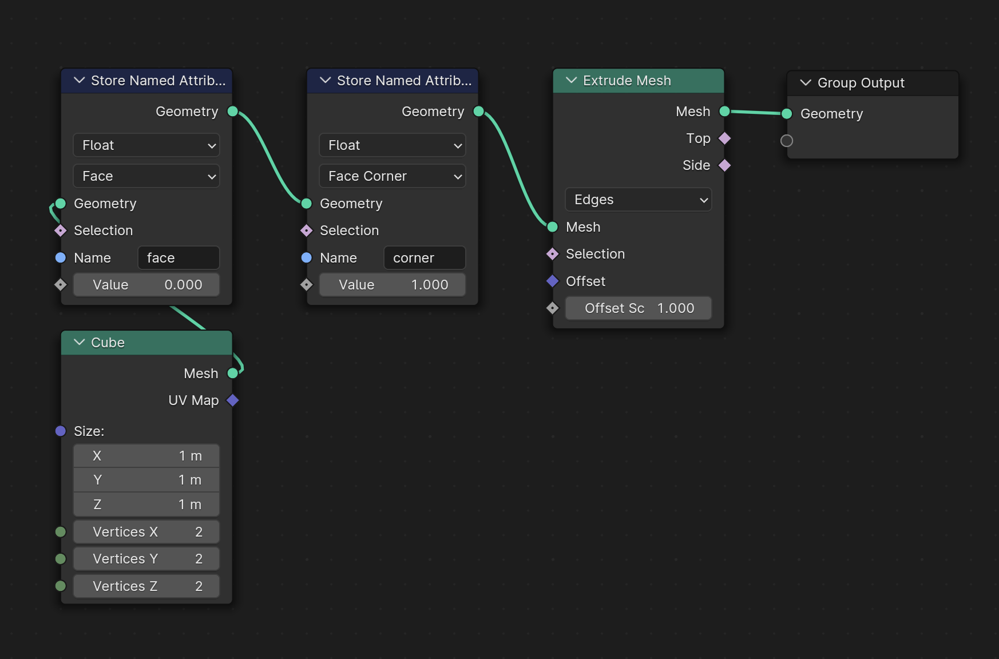
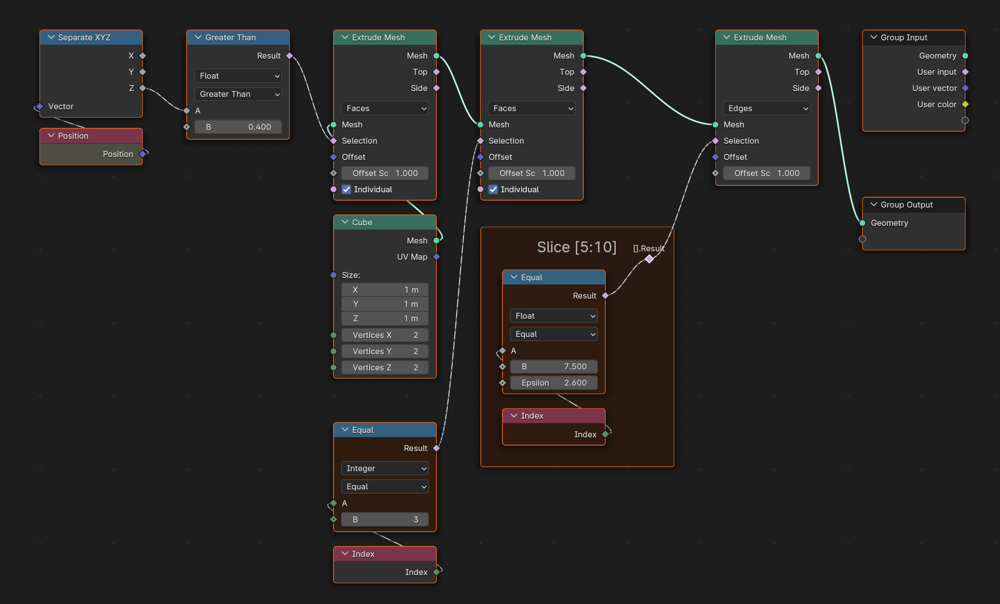
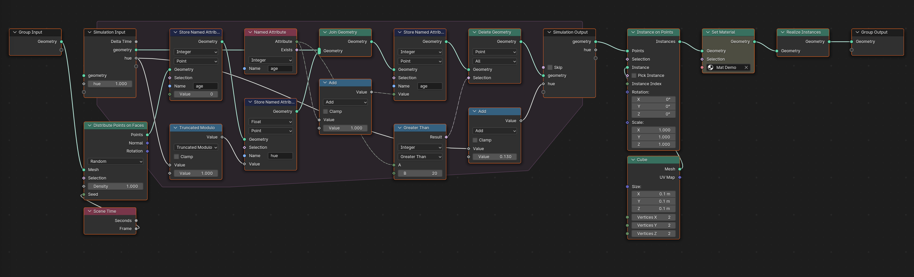
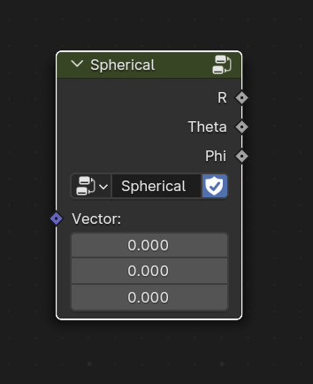

# Getting started

- [Prerequisites](#prerequisites)
  - [3 Types of Nodes Trees](#3-types-of-nodes-trees)
  - [Importing the Module](#importing-the-module)
- [Creating a new Tree](#creating-a-new_tree)
  - [Creating a Group](#creating-a-group)
- [Creating a Node](#creating-a-node)
  - [Node Sockets](#node-sockets)
  - [Links](#links)
  - [Sockets sharing the same Name](#sockets-sharing-the-same-name)
  - [Node parameters](#node-parameters)
  - [Node init arguments order](#node-init-arguments-order)
  - [Multi Input Sockets](#multi-input-sockets)
  - [Input and Output Nodes](#input-and-output-nodes)
- [Socket Classes](#socket-classes)
  - [Socket Types](#socket-types)
  - [Tree input and output Sockets](#tree-input-and-output-sockets)
  - [Creating group input sockets](#creating-group-input-sockets)
  - [Input sockets](#input-sockets)
  - [Operations on Values](#operations-on-values)
  - [Boolean operations](#boolean-operations)
  - [Vectors, Rotations and Colors automatic Separation](#vectors-rotations-and-colors-automatic-separation)
- [Geometry](#geometry)
  - [Geometry primitives](#geometry-primitives)
  - [Geometry attributes](#geometry-attributes)
  - [Operations on Geometry](#operations-on-geometry)
  - [Domain Parameter](#domain-parameter)
  - [Selection socket](#selection-socket)
  - [Data Type](#data-type)
- [Simulation and Repeat Zones](#simulation-and-repeat-zones)
- [Groups](#groups)
  - [Creating a Group](#creating-a-group)
  - [Calling a Group](#calling-a-group)
  - [Working with Prefix](#working-with-prefix)


## Prerequisites

To use the **geonodes** python module, you are supposed to be familiar with:
- Blender Geometry and Shader nodes
- Python language
- Running python scripts in Blender

Install the version of **geonodes** compatible with the Blender version you use.

### 3 types of Nodes Trees

**geonodes** support 3 types of nodes trees:

- Geometry nodes (class `geonodes.GeoNodes`)
- Shader nodes (class `geonodes.Shader`)
- Compositor nodes (class `geonodes.Compositor`)

Once initialized as described below, there is no major differences in the behavior.
Differences exists in the inputs and outputs of the trees and on the set of possible nodes.

### Importing the Module

We suppose that all scripts start with the following import instruction:

``` python
from geonodes import GeoNodes, Shader, Compositor
```

## Creating a new Tree

A tree is created using the with statement:

``` python
# Creating a new Geometry nodes modifier
with GeoNodes("Geometry Nodes") as tree:
    pass

# Creating a new material
with Shader("Material") as tree:
    pass
    
# Accessing the scene compositor nodes:
with Compositor() as tree:
    pass
```

The first parameter is the name of the tree to create. For `Compositor`, the nodes are the one of the current scene.
If your file hase several scenes, you can specify the name of the scene you want to edit the compositor of:

``` python
# Edit the compositor nodes of the scene named "Scene.001"
with Compositor("Scene.001") as tree:
    pass
```

> [!WARNING]
> When opening a tree, the existing nodes are deleted!

### Creating a Group

A **Node Group** can be created by using the `is_group` argument:

```python
with GeoNodes("My Group", is_group=True):
    pass
```

## Creating a Node

Create a node by using its **CamelCase** name. For instance:
- Node *Set Shade Smooth* : `tree.SetShadeSmooth``
- Node *Set Position* : `tree.SetPosition`
- Node *Curve Circle* : `tree.CurveCircle` 

The following piece of code creates an *Ico Sphere* node with default parameters:

``` python
with GeoNodes("Geometry Nodes") as tree:
    # Create an ico sphere
    node = tree.IcoSphere()
``` 

Nodes generally have input sockets and can have parameters.
These can be set as initialization arguments of the node:

``` python
with GeoNodes("Geometry Nodes") as tree:

    # Create a Math node adding 2 and 2 and get the result in the value variable
    value = tree.Math(2, 2, operation='ADD').value
    
    # Use this result as resolution of the ico sphere
    ico = tree.IcoSphere(resolution=value).mesh
```

The way sockets and parameters are named is described below.

### Node Sockets

The node sockets are named with the **snake_case** version of their actual name. For instance:
- Input sockets of `IcoSphere` node: `radius` and `subdivisions`
- Output sockets of `IcoSphere` node : `mesh` and `uv_map`

Input sockets are **write only** node attributes when output sockets are **read only** node attributes:

``` python
with GeoNodes("Geometry Nodes") as tree:
    # Create an ico sphere
    node = tree.IcoSphere()
    
    # Set the input sockets (write only attributes)
    node.radius = 2.
    node.subdivisions = 5
    
    # Get the output sockets (read only attributes)
    mesh = node.mesh
    uv = node.uv_map
```

### Links

Links between nodes are simply created by setting an input socket with an output sockets.
In the following examplen the ico sphere is smoothed:

``` python
with GeoNodes("Geometry Nodes") as tree:
    # Create an ico sphere
    node = tree.IcoSphere()
    
    # Create a Set Shade Smooth node
    smooth = tree.SetShadeSmooth()
    
    # Link the two nodes
    smooth.geometry = node.mesh
```

### Sockets sharing the same Name

When a node uses the same name for an input and an output socket, the same **snake_case** name is used for both sockets with no ambiguity.

``` python
with GeoNodes("Geometry Nodes") as tree:

    # Create a Set Shade Smooth node
    smooth = tree.SetShadeSmooth()

    # set : Input geometry of the SetShadeSmooth node
    smooth.geometry = node.mesh
    
    # get : Output geometry of the SetShadeSmooth node
    smoothed = smooth.geometry
```

The same name can be used several times for input and output sockets. In that case, the sockets are numerbered
in their order in the node from the seconde one (the first one keeps its raw snake_case name) as shown
in the example below:

``` python
with GeoNodes("Geometry Nodes") as tree:

    # A math node
    node = tree.Math()
    
    node.value    = 1 # Set the first 'Value' socket
    node.value_1  = 2 # Set the second 'Value' socket
    node.value_2  = 3 # Set the third 'Value' socket
    
    # Get the result
    result = node.value # Output 'Value' socket
```

### Node parameters

Node parameters can be accessed with their Blender attribute name. For instance de Blender node *Math* has
a parameter named `operation` which can set as an attribute of the `Math` node:

``` python

    # A math node
    node = tree.Math()
    
    # Setting the operation
    node.operation = 'MULTIPLY'
```

### Node Init Arguments Order

Sockets and parameters can be set as arguments of the node creation `__init__` instruction.
The first arguments are the sockets, then the parameters.

``` python
# Math node __init__ header
def __init__(self, value=None, value_1=None, value_2=None, operation='ADD', use_clamp=False):
```

> [!CAUTION]
> Some sockets are hidden in the default configuration but they are present in the initialization.
> Hence, it is recommended to use keyword arguments for paramters

``` python
with GeoNodes("Geometry Nodes") as tree:

    # Add two values
    value = tree.Math(2, 2, operation='ADD').value
    
    # The following line uses 'ADD' string as input for the third socket named 'Value'
    value = tree.math(2, 2, 'ADD').value
```

> [!CAUTION]
> By exception when a selection socket exists, it is placed as the last socket

``` python
# SetPosition __init__ header: selection is the last socket even if it is the second one in the actual Node
def __init__(self, geometry=None, position=None, offset=None, selection=None)
```

### Multi Input Sockets

Some nodes have multi input sockets. Multiple output sockets can be set simultaneously through `*args`:

``` python
with GeoNodes("Geometry Nodes") as tree:

    # Creating geometries geo1, geo2 and geo3
    
    ...
    
    # Joining the geometries    
    joined_geo = tree.JoinGeometry(geo1, geo2, geo3).geometry
```

### Input and Output Nodes

Tree classes have optional input and output nodes named `tree.input_node` and `tree.output_node`.
The type of these nodes depends upon the type of tree:

- `GeoNodes` : Geometry Nodes **Group Input** and **Group Output**
- `Shader` : only **Material Output** node
- `Compositor` : **Render Layers** and **Composite**
- `Group` (`is_group = True`) : **Group Input** and **Group Output**

In the following example we connect the tree input geometry to the tree output geometry:

``` python
with GeoNodes("Do Nothing") as tree:
    tree.output_node.geometry = tree.input_node.geometry
``` 

## Socket Classes

One could implement any tree by simply creating nodes and setting sockets input sockets from output sockets.
But this wouldn't be very interesting compared to using directly the nodes editor in Blender.

A better way to create nodes is to think them as **methods** or **properties** of sockets. For instance creating a `SetShadeSmooth` node
can be thought as setting the `shade_smooth` property of a geometry:

``` python
with GeoNodes("Geometry Nodes") as tree:

    # Create an ico sphere
    ico = tree.IcoSphere(radius=2., subdivisions=4).mesh
    
    # Shading smooth
    ico.shade_smooth = True
    
    # This is equivalent to
    ico = tree.SetShadeSmooth(geometry=ico, shade_smooth=True).geometry
```

Some nodes are also implemented as **operators** between sockets and other sockets or values:

``` python
with GeoNodes("Geometry Nodes") as tree:

    # Add two values, set the result in a
    a = tree.Math(2, 2, operation='ADD').value
    
    # variable a is a socket or type VALUE
    # Standard operations are possible
    
    # Between a socket and a python value
    b = 2*a
    
    # Between two sockets
    c = b/a
    
    # In place operators are possible
    c *= 5
    b /= a
    
    # Unary operator
    e = -b
```

### Socket Types

The methods available depend upon the socket types:

- VALUE
- INT
- BOOLEAN
- VECTOR
- ROTATION
- STRING
- RGBA
- SHADER
- OBJECT
- IMAGE
- GEOMETRY 
- COLLECTION
- TEXTURE
- MATERIAL

Normally, the socket classes are never directly instantied but are read from nodes.

> [!CAUTION]
> Not all types exist in the different trees : **GeoNodes**, **Shader** and **Compositor**.

### Tree input and output Sockets

As mentioned in the section [Input and Output Nodes](#input-and-output-nodes), the input and output nodes
can be read from a tree through its attributes `tree.input_node` and `tree.output_node`.

The default sockets can be directly read with dedicated attributes:

- GeoNodes
  - `tree.input_geometry` (shortcut `tree.ig`) : input ***Geometry*** socket
  - `tree.output_geometry` (shortcut `tree.og`) : output ***Geometry*** socket
- Shader
  - `tree.output_surface` : output ***Surface*** socket
  - `tree.output_volume` : output ***Volume*** socket
  - `tree.output_displacement` : output ***Displacement*** socket
- Compositor
  - `tree.use_alpha` : parameter ***Use Alpha*** of the output node
  - `tree.output_image` : output ***Image*** socket
  - `tree.output_alpha` : output ***Alpha*** socket
  
In the example below, a "Do Nothing" geometry nodes tree is created:

``` python
with GeoNodes("Do Nothing") as tree:
    tree.og = tree.ig
```

### Creating group input sockets

Tree groups and geometry nodes tree accept user created sockets.
To create custom sockets, use the methods `tree.xxx_input()` methods where `xxx` is the type
of socket input you want.

Sockets of type `FLOAT` and `VECTOR` accept sub types. The example below show all the possible inputs:

``` python
with GeoNodes("All inputs") as tree:
    
    val = 123
    min_value = 0
    max_value = 1000
    
    # Integers
    
    tree.int_input(           "Int",            value=val, min_value=min_value, max_value=max_value, description="Int")
    tree.integer_input(       "Integer",        value=val, min_value=min_value, max_value=max_value, description="Integer")
    tree.int_factor_input(    "Int Factor",     value=val, min_value=min_value, max_value=max_value, description="Int Factor")
    tree.int_percentage_input("Int Percentage", value=val, min_value=min_value, max_value=max_value, description="Int Percentage")
    
    # Floats

    tree.float_input(        "Float",       value=val, min_value=min_value, max_value=max_value, description="Float")
    tree.value_input(        "Value",       value=val, min_value=min_value, max_value=max_value, description="Value")
    tree.angle_input(        "Angle",       value=val, min_value=min_value, max_value=max_value, description="Angle")
    tree.distance_input(     "Distance",    value=val, min_value=min_value, max_value=max_value, description="Factor")
    tree.factor_input(       "Factor",      value=val, description="")
    tree.percentage_input(   "Percentage",  value=val, min_value=min_value, max_value=max_value, description="Percentage")
    tree.time_input(         "Time",        value=val, min_value=min_value, max_value=max_value, description="Time")
    tree.time_absolute_input("Time abs",    value=1., min_value=min_value, max_value=max_value, description="Time Absolute")
    
    # Rotation and vectors
    
    tree.rotation_input("Rotation", value=None, min_value=None, max_value=None, description="")

    tree.vector_input(      "Vector",       value=val, min_value=min_value, max_value=max_value, description="Vector")
    tree.translation_input( "Translation",  value=val, min_value=min_value, max_value=max_value, description="Translation")
    tree.direction_input(   "Direction",    value=val, min_value=min_value, max_value=max_value, description="Direction")
    tree.velocity_input(    "Velocity",     value=val, min_value=min_value, max_value=max_value, description="Velocity")
    tree.acceleration_input("Acceleration", value=val, min_value=min_value, max_value=max_value, description="Acceleration")
    tree.euler_input(       "Euler",        value=val, min_value=min_value, max_value=max_value, description="Euler")
    tree.xyz_input(         "xyz",          value=val, min_value=min_value, max_value=max_value, description="xyz")
    
    # Geometry
    
    tree.geometry_input(    "Geometry",     value=None, description="Geometry")
    
    # Other
    
    tree.bool_input(        "Bool",         value=True,         description="Bool")
    tree.color_input(       "Color",        value=(.2, .3, 5),  description="Color")
    tree.string_input(      "String",       value="Def string", description="String")
    
    # Blender data

    tree.collection_input(  "Collection",   value=None,         description="Collection")
    tree.image_input(       "Image",        value=None,         description="Image")
    tree.material_input(    "Material",     value=None,         description="Material")
    tree.object_input(      "Object",       value=None,         description="Object")
    tree.texture_input(     "Texture",      value=None,         description="Texture")
```

### Input sockets

Sockets can be created with input nodes such as `Boolean` or `Value`.

``` python
with GeoNodes("Demo") as tree:
    # Input boolean
    b = tree.Boolean(True).boolean
```

A better way is to use the equivalent Tree function returning directly the desired socket:

``` python
with GeoNodes("Demo") as tree:
    bool = tree.boolean(True)
    col  = tree.color(mathutils.Color((.1, .2, .3)))
    img  = tree.image(bpy.data.images.get("Image"))
    i    = tree.integer(123)
    mat  = tree.material(bpy.data.materials.get("Material"))
    s    = tree.string("Hello")
    v    = tree.value(3.14)
    vect = tree.vector((1, 2, 3))
``` 

### Operations on Values

Value sockets are basic types such as VALUE (float), INT, STRING, BOOLEAN, VECTOR, RGBA (color), ROTATION.

Nodes operating on basic types are implemented as functions, methods and operations to allow a
"pythonistic" syntax. The operations can mix sockets and true python values.

For instance, the `Math` nodes is iemplemented in the following way:
- single argument operations
  - as Tree function, e.g. `a = tree.cos(socket)`
  - as socket method, e.g. `a = socket.cos()`
  - as unary operator, e.g. `a = -b`
- several arguments operations
  - as Tree function, e.g. `a = tree.atan2(y, x)`
  - as socket method, e.g. `a = y.atan2(x)`
  - as operator, e.g. `a = b + c`

The following example generates the nodes illustrated below:

``` python
from geonodes import GeoNodes

with GeoNodes("Some computation") as tree:
    
    x = tree.value(10)
    y = tree.value(20)
    
    distance = tree.sqrt(x**2 + y**2)

    z = 3*tree.sin(distance*10)/distance
```


### Boolean operations

The python boolean operators `and`, `or` and `not` are reserved keywords.
They are implemented with nameds `band`, `bor` and `bnot`.
The operator `*`, `+` and `-`can also be used.

``` python
with GeoNodes("Demo") as tree:
    a = tree.boolean(False)
    b = tree.bool_input("User input", True)
    
    # Operations on booleans
    c = a.band(b)      # a and b
    d = tree.bor(a, b) # a or b, function 
    e = a.bnot()       # not a

    # The folllowing lines are equivalent
    c = a * b
    d = a + b
    e = -a
```

### Vectors, Rotations and Colors automatic Separation

`VECTOR`, `ROTATION` and `RGBA` sockets have components. The nodes `SeparateXYZ` and `SeparateColor`
are use to have access to their components:

``` Python
with GeoNodes("Demo") as tree:

    vect = tree.vector_input("User vector")
    col  = tree.color_input("User color")
    
    # Separate to have acces to the components
    xyz = tree.SeparateXYZ(vect)
    rgb = tree.SeparateColor(col)
    
    # Access to the components
    n = tree.sqrt(xyz.x**2 + xyz.y**2)
    a = rgb.red
```     

The separation nodes can be automatically generated by accessing the components directly from
the sockets. The code below is equialent to the previous one:

``` Python
with GeoNodes("Demo") as tree:

    vect = tree.vector_input("User vector")
    col  = tree.color_input("User color")
    
    # Separate nodes are automatically generated by refering to the components
    
    # SeparateXYZ is automatically generated
    n = tree.sqrt(vect.x**2 + vect.y**2)
    
    # SeparateColor is automatically generated
    a = col.red # mode = 'RGB'
    b = col.hue # mode = 'HSV'
```

### Geometry primitives

Geometry can be created by using the **snake_case** version of the node name rather than the **CamelCase** version.
The **snake_case** version directly returns the geometry socket rather than the node.
If other output sockets are required, theu can be read from the `IcoSphere` node which is a property
of the socket as shown below:


``` Python
with GeoNodes("Demo") as tree:

    ico_node = tree.IcoSphere()
    ico = ico_node.mesh
    uv  = ico_node.uv_map
    
    # The lines below are equivalent
    ico = tree.ico_sphere()
    
    # If we need the uv map, the node is an attribute of the socket:
    uv = ico.node.uv_map
```

### Geometry attributes

Nodes giving geometry attributes are implemented as methods or read properties of the GEOMETRY socket.
They are properties when no parameter is required (for instance `position` or `index`).
If a parameter is required, the node is implemented as a method (for instance `named_attribute` or `handle_type_selection`).
In both case, if there is only one output socket, this single socket is returned, otherwise the node is returned.

``` python
with GeoNodes("Demo") as tree:
    
    # Get the input geometry
    geo = tree.ig
    
    # Position has not input and returns only one socket
    # property returning a vector socket
    
    vector_socket = geo.position
    
    # EndpointSelection has two input sockets and returns only one socket
    # mehod returning a boolean socket
    
    boolean_socket = geo.endpoint_selection(start_size=0, end_size=1)
    
    # SplineParameter has no input socket and returns several sockets
    # property returning a node
    
    node = geo.spline_parameter()
    
    # NamedAttribute has input sockets and returns several sockets
    # method returning a node
    
    node = geo.named_attribute()
```


## Geometry

### Operations on Geometry

Nodes operating on geometry accept one input GEOMETRY socket and return one output GEOMETRY socket.
These nodes are implemented as methods or write properties of the GEOMETRY socket.
The nodes is impplemenetd as a write properties when it has only one input parameter, otherwise the node
is implemented as a method.

`SetPosition` is implemented twice :
- as `position` property
- as `offset` property

> [!NOTE]
> Since `position` is also a read property, the GEOMETRY socket has a read/write property named `position`.

> [!IMPORTANT]
> Operations on geometry changes the actual socket pointed by the class GEOMETRY.
>
> For instance with `geo.position = v` :
> - before setting the position, `geo` points to the output socket of node A
> - after the operation, `geo` points to the output socket of node `SetPosition` 

``` python
with GeoNodes("Demo") as tree:
    
    # Get the input geometry
    geo = tree.ig
    
    # position is a read/write property
    geo.position = geo.position + (0, 0, 1)
    
    # One can also use the write only property offset
    # The following line is equivalent
    geo.offset = (0, 0, 1)
    
    # Transform the geometru
    geo.transform_geometry(translation=(0, 0, 1), rotation=(1, 2, 3), scale=2)
    
    # Getting the result
    tree.og = geo
```



### Domain parameter

Some nodes need to specify the domain through a `domain` parameter.
As an alternative to specify the domain as an argument, the domain can be specified as a property
of the geometry as shown below.

``` python
with GeoNodes("Demo") as tree:
    
    # Operate on a Cube
    geo = tree.cube()
    
    # Store 0 on faces and 1 on corners with the two alternative syntax
    
    geo.store_named_attribute("face", 0, domain='FACE')
    geo.CORNER.store_named_attribute("corner", 1)
    
    # Syntax is extended to node operating on domains    
    # Extrude the edges with EDGE prefix rather than mode='EDGES'
    
    geo.EDGE.extrude_mesh()
    
    # To output
    tree.og = geo
```



### Selection socket

As mentioned in section [Node Init Arguments Order](#node-init-arguments-order), the **Selection** socket,
when it exists, is placed at the last position, just before parameters. This is done to allow an alternative syntax to setting the selection socket.

Rather than giving a value to the `selection` socket, this value can be used as index of the geometry.

``` python
with GeoNodes("Demo") as tree:
    
    # Operate on a Cube
    geo = tree.cube()
    
    # Extrude the upper face
    face_selection = geo.position.z.greater_than(.4)
    
    # Selection is used as list index rather than selection = face_selection
    geo[face_selection].extrude_mesh()
    
    # When selection is based on index, index can be used directly
    
    # Extrude face with index 3
    geo[3].extrude_mesh()
    
    # Can be combined with domain selection
    # Extrude edges in range 5 10
    geo.EDGE[5:10].extrude_mesh()
    
    # To output
    tree.og = geo
```



### Data Type

Some nodes needs to specify a data type for the input socket. This is for instance the case for nodes
`StoreNamedAttribute` or `Switch`. This kind of node is implemented severale times in order to avoid to have
to specify the `data_type` parameter.

If the node operates on a GEOMETRY socket, its named include the data type. For instance, `StoreNamedAttribute`
is implemented in:
- `store_named_attribute` : need to specify the `data_type` argument
- `store_named_boolean` : `data_type='BOOLEAN'`
- `store_named_byte_color` : `data_type='BYTE_COLOR'`
- `store_named_float` : `data_type='FLOAT'`
- `store_named_float2` : `data_type='FLOAT2'`
- `store_named_float_color`  : `data_type='FLOAT_COLOR'`
- `store_named_int` : `data_type='INT'`
- `store_named_quaternion`  : `data_type='QUATERNION'`
- `store_named_vector`  : `data_type='FLOAT_VECTOR'`

Combined with `domain` prefix and `selection` as index, the code is highly simplified as shown below:

``` python
with GeoNodes("Demo") as tree:
    
    geo = tree.ig
    
    # Use directly the node
    geo.store_named_attribute("int", value=0, selection=geo.index.less_than(10), domain='FACE', data_type='INT')
    
    # Same using shortcuts
    geo.FACE[:10].store_named_int("int", 0)
    
    # To output
    tree.og = geo
``` 


## Simulation and Repeat Zones

**Simulation** and **Repeat** zones are created in the same way, using context managers `tree.simulation()` and `tree.repeat()`:

The sockets required within the zone are created as arguments of the `simulation` and `repeat` methods and are then refered as properties of the zone:

- `with tree.simulation(geometry=None, hue=1.) as simul` :
  - `geometry` socket is initialized to `None`
  - `hue` can be read with `simul.hue`
  - `a = simul.geometry` : read the geometry from the input node of the zone
  - `simul.geometry = geo` : write the geometry to the output node of the zone

After the `with` block, the result of the simulation can be read with `simul.geometry`.

The example below shows a simple example of a simulation zone:

``` python
# A Shader to be used by the Geometry Nodes modifier
with Shader("Mat Demo") as tree:
    # Build a color base on the arribute hue
    hue = tree.Attribute("hue").fac
    col = tree.CombineColor(hue, 1, 1, mode='HSV')
    ped = tree.PrincipledBSDF(base_color=col)
    tree.output_surface = ped.bsdf

# The Geometry Nodes modifier
with GeoNodes("Demo") as tree:
    
    # Create a Simulation zone
    with tree.simulation(geometry=None, hue=1.) as simul:
        
        # Create random points on the faces
        points = tree.ig.distribute_points_on_faces(density=1., seed=tree.frame).points
        
        # Starting age is 0
        points.POINT.store_named_int("age", 0)
        
        # Stores the hue
        points.POINT.store_named_float("hue", simul.hue % 1)

        # Update hue for next loop
        simul.hue += 0.13
        
        # Equivalent to simul.geometry.join_geometry(points)
        simul.geometry += points
        
        # Increase the age
        age = simul.geometry.named_int("age")
        simul.geometry.POINT.store_named_int("age", age + 1)
        
        # Delete old points
        simul.geometry.POINT[age.greater_than(20)].delete_geometry()
        
    # Cubes on points
    geo = simul.geometry.instance_on_points(instance=tree.Cube(size=.1))

    # Set the material reading hue attribute
    geo.material = "Mat Demo"
    
    # Output the realized mesh        
    tree.og = geo.realize_instances()
```



The example below gives a simple example of a **Repeat** zone:

``` python
with GeoNodes("Demo") as tree:
    
    count = tree.integer_input("Number of layers", 10, min_value=1, max_value=100)
    
    # Create several planes rotating
    with tree.repeat(planes=None, iterations=count, z=0., rot=0., scale=1., dz=.2) as rep:
        
        # Create a new plane
        plane = tree.cube()
        
        # Rotate and scale
        plane.transform_geometry(translation=(0, 0, rep.z), rotation=(0, 0, rep.rot), scale=(rep.scale, rep.scale, .01))
        
        # Join to the planes
        rep.planes.join_geometry(plane)
        
        # Update the loop variales
        rep.z  += rep.dz
        rep.dz *= .9
        rep.rot  += .1
        rep.scale *= .95
    
    # Output the result     
    tree.og = rep.planes
```


## Groups

### Creating a Group

A node **Group** is created as any tree using the argument `is_group=True`:

``` python

# Create the group named "Function"

with GeoNodes("Function", is_group=True):
    pass
```

The input sockets are created as for any tree using the `tree.xxx_input` methods.
The result of the group computation can be created using the socket method `to_output(name)`.

``` python
from geonodes import GeoNodes

# Compute the spherical coordinates of a vector

with GeoNodes("Spherical", is_group=True) as tree:
    # Take a vector as input
    v = tree.vector_input("Vector")
    
    # Norm
    r = v.length()
    
    # xy norm
    xy = tree.vector((v.x, v.y, 0)).length()
    
    # Theta : xy angle
    theta = tree.arctan2(v.y, v.x)
    
    # Phi : angle along z
    phi = tree.arctan2(v.z, xy)
    
    # Return the result
    r.to_output("R")
    theta.switch(xy.less_than(0.001), 0).to_output("Theta")
    phi.switch(r.less_than(0.001), 0).to_output("Phi")
```



### Calling a Group

A custom **Group** can be called with the method `tree.group(name, **kwargs)` where:
- `name`is the name of the group
- `**kwargs` set the initial values of the sockets

The method returns a node providing access to the output sockets through their **snake_case** name.

> [!Note]
> Any group node can be called in that way, even groups which are created outside **geonode** module.

``` python
with GeoNodes("Demo") as tree:
    
    geo = tree.ig
    
    # Getting the spherical coordinates of the vertices    
    sph = tree.group("Spherical", vector=geo.position)
    
    # Doing something with the result    
    geo.offset = sph.theta*.3
    
    tree.og = geo
```

### Working with Prefix

For big projects, you may want to prefix the names of your trees and groups in order to better organize them.
For instance, in the **4D Project**, mathematical nodes groups are prefixed by the letter M.

You can prefix "manually" the name of your Group. This requires to include the prefix when calling the nodes:


``` python
with GeoNodes("M Spherical", is_group=True) as tree:
    pass
    
with GeoNodes("Demo") as tree:
    node = tree.group("M Spherical")
```

But you can also use the class method `tree.prefixed(prefix)` which provides automations for this:
- Add automatically the prefix to the **Group** names
- Provides **snake_case** method to call the **Groups**
- Provides a way to delete trees using the prefix

> [!Caution]
> `GeoNodes.prefixed(None).clear()` erases all the Geometry Nodes modifiers

``` python
from geonodes import GeoNodes

# Create the set of groups prefixed by the letter 'M'
groups = GeoNodes.prefixed("M")

# Clear all the existing groups prefixed by M
groups.clear()

# Create a first group
with GeoNodes("First Function", is_group=True, prefix=groups) as tree:
    # Simply micmics separate xyz node
    v = tree.vector_input("Vector")
    v.x.to_output("X")
    v.y.to_output("Y")
    v.z.to_output("Z")
    
# Create a second group
with GeoNodes("Second Function", is_group=True, prefix=groups) as tree:
    # Simply micmics combine xyz node
    x, y, z = tree.float_input("X"), tree.float_input("Y"), tree.float_input("Z")
    tree.vector((x, y, z)).to_output("Vector")

# Uses these groups
with GeoNodes("Demo") as tree:
    
    # ...
    
    # Call the nodes as methods of groups
    
    node = groups.first_function(vector=geo.position)   
    v = groups.second_function(x=node.x, y=node.y, z=node.z).vector
```


    


    


  
  


