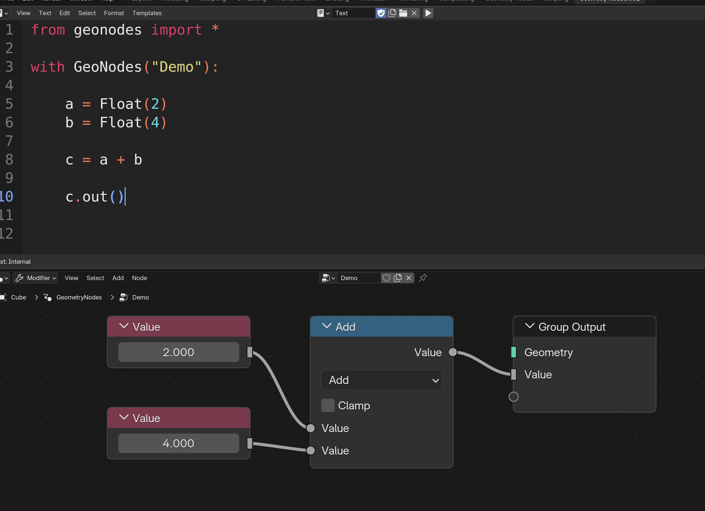

# Data Classes

**geonodes** classes are named after their name in Geometry Nodes, for instance: **Integer** socket -> `Integer` class.

Blender **Nodes** are implemented as methods, properties and operators working on these classes.
For instance, if `a` and `b` are two **Floats**, the script `a + b` will generate a **Math** node with
_ADD_ operation. The result of this operation is the **Output Socket** of the node.



## Geometry Classes

There is basically one single socket type which is <!Geometry>. But **geonodes** implemented sub types to
increase object oriented framework:

- <!Mesh>
- <!Curve>
- <!Instances>
- <!Cloud>
- <!Volume>
- <!GreasePencil>

## Attribute Classes

- <!Boolean> : Boolean socket, compatible with python `bool`
- <!Integer> : Integer socket, compatible with python `int`
- <!Float> : Float socket, compatible with python `float`
- <!Vector> : Vector socket, compatible with python `tuple`
- <!Color> : Vector socket, compatible with python `tuple`
- <!Rotation> : Rotation socket
- <!Matrix> : Matrix socket

## Blender Resources

Blender resources can be passed either by their name or by instance:

- <!Object> : Object socket
- <!Collection>
- <!Image>
- <!Material>
- <!Font>

## Other Sockets

- <!String> : String socket, compatible with python `str`
- <!Menu> : Menu socket, can be set with a valid python `str`
- <!Closure> : Closure socket
- <!Bundle> : Bundle socket

## Shader sockets

- <!Shader> : BSDF socket
- <!VolumeShader> : Volume BSDF socket


### Domains

Geometry classes have one or several _Domain_ attributes following **Blender** data structure.
The domains are the following:
- **Mesh**
  - points
  - faces
  - edges
  - corners
- **Curve**
  - points
  - splines
- **GreasePencil**
  - layers 
- **Cloud**
  - points
- **Instances**
  - insts
- **Volume**

The _Domain_ attribute is used in nodes having a _Domain_ parameter. In the following example,
the node '_Store Named Attribute_' is setup with the domain calling the method:

``` python
      # Create a Cube
      mesh = Mesh.Cube()

      # Store on domain POINT
      mesh.points.store_named_attribute("Point Value", 0.)

      # Store on domain FACE
      mesh.faces.store_named_attribute("Face Value", 0.)
```

!!! warning
    A **Domain** is never instanced directly, it is always initialized as a property of a Geometry Class.

