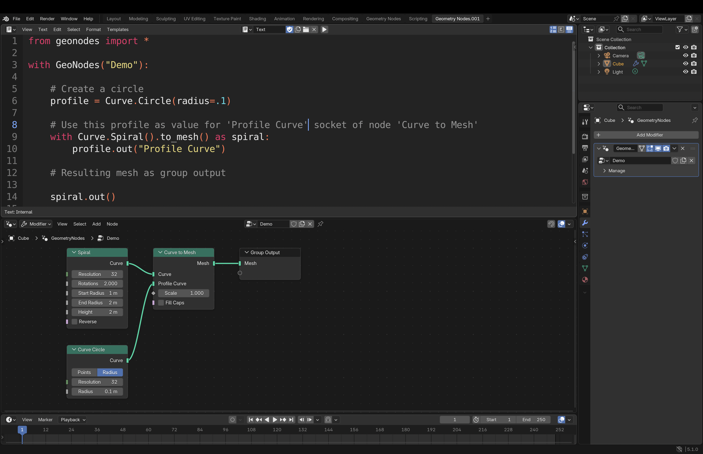

# Linking sockets

Linking a socket is as simple as setting a python value. Here after are the ways to link to nodes:

- Outing to the _Group Output_ node
- Passing argument to a class method
- Explicitly setting a node input socket

## Group outing

Any instance can be outed to the _Group Output_ node with the methode `out`:

``` python
with GeoNodes("Outing to Group Output"):

    # Getting the group input geometry
    geo = Geometry()

    # Outing
    geo.out()

    # Outing with a name
    geo.transform(scale=2).out("Scaled by Two Geometry")
```

## Method argument

The standard syntax to provide values to input sockets of a node, is to use
argument of a function:

``` python
    # Create a circle : input socket radius is initialized to 0.1
    profile = Curve.Circle(radius=.1)

    # Use this profile as value for 'Profile Curve' socket of node 'Curve to Mesh'
    spiral = Curve.Spiral().to_mesh(profile_curve=profile)

    # Resulting mesh as group output
    spiral.out()
```

## Replacing Group Output

Another way to set values to input socket is to temporarily set the node as current
output node, replacing the the Group Output Node. This is done using the ***with*** context
as shown below.

``` python
    # Create a circle
    profile = Curve.Circle(radius=.1)

    # Use this profile as value for 'Profile Curve' socket of node 'Curve to Mesh'
    with Curve.Spiral().to_mesh() as spiral:
        profile.out("Profile Curve")

    # Resulting mesh as group output
    spiral.out()
```



This alternative can be easier to read for complex nodes. It can be used with menu-like nodes:

``` python
from geonodes import *

with GeoNodes("Menu Demo") as tree:
    
    # ----------------------------------------------------------------------------------------------------
    # Geometries are provided as method arguments
    # ----------------------------------------------------------------------------------------------------
    
    simple = Geometry().menu_switch("Input", {
        "Cube": Mesh.Cube(),
        "Ico": Mesh.IcoSphere(),
        "Cone": Mesh.Cone(), 
        },
        menu=Input("Simple Mesh", default="Ico"), 
        )

    # ----------------------------------------------------------------------------------------------------
    # Here, the geometries are successfully adeed, making the source code clearer
    # ----------------------------------------------------------------------------------------------------
        
    profile = Curve.Circle(radius=.1)
        
    with Geometry.MenuSwitch() as from_curve:
        simple.out("Simple Mesh")
        
    with from_curve:
        Curve.Spiral().to_mesh(profile_curve=profile).out("Spiral")
        
    with from_curve:
        Curve.Circle().to_mesh(profile_curve=profile).out("Circle")
        
    # The best is to set the menu socket once the inputs are completed
    from_curve.node.menu = Input("From Curve", default="Simple Mesh")
    
    # ----------------------------------------------------------------------------------------------------
    # Same for Index switch
    # ----------------------------------------------------------------------------------------------------

    # Each out method feeding an Index Switch node will add an entry
    
    curve = Curve.IndexSwitch(index=Input("Curve Index"))
    with curve:
        Curve.Spiral().out()
        
    with curve:
        Curve.Circle().out()
        
    with curve:
        Curve.Quadrilateral().out()
        
    # ----------------------------------------------------------------------------------------------------
    # Switch
    # ----------------------------------------------------------------------------------------------------
    
    curve.switch(Input("Mesh/Curve"), from_curve).out()
```

## Setting node sockets

Ultimately you can directly set input sockets of a node as shown below:

``` python
    with GeoNodes("Setting Node input sockets"):

        geo = Geometry()

        # Calling transform will create the node "Transform Geometry"
        # We can get the node from node property
        node = geo.transform().node

        # We can set the node with python values or geonodes classes
        node.translation = (1, 2, 3)
        node.scale = Vector((2, 3, 4))
        node.rotation = Rotation(name="Rotation")

        node.out()
```


