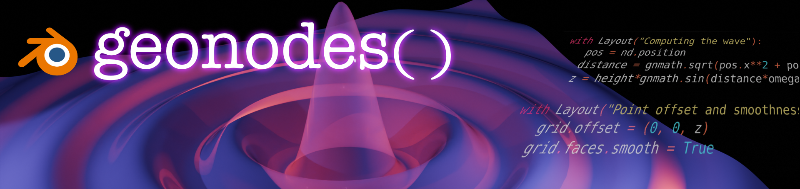

> Scripting Blender **Geometry Nodes**

**geonodes** is a Python API for creating and manipulating **Blender Geometry Nodes** programmatically.

It provides a clean, expressive DSL that lets you build node graphs using Python, instead of the Blender UI.

---

- [Overview](getting_started/overview.md)
- [Installation](getting_started/installation.md)
- [API reference](api/index.md)

---

## ✨ Features

- Pythonic API for Geometry Nodes

    - Object oriented API

        - Sockets are classes
        - Nodes are methodds and propetries

    - Full node tree construction via code
    - Designed for readability and composability

- Support for:

  - Geometry Nodes and Shaders
  - Modidiers, Groups and Tools
  - Panels to build clean user interface
  - Layouts to group and comment your trees

