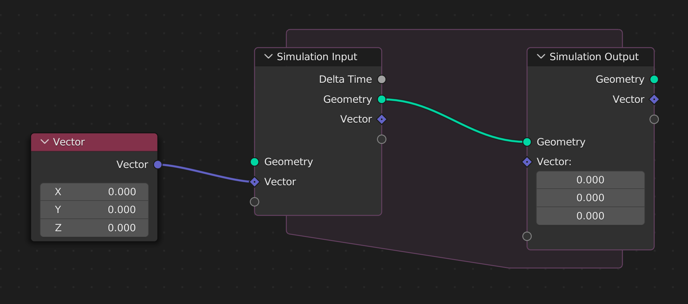
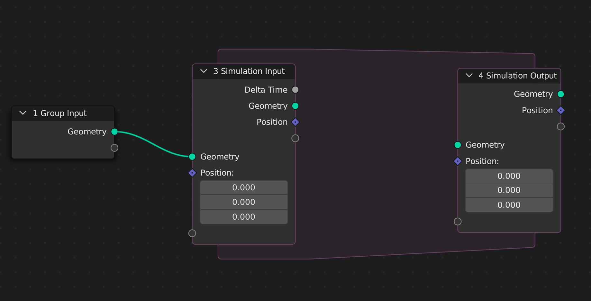
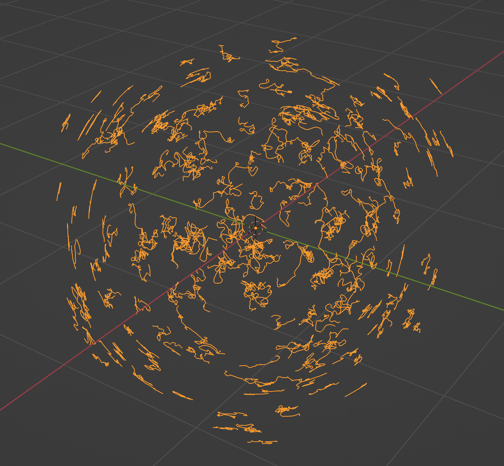
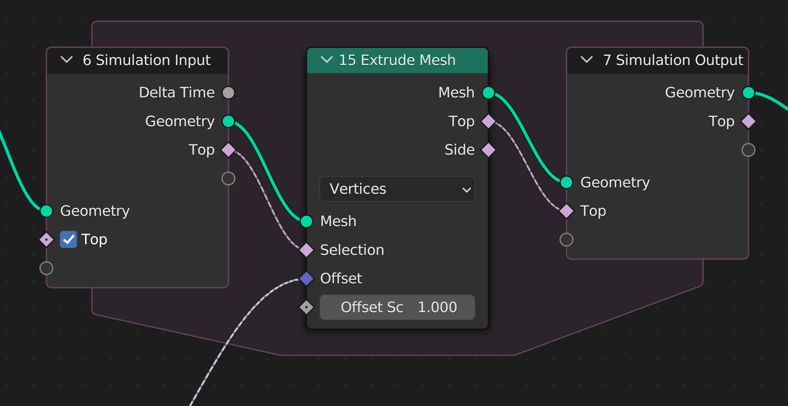

# Simulation

> Tutorial on how to create a simulation zone.

## Objective

We want to randomly create curves at the surface of the input geometry:
- Generate random points
- At each step, extruding each point randomly on the surface
- Trying to beautify the result

## How the create a simulation zone

A simulation zone is made of two nodes: **Simulation Input** and **Simulation Output**.
These two nodes have the same input and output sockets with one exception: the **input node** has an additional output socket : **Delta Time**



The nodes are created by instanciating a **Simulation** class. The class constructor takes one mandatory argument: the geometry to use in the simulation zone. It accepts additional keyword arguments corresponding to the additional sockets to use in the simulation. In the following example, a simulation zone is created with one vector to be used in the simulation loops:



``` python
import geonodes as gn

with gn.Tree("Simul") as tree:

  # Create a simulation zone for the input geometry with one socket initialized to (0, 0, 0)

  simul = gn.Simulation(tree.ig, position=(0, 0, 0))
```

The input and output nodes can be accessed with the **input** and **output** attributes:

``` python
import geonodes as gn

with gn.Tree("Simul") as tree:
  simul = gn.Simulation(tree.ig, position=(0, 0, 0))
  node = simul.input  # Simulation input node
  node = simul.output # Simulation output node
```

## Accessing the sockets

With the exception of **delta_time** output socket of the input simulation node, the socket names have four meanings:
- input socket of the input node: ``` simul.input.geometry = var```
- output socket of the input node : ``` var = simul.input.geometry ```
- input socket of the output node : ``` simul.output.geometry = var```
- output socket of the output node : ``` var = simul.output.geometry ```

To ease code writing, the Simulation instance exposes attributes for sockets used within the simulation:
- when the attribute is read, this is the output socket of the input node
- when the attribute is written, this is the input socket of the output node

``` python
with gn.Tree("Simul") as tree:
  simul = gn.Simulation(tree.ig, position=(0, 0, 0))

  v = simul.input.position # Output socket of simulation input node
  v = simul.position       # Same

  simul.output.position = v # Input socket of the simulation output node
  simul.position = v        # Same

  # Outside the simulation zone, the result can read through output node

  my_vector = simul.output.position
```

### Note

**Simulation** class exposes shortcuts for the simulation output geometry:

``` python
  # Resulting geometry through output node
  geo = simul.output.geometry

  # Or through Simulation shortcuts
  geo = simul.output_geometry
  geo = simul.og
```

## Geometry class

The type of the simulation geometry is the one of the input geometry. For instance if you instantiate a **Simulation** with a mesh, the simulation geometry will be a mesh:

``` python
mesh = gn.Mesh.Cube().mesh
simul = gn.Simulation(mesh)

geo = simul.geometry # Mesh
geo = simul.og # Mesh
```

:stop_sign: **Important**: the created sockets must be set within the simulation zone. In particular, the geometry must be updated with an instruction ``` simul.geometry = ...```. A typical simulation is written as in the following example:

``` python
with gn.Tree("Simul") as tree:
  simul = gn.Simulation(tree.ig, a_vector=(0, 0, 0), a_bool=False)

  # Getting the simulation variables

  geo = simul.geometry
  v   = simul.a_vector
  b   = simul.a_bool

  # Doing some stuff with these guys
  # ...

  # Done: time to update the simulation zone

  simul.geometry = modified_geometry
  simul.a_vector = modified_vector
  simul.a_bool   = modified_bool

  # Outputing the tree

  tree.of = simul.og
```

## Do nothing simulation

The *do nothing* simulation can be created with:

``` python
import geonodes as gn

with gn.Tree("Do nothing simulation") as tree:
  # Create the simulation zone with tree input geometry as 
  simul = gn.Simulation(tree.ig)

  # Link the two simulation nodes
  simul.geometry = simul.geometry

  # The simulated geometry is use as tree output
  tree.og = simul.og
```

## Something more interesting

The following tree generates random points on the faces of the input geometry. Each time, the simulation zone is executed, the last vertices are randomly extruded. The last vertex flag is stored in the named attribute "Top".

``` python
import geonodes as gn

with gn.Tree("Simul") as tree:
    
    # Points on the input geometry (allegedly a mesh)
    
    mesh = gn.Mesh(tree.ig).distribute_points_on_faces(density=gn.Float(10, "Density")).points.to_vertices()

    # We need to extrude only the last vertices
    # At the begining all the vertices are the last
    
    mesh.store_named_attribute(name="Top", value=True)
    
    # ----- The simulation zone
    
    simul = gn.Simulation(mesh)
    
    # Read the geometry within the zone

    mesh = simul.geometry
    
    # Let's generate the extrusion direction by a random vector perpendicular to the normal
    
    normal = mesh.verts.normal
    v = gn.Vector(gn.Texture.Noise4D(w=tree.seconds).color) - (.5, .5, .5)

    # Extrusion along this vector
    
    top  = mesh.verts[mesh.verts.named_boolean("Top")].extrude(offset=normal.cross(v).scale(.1)).top
    
    # Let's update the last vertex flag
    
    mesh.verts.store_named_attribute("Top", top)

    # Connecting the modified mesh to the simulation output node
    
    simul.geometry = mesh
    
    # ----- Outside the simulation
    # Transformation to NURBS curve
    
    curve = simul.og.to_curve()
    curve.splines.type = 'NURBS'

    # Removing the begining with time

    curve.splines.trim(start=gn.max(0, (tree.frame - 100)/250))
    
    # Done
    
    tree.og = curve
```



## Alternative to the stored attribute

Rather than using the named attribute, we can use a simulation state named **top**:

``` python
import geonodes as gn

with gn.Tree("Simul 2") as tree:
    
    # Points on the input geometry (allegedly a mesh)
    
    mesh = gn.Mesh(tree.ig).distribute_points_on_faces(density=gn.Float(10, "Density")).points.to_vertices()

    # ----- The simulation zone starts with all vertices as "Top vertices"
    
    simul = gn.Simulation(mesh, top=True)
    
    # Read the geometry within the zone

    mesh = simul.geometry
    
    # Let's get the top vertices selector
    
    top = simul.top
    
    # Let's generate the extrusion direction by a random vector perpendicular to the normal
    
    normal = mesh.verts.normal
    v = gn.Vector(gn.Texture.Noise4D(w=tree.seconds).color) - (.5, .5, .5)

    # Extrusion along this vector
    
    top  = mesh.verts[top].extrude(offset=normal.cross(v).scale(.1)).top
    
    # Connecting the modified mesh to the simulation output node
    
    simul.geometry = mesh
    
    # Updating the top vertices
    
    simul.top = top
    
    # ----- Outside the simulation
    # Transformation to NURBS curve
    
    curve = simul.og.to_curve()
    curve.splines.type = 'NURBS'

    # Removing the begining with time

    curve.splines.trim(start=gn.max(0, (tree.frame - 100)/250))
    
    # Done
    
    tree.og = curve    
```

The image below shows the use of **top** simulation state rather than the stored attribute:




 


